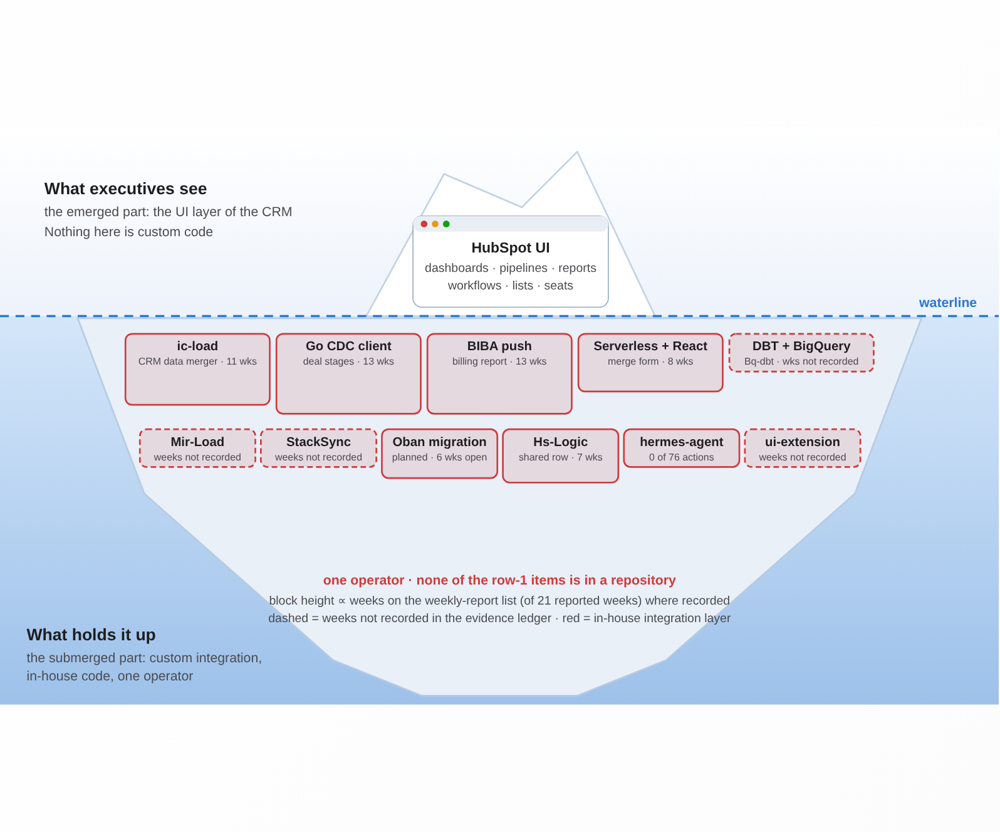
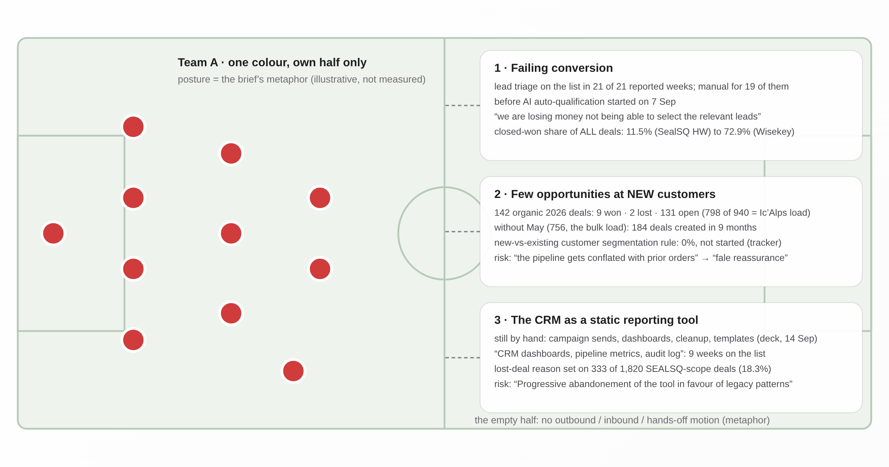
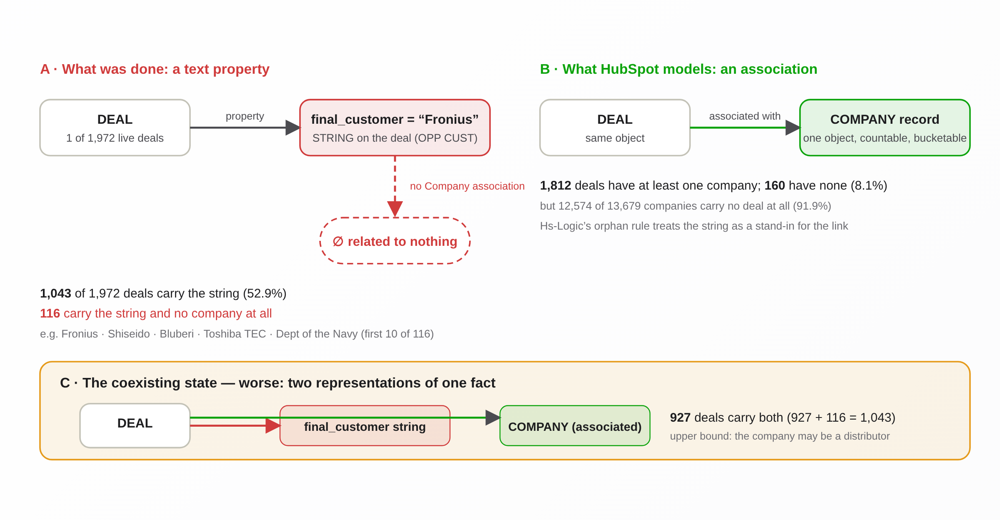
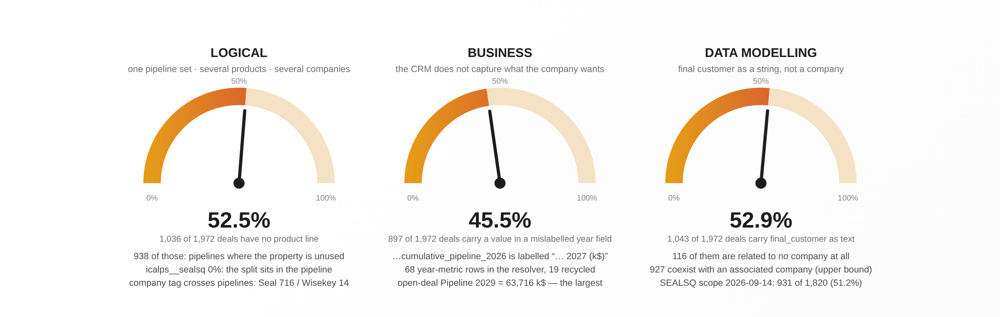
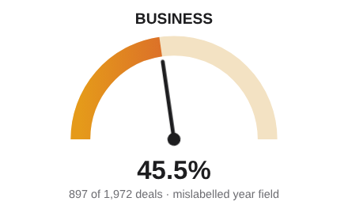
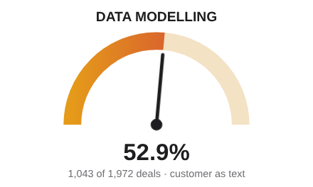
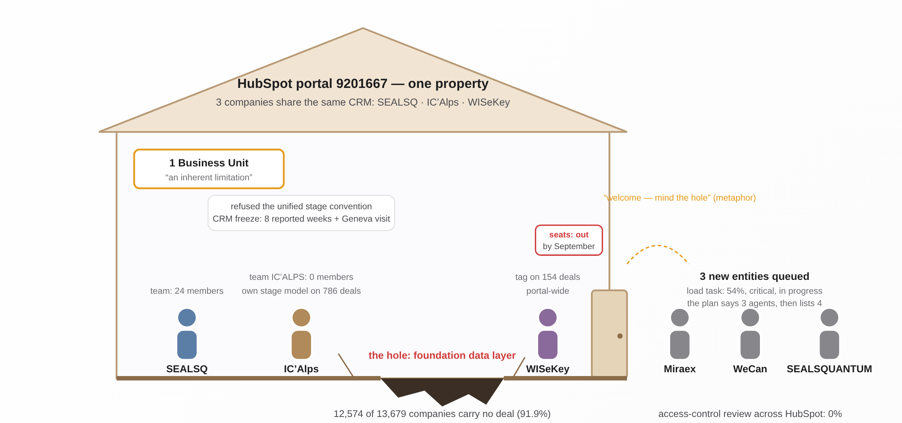
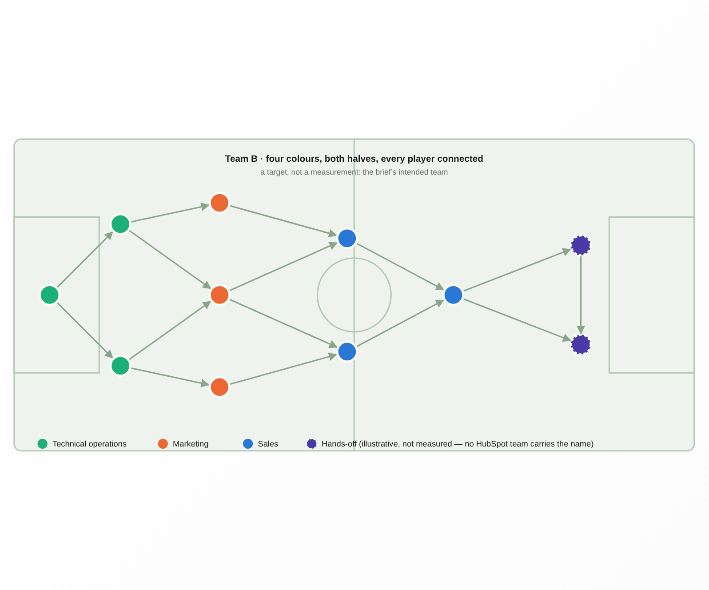
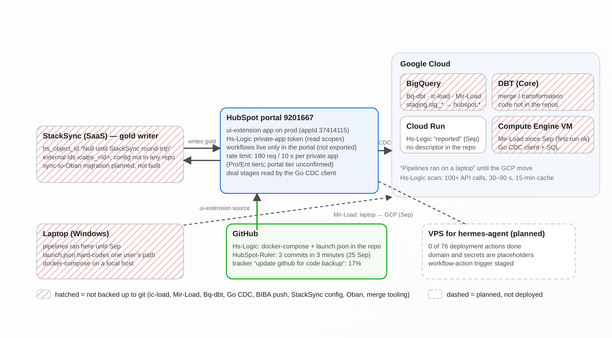

<!-- Generated by projects/crm-three-scenarios/pptx/build_pptx.py from Finished Presentations/crm-three-scenarios.html. 
Edit here only for wording; facts live in the HTML deck and the evidence ledger. Produce the deck with: 
pandoc crm-three-scenarios.md -o "../../Finished Presentations/crm-three-scenarios.pptx" (run from this folder). -->

## Three stories, three scenarios

Story 1 · The DIY technical debt · Story 2 · The types of teams

S1 · DIY with the cloud stack and AI · S2 · DIY + an expert CRM partner · S3 · HubSpot-native tools

A presentation layer, not a decision layer — no choice is offered.\
Press **Space** to advance, **←** to go back, **N** for provenance notes.

::: notes
Title slide: no measured number. Portal id and the scenario wording come from projects/crm-three-scenarios/brief.md §1 (lines 3–5, 38–49); the scenario wording is cited as C148 on slide 12.
:::

## A boundary beats sixty projects (1/3)

*Why stories*

*Between the desired outcome and the measured reality sits a presentation layer, not a decision layer*

**The year in numbers**

**21 weekly reports**

6 work categories · roughly 60 projects (self-reported; the deck itemises 38) · Jan–Sep 2026

::: notes
**C001** caveat · 21 weekly reports, \~60 projects tracked, 6 work categories (Jan-Sep 2026). caveat → 21 weekly reports (dated list on slide 16), 6 work categories, and roughly 60 projects (self-reported on slide 1; the deck itemises 38) - Jan-Sep 2026. source: projects/crm-three-scenarios/sources/aya-work2026-pptx-extract.txt · locator: SLIDE 1 Text 12-17 · as-of: 2026-10-01 · tag: deck-aya-work2026-pptx

**C149** confirmed · The governing rule in the user's words: 'by keeping the tight boundary between the desired outcome and the reality you provide a PRESENTATION LAYER, rather than a DECISION LAYER'; 'present grounded truth against the scenarios WITHOUT PROVIDING CHOICE but presentation only'. source: projects/crm-three-scenarios/brief.md · locator: lines 31-33 · as-of: 2026-10-01 · tag: brief-2026-10-01

**C150** caveat · The stories and images are the user's own visual metaphors (iceberg, sports team, speedometer, messy landlord, Team B); their wording is the brief's, and where no measurement grounds an element the deck labels it 'illustrative, not measured'. caveat → Stories and images are the user's own metaphors (iceberg, sports team, speedometer, messy landlord, Team B) per BRIEF lines 62-101; the brief (lines 9-10) requires ungrounded elements to be labelled 'illustrative, not measured' — applied in the project docs, to be carried into the deck's speaker notes when the deck is built. source: projects/crm-three-scenarios/brief.md · locator: lines 62-101 · as-of: 2026-10-01 · tag: brief-2026-10-01
:::

## A boundary beats sixty projects (2/3)

**The governing rule**

> “by keeping the tight boundary between the desired outcome and the reality you provide a PRESENTATION LAYER, rather than a DECISION LAYER”

“present grounded truth against the scenarios WITHOUT PROVIDING CHOICE but presentation only”

::: notes
Provenance notes: see the first slide of "A boundary beats sixty projects".
:::

## A boundary beats sixty projects (3/3)

**Four images, one ledger**

- Iceberg — the DIY technical debt
- Sports team — Team A, then Team B
- Speedometer — three data problems
- Messy landlord — a shared, shaky floor

The metaphors are the brief’s; where no measurement grounds an element it is labelled “illustrative, not measured”.

claim id C0xx → source · locator · as-of

::: notes
Provenance notes: see the first slide of "A boundary beats sixty projects".
:::

## The iceberg: what you see, and what holds it up (1/3)

::: notes
*Story 1 · The DIY technical debt*

Deviation from the metagraph plan: the iceberg blocks are sized by weeks on the weekly-report list, so C030 (top-10 list), C011 (six-week strips), C028 (7-week shared row) and C082 (hermes 0/76) are cited here as well as on slides 4 and 13.

**C002** caveat · Focus mix of active project-weeks: Data 35%, DevOps 22%, Marketing 17%, Process/Ops 17%, Admin 6%, Other 3%. caveat → Focus mix of active project-weeks (slide 4, sums to 100%): Data 35%, DevOps 22%, Marketing 17%, Process/Ops 17%, Admin 6%, Other 3%. Note: the per-category slides of the same deck give Data 40% and Marketing 8%\*, so quote slide 4 only and tag it 'self-reported, deck-internal variance'. source: projects/crm-three-scenarios/sources/aya-work2026-pptx-extract.txt · locator: SLIDE 4 Text 103-120 · as-of: 2026-10-01 · tag: deck-aya-work2026-pptx

**C003** caveat · Code share of active project-weeks grew 41% (Q1) to 53% (Q3); the last reported week (14 Sep) reached 63% code; weekly code share rose from 34% (12 Jan). caveat → Code share of active project-weeks (manual/UI / code / people split) rose from 41% in Q1 to 53% in Q3; the last reported week (14 Sep) was 63% code, versus 34% on 12 Jan (deck notes, not recomputable). Avoid the deck's '1.2:1' Q1 ratio: 41/36 = 1.1:1. source: projects/crm-three-scenarios/sources/aya-work2026-pptx-extract.txt · locator: SLIDE 3 Text 12-16 · as-of: 2026-10-01 · tag: deck-aya-work2026-pptx

**C025** confirmed · Switched to code in 2026: regional weekly report (11 weeks by hand, then a workflow in Jun); deal stages (HubSpot UI, then Go CDC client + SQL, Aug); BIBA (local Python, then scheduled push into HubSpot, Aug); Mir-Load (laptop, then GCP instance, Sep); lead triage (19 weeks manual, AI from 7 Sep). source: projects/crm-three-scenarios/sources/aya-work2026-pptx-extract.txt · locator: SLIDE 3 Text 15 · as-of: 2026-10-01 · tag: deck-aya-work2026-pptx

**C018** caveat · 'What keeps coming back' (deck): the role changed yet few understand; upgrading infrastructure is no longer an option if we want to scale; SEALSQ seems to attempt isolation in its BUs; the data is poor but nobody wants to look at it; AI is severely underutilized; sales stakeholder turnover is concerning. caveat → Locator: SLIDE 12 Text 13/15/17 (six boxes, ids reused). Quote verbatim: 'Upgrading infrastructure is no longer an option if we want to scale' and 'SEALSQ seems to attempt isolation in it's Bu's to cope with pressure'; do not harden 'seems' into a fact. source: projects/crm-three-scenarios/sources/aya-work2026-pptx-extract.txt · locator: SLIDE 12 Text 13-15 · as-of: 2026-10-01 · tag: deck-aya-work2026-pptx

**C001** caveat · 21 weekly reports, \~60 projects tracked, 6 work categories (Jan-Sep 2026). caveat → 21 weekly reports (dated list on slide 16), 6 work categories, and roughly 60 projects (self-reported on slide 1; the deck itemises 38) - Jan-Sep 2026. source: projects/crm-three-scenarios/sources/aya-work2026-pptx-extract.txt · locator: SLIDE 1 Text 12-17 · as-of: 2026-10-01 · tag: deck-aya-work2026-pptx

**C150** caveat · The stories and images are the user's own visual metaphors (iceberg, sports team, speedometer, messy landlord, Team B); their wording is the brief's, and where no measurement grounds an element the deck labels it 'illustrative, not measured'. caveat → Stories and images are the user's own metaphors (iceberg, sports team, speedometer, messy landlord, Team B) per BRIEF lines 62-101; the brief (lines 9-10) requires ungrounded elements to be labelled 'illustrative, not measured' — applied in the project docs, to be carried into the deck's speaker notes when the deck is built. source: projects/crm-three-scenarios/brief.md · locator: lines 62-101 · as-of: 2026-10-01 · tag: brief-2026-10-01

**C030** caveat · Top-10 recurrent entries (weeks on the list): lead triage 21; Ic'Alps property integration 15; BIBA 13; deal-stage workflow 13; CRM data merger 11; weekly regional report 11; Wise.Sat 10; onboarding/training 10; dashboards 9; merge workflow features 8. caveat → Keep the ten numbers; label them 'recurrent work, code and manual mixed'. If the slide is about submerged code, cite only the code rows (BIBA 13, deal-stage workflow 13, CRM data merger 11, merge workflow 8) or state that 3 of the top 4 by weeks are manual/people items. Note the 8-week tie-break and the excluded 21-week 'Marketing automation' placeholder in speaker notes. source: projects/crm-three-scenarios/sources/aya-work2026-pptx-extract.txt · locator: SLIDE 13 Text 1-230 · as-of: 2026-10-01 · tag: deck-aya-work2026-pptx

**C011** caveat · Four hygiene items (cleanup, backups, codebase migration) have recurred for six weeks; none is closed. caveat → Deck reports four hygiene items (cleanup, backups, codebase migration) recurring for six of the 21 reported weeks, none closed as of 14 Sep 2026; the deck does not list the four - the visible 6-week strips are 'Codebase cleanup and documentation', 'Migrate local codebase and backups' and 'Migrate Stacksync workload to Oban' (slide 22) plus 'Knowledge base and CRM company cleanup' (slide 20). source: projects/crm-three-scenarios/sources/aya-work2026-pptx-extract.txt · locator: SLIDE 22 Text 104-172, 204 · as-of: 2026-10-01 · tag: deck-aya-work2026-pptx

**C082** confirmed · hermes-agent is a scaffold, not deployed: the Factory deployment workbook lists 76 actions across 10 phases with 0 done; domain and secrets are placeholders (agent.example.com); 5 scoping decisions remain open. source: agent-deployment-workbook.xlsx · locator: sheet Overview rows 11-22 · as-of: 2026-10-01 · tag: repo-hubspot-ruler

**C028** caveat · Deck: 'AI is severely underutilized in the company'; Enterprise AI ranked third in January and returned in July and September (7 shared weeks with HS-LOGIC). caveat → Word as: 'AI exploration shares one 7-week entry with the HS-LOGIC query layer (SLIDE 25); the deck gives no AI-only week count, and the whole Other category is 3% of project-weeks.' Locator: SLIDE 12 second 'Text 13' box; SLIDE 25 Text 12/34/136. source: projects/crm-three-scenarios/sources/aya-work2026-pptx-extract.txt · locator: SLIDE 12 Text 13 · as-of: 2026-10-01 · tag: deck-aya-work2026-pptx

**Illustrative, not measured:** Block heights for DBT + BigQuery, Mir-Load, StackSync and ui-extension are not sized by evidence (dashed): no week count for them exists in the ledger. · The mapping of the deck row “CRM data merger project” (11 weeks) to ic-load is the health check’s reading (item 2), not stated in the deck. · The comparison with an “autonomous system” that executives assume is not measured (ledger unsupported list).
:::

## The iceberg: what you see, and what holds it up (2/3)

*Iceberg — above the waterline the HubSpot UI that executives see; below it the custom integration layer, each built item a block sized by its weeks on the weekly-report list where recorded*

**Focus mix of active project-weeks**

- Data — 35%
- DevOps — 22%
- Marketing — 17%
- Process / Ops — 17%
- Admin — 6%
- Other — 3%

self-reported, review deck slide 4 (deck-internal variance noted)

::: notes
Provenance notes: see the first slide of "The iceberg: what you see, and what holds it up".
:::

## The iceberg: what you see, and what holds it up (3/3)

**Share of the work done in code**

**41% → 53% → 63%**

Q1 → Q3 → last reported week (14 Sep); 34% on 12 Jan

**Switched to code in 2026**

regional weekly report (11 weeks by hand → workflow, Jun) · deal stages (UI → Go CDC + SQL, Aug) · BIBA (local Python → scheduled push, Aug) · Mir-Load (laptop → GCP, Sep) · lead triage (19 weeks manual → AI, 7 Sep)

> “The Data is poor but nobody wants to look at it”

::: notes
Provenance notes: see the first slide of "The iceberg: what you see, and what holds it up".
:::

## The submerged part: in-house pipelines, one operator, nothing in a repo (1/3)

*Story 1 · The DIY technical debt*

**Weeks on the weekly-report list · code rows only (of 21 reported weeks)**

- BIBA billing report — 13
- Deal-stage workflow (Go CDC) — 13
- CRM data merger (ic-load) — 11
- Merge workflow + refactor — 8
- Migrate StackSync workload to Oban — 6
- Codebase cleanup and documentation — 6
- Migrate local codebase and backups — 6

::: notes
**C004** confirmed · The deck states: 'The CRM is not autonomous, it requires constant attention to avoid data drifts'. source: projects/crm-three-scenarios/sources/aya-work2026-pptx-extract.txt · locator: SLIDE 22 Text 204 · as-of: 2026-10-01 · tag: deck-aya-work2026-pptx

**C005** caveat · 10+ tools tested; four kept: DBT, BigQuery, Stacksync, HubSpot serverless. caveat → The author reports '10+ tools tested; four kept: DBT, BigQuery, Stacksync, HubSpot serverless' (self-reported, slide 7). The deck also reports Go CDC client, Cloud Run, Claude and a planned Oban migration in use, so the running stack is wider than the four named. source: projects/crm-three-scenarios/sources/aya-work2026-pptx-extract.txt · locator: SLIDE 7 Text 15-16 · as-of: 2026-10-01 · tag: deck-aya-work2026-pptx

**C006** caveat · Ic'Alps merger: 9 months of preparation, 4 days to load the full data in production (mid-May), about 6 weeks of active follow-up. caveat → Ic'Alps merger: 9 months of preparation (self-reported; predates the Jan 2026 reports), 4 days to load the full data in production in mid-May 2026, and roughly 6 weeks of active follow-up (deck footnote: 'not precise ... at least 1.5 month'). source: projects/crm-three-scenarios/sources/aya-work2026-pptx-extract.txt · locator: SLIDE 5 Text 12-16, TextBox 22 · as-of: 2026-10-01 · tag: deck-aya-work2026-pptx

**C011** caveat · Four hygiene items (cleanup, backups, codebase migration) have recurred for six weeks; none is closed. caveat → Deck reports four hygiene items (cleanup, backups, codebase migration) recurring for six of the 21 reported weeks, none closed as of 14 Sep 2026; the deck does not list the four - the visible 6-week strips are 'Codebase cleanup and documentation', 'Migrate local codebase and backups' and 'Migrate Stacksync workload to Oban' (slide 22) plus 'Knowledge base and CRM company cleanup' (slide 20). source: projects/crm-three-scenarios/sources/aya-work2026-pptx-extract.txt · locator: SLIDE 22 Text 104-172, 204 · as-of: 2026-10-01 · tag: deck-aya-work2026-pptx

**C012** caveat · 'Benjamin Left with no replacement on sight \| Technical Debt'; 'Sales stakeholder turnover is concerning'. caveat → Quote as two separate Admin bullets from SLIDE 10: 'Benjamin Left with no replacement on sight' and 'Technical Debt' (the deck does not link the two); plus SLIDE 12: 'Sales stakeholder turnover is concerning'. source: projects/crm-three-scenarios/sources/aya-work2026-pptx-extract.txt · locator: SLIDE 10 Text 12 · as-of: 2026-10-01 · tag: deck-aya-work2026-pptx

**C029** confirmed · 'Pipelines ran on a laptop. Backups and codebase migration sat on the list for six weeks as open risks.' The ic-load pattern is to be replicated (BigQuery + Cloud Shell + DBT + Python on a remote instance). source: projects/crm-three-scenarios/sources/aya-work2026-pptx-extract.txt · locator: SLIDE 19 Text 14 · as-of: 2026-10-01 · tag: deck-aya-work2026-pptx

**C030** caveat · Top-10 recurrent entries (weeks on the list): lead triage 21; Ic'Alps property integration 15; BIBA 13; deal-stage workflow 13; CRM data merger 11; weekly regional report 11; Wise.Sat 10; onboarding/training 10; dashboards 9; merge workflow features 8. caveat → Keep the ten numbers; label them 'recurrent work, code and manual mixed'. If the slide is about submerged code, cite only the code rows (BIBA 13, deal-stage workflow 13, CRM data merger 11, merge workflow 8) or state that 3 of the top 4 by weeks are manual/people items. Note the 8-week tie-break and the excluded 21-week 'Marketing automation' placeholder in speaker notes. source: projects/crm-three-scenarios/sources/aya-work2026-pptx-extract.txt · locator: SLIDE 13 Text 1-230 · as-of: 2026-10-01 · tag: deck-aya-work2026-pptx

**C038** confirmed · Tracker: '\[ADMIN\] Doc Document workflows and script and update github for code backup' (goal: no technical debt or hard dependency on any user) HIGH, E4, 17%, in progress. source: projects/crm-three-scenarios/sources/AYA\_trackerv4\_210926-xlsx-extract.txt · locator: sheet 'RevOps 6-month plan (2)' line 21 · as-of: 2026-10-01 · tag: tracker-210926

**C081** caveat · IC'Alps merge lineage (ontology workbook): deal->company fill 99.7%, deal->contact 82.5%, contact->company source-side 93.9% but all-types 37.1%, meetings->company and meetings->contact 0.0% (0 of 474 / 411); bronze = staging.stg\_\* (ic-load), gold = hubspot.\* via StackSync external-ids; hs\_object\_id 'Null until StackSync outgoing-sync round-trip'. The referenced sql/\_scratch files are absent from the repo. caveat → company 4,509/4,802 = 93.9% source-side but only 1,780/4,802 = 37.1% once all three association types are required; meetings 0/474 = 0.0%. These are merge-batch figures, not portal-wide.' source: ontology\_workbook\_full.xlsx · locator: sheet 'Relationship Lineage' rows 2-5, 11-12 · as-of: 2026-10-01 · tag: repo-hubspot-ruler

**C102** caveat · Deals created per month in 2026: Jan 19, Feb 11, Mar 20, Apr 16, May 756 (the Ic'Alps bulk load), Jun 37, Jul 35, Aug 16, Sep 23, Oct (1 day) 7; without May, 184 deals in 9 months. caveat → Oct = 7 is month-to-date as of 2026-10-01. May 756 coincides with the mid-May Ic'Alps production load reported in the 2026 review deck (BRIEF 2c); the query shows the spike, not its cause. source: live-hubsql-2026-10-01 · locator: SELECT DATE\_TRUNC(createdate, 'MONTH'), COUNT(\*) FROM DEAL WHERE createdate BETWEEN '2026-01-01' AND '2026-12-31' GROUP BY DATE\_TRUNC(createdate, 'MONTH') · as-of: 2026-10-01 · tag: live-hubsql-2026-10-01

**C152** caveat · Not in any of the three repos (named in the deck/tracker only): ic-load, Mir-Load, the DBT/BigQuery pipeline (Bq-dbt), the Go CDC client, BIBA push, StackSync config, the Oban/Elixir migration, the serverless merge workflow + React form — grep over the three repos returns 0 files; their status rests on the weekly reports. caveat → Not in any of the three repos as code: ic-load, Mir-Load, Bq-dbt, the Go CDC client, the BIBA push, StackSync config, the Oban/Elixir migration, the merge workflow + React form. No .go/.ex/.exs/.sql/dbt\_project.yml file exists under Hs-Logic, HubSpot-Ruler or presentation-builder; the only text matches for these names are this project's own deliverable docs under presentation-builder/projects/crm-three-scenarios/ and BIBA as a property value in HubSpot-Ruler's SEALSQ property source: grep -rli over Hs-Logic, HubSpot-Ruler, . (2026-10-01) · locator: repo\_check · as-of: 2026-10-01 · tag: repo-check-2026-10-01

**Illustrative, not measured:** The deck does not enumerate the “four hygiene items”; three six-week rows are visible on slide 22 plus one on slide 20. · The 10th slot of the top-10 list is a four-way tie at 8 weeks; the 21-week “Marketing automation” placeholder is excluded as stale.
:::

## The submerged part: in-house pipelines, one operator, nothing in a repo (2/3)

top-10 list is recurrent work, code and manual mixed; 3 of the top 4 by weeks are manual/people items. “Four hygiene items have recurred for six weeks; none is closed” (14 Sep report)

IC’Alps merge lineage (merge batch, not portal-wide): deal → company 747/749 = 99.7% · contact → company 37.1% once all association types are required · meetings → company 0/474

> “The CRM is not autonomous, it requires constant attention to avoid data drifts”

10+ tools tested; four kept: DBT, BigQuery, Stacksync, HubSpot serverless (self-reported) — the running stack is wider than the four named

::: notes
Provenance notes: see the first slide of "The submerged part: in-house pipelines, one operator, nothing in a repo".
:::

## The submerged part: in-house pipelines, one operator, nothing in a repo (3/3)

**The Ic’Alps merger**

**9 months prep · 4 days to load · \~6 weeks follow-up**

live portal: 756 deals created in May 2026 — the bulk load; 184 deals in the other 9 months

**Custody**

**Not in any of the three repos as code:** ic-load · Mir-Load · Bq-dbt · Go CDC client · BIBA push · StackSync config · Oban migration · merge workflow + React form

“Pipelines ran on a laptop. Backups and codebase migration sat on the list for six weeks as open risks.”

tracker “update github for code backup”: 17% · deck Admin bullets: “Benjamin Left with no replacement on sight” · “Technical Debt”

::: notes
Provenance notes: see the first slide of "The submerged part: in-house pipelines, one operator, nothing in a repo".
:::

## Team A: one colour, own half, three measured examples (1/2)

::: notes
*Story 2 · The types of teams*

**C009** caveat · Inbound lead triage sat on the list 21 weeks (every reported week); 19 weeks manual before AI auto-qualification from 7 Sep. caveat → 21 reported weeks (every weekly report from 12 Jan to 14 Sep 2026; the deck counts report files, not calendar weeks) on the list; manual in the 19 reported weeks before AI auto-qualification started on 7 Sep. source: projects/crm-three-scenarios/sources/aya-work2026-pptx-extract.txt · locator: SLIDE 13 Text 1/23 · as-of: 2026-10-01 · tag: deck-aya-work2026-pptx

**C010** confirmed · Deck quote: 'we are losing money not being able to select the relevant leads'. source: projects/crm-three-scenarios/sources/aya-work2026-pptx-extract.txt · locator: SLIDE 21 Text 135 · as-of: 2026-10-01 · tag: deck-aya-work2026-pptx

**C018** caveat · 'What keeps coming back' (deck): the role changed yet few understand; upgrading infrastructure is no longer an option if we want to scale; SEALSQ seems to attempt isolation in its BUs; the data is poor but nobody wants to look at it; AI is severely underutilized; sales stakeholder turnover is concerning. caveat → Locator: SLIDE 12 Text 13/15/17 (six boxes, ids reused). Quote verbatim: 'Upgrading infrastructure is no longer an option if we want to scale' and 'SEALSQ seems to attempt isolation in it's Bu's to cope with pressure'; do not harden 'seems' into a fact. source: projects/crm-three-scenarios/sources/aya-work2026-pptx-extract.txt · locator: SLIDE 12 Text 13-15 · as-of: 2026-10-01 · tag: deck-aya-work2026-pptx

**C023** caveat · Stalled or dropped: Marketing automation at 5% since June 2024 (21 weeks); Sigma Computing POC dropped (5 weeks); Coefficient / Google Sheets link dropped (2 weeks); forecasting on hold for lack of feedback; 'BIBA + CRM (May be dropped)'. caveat → State counts as 'listed active in N of 21 reported weeks'; note the deck itself treats the 5%-since-June-2024 marketing automation line as a stale placeholder; 'BIBA + CRM (May be dropped)' has no week count on the slide. source: projects/crm-three-scenarios/sources/aya-work2026-pptx-extract.txt · locator: SLIDE 25 Text 59-136 · as-of: 2026-10-01 · tag: deck-aya-work2026-pptx

**C026** confirmed · Still by hand: campaign sends, dashboards, cleanup, templates; 'CRM dashboards, pipeline metrics, audit log' 9 weeks; 'the quarterly report pattern was questionable'. source: projects/crm-three-scenarios/sources/aya-work2026-pptx-extract.txt · locator: SLIDE 3 Text 15 · as-of: 2026-10-01 · tag: deck-aya-work2026-pptx

**C044** confirmed · Risks sheet: '\[DATA\] Define existing-customer vs new-customer segmentation rules' 0%, not started; risk 'Failure to understand the weigh of new customer vs existing one might skew analysis towards fale reassurance because the pipeline gets conflated with prior orders'. source: projects/crm-three-scenarios/sources/AYA\_trackerv4\_210926-xlsx-extract.txt · locator: sheet 'Risks' line 42 · as-of: 2026-10-01 · tag: tracker-210926

**C047** confirmed · Risks sheet: '\[DOC\] Document CRM usage patterns & best practices for sales team' 0%; risk 'Progressive abandonement of the tool in favour of legacy patterns'. source: projects/crm-three-scenarios/sources/AYA\_trackerv4\_210926-xlsx-extract.txt · locator: sheet 'Risks' line 48 · as-of: 2026-10-01 · tag: tracker-210926

**C069** caveat · \`stratification\_of\_lost\_deals\` set on 333 deals (18.3%): Competition/Price 89 · End of Life/Stale 73 · No Activity 68 · Product Issue 39 · Unknown 35 · Other 29. caveat → stratification\_of\_lost\_deals filled on 333 of 1,820 deals (18.3% of all SEALSQ-scope deals; the field applies to lost deals only, lost-deal coverage not measured): Competition/Price 89 · End of Life/Stale 73 · No Activity 68 · Product Issue 39 · Unknown 35 · Other 29. source: SEALSQ\_Property\_Resource.md · locator: line 40 · as-of: 2026-10-01 · tag: sealsq-property-set-2026-09-14

**C100** caveat · Closed-won deals per pipeline (all time, live): SealSQ Hardware 84/730 (11.5%); SealSQ Services 51/303 (16.8%); Wisekey Services + PKI 102/140 (72.9%); Icalps\_hardware 324/798 (40.6%); SEALCOIN 0/1; overall 561/1,972 (28.4%). caveat → Label as 'closed-won as a share of ALL deals (open included)', not 'conversion rate' or 'win rate'. Add: pipelines use different deal-stage conventions (IC'Alps refused the unified convention), so the 11.5%-72.9% spread partly reflects stage semantics, not sales performance. source: live-hubsql-2026-10-01 · locator: SELECT pipeline, hs\_is\_closed\_won, COUNT(\*) FROM DEAL GROUP BY pipeline, hs\_is\_closed\_won · as-of: 2026-10-01 · tag: live-hubsql-2026-10-01

**C101** caveat · Deals created in 2026 (to 2026-10-01): 940 — 333 won, 391 lost, 216 open; won share of created 35.4%, won share of closed 333/724 = 46.0%. caveat → 940 deals carry a 2026 createdate, but 798 of them are the Ic'Alps bulk load (May) with their historical outcomes (324 won / 389 lost / 85 open). Organic 2026 deals = 142: 9 won, 2 lost, 131 still open. The '46.0% won share' is migrated IC'Alps history, not 2026 performance; createdate cannot serve as a 2026 cohort marker. source: live-hubsql-2026-10-01 · locator: SELECT hs\_is\_closed\_won, hs\_is\_closed\_lost, COUNT(\*) FROM DEAL WHERE createdate BETWEEN '2026-01-01' AND '2026-12-31' GROUP BY hs\_is\_closed\_won, hs\_is\_closed\_lost · as-of: 2026-10-01 · tag: live-hubsql-2026-10-01

**C102** caveat · Deals created per month in 2026: Jan 19, Feb 11, Mar 20, Apr 16, May 756 (the Ic'Alps bulk load), Jun 37, Jul 35, Aug 16, Sep 23, Oct (1 day) 7; without May, 184 deals in 9 months. caveat → Oct = 7 is month-to-date as of 2026-10-01. May 756 coincides with the mid-May Ic'Alps production load reported in the 2026 review deck (BRIEF 2c); the query shows the spike, not its cause. source: live-hubsql-2026-10-01 · locator: SELECT DATE\_TRUNC(createdate, 'MONTH'), COUNT(\*) FROM DEAL WHERE createdate BETWEEN '2026-01-01' AND '2026-12-31' GROUP BY DATE\_TRUNC(createdate, 'MONTH') · as-of: 2026-10-01 · tag: live-hubsql-2026-10-01

**C150** caveat · The stories and images are the user's own visual metaphors (iceberg, sports team, speedometer, messy landlord, Team B); their wording is the brief's, and where no measurement grounds an element the deck labels it 'illustrative, not measured'. caveat → Stories and images are the user's own metaphors (iceberg, sports team, speedometer, messy landlord, Team B) per BRIEF lines 62-101; the brief (lines 9-10) requires ungrounded elements to be labelled 'illustrative, not measured' — applied in the project docs, to be carried into the deck's speaker notes when the deck is built. source: projects/crm-three-scenarios/brief.md · locator: lines 62-101 · as-of: 2026-10-01 · tag: brief-2026-10-01

**Illustrative, not measured:** Team A as “mostly defensive, content with the current data structure” — posture not measured; nearest evidence C018 and the risk C047. · “individual exploits will not always be a means to compete at the highest level” — metaphor only. · Growth motions outbound / inbound / hands-off — no HubSpot team, tracker row or deck item names them. · Closed-won shares are shares of ALL deals (open included), not conversion or win rates; stage conventions differ by pipeline.
:::

## Team A: one colour, own half, three measured examples (2/2)

*Sports pitch, Team A — a defensive formation in one colour packed into its own half; the opponent's half is empty except for three callouts with the measured practical examples*

“The Data is poor but nobody wants to look at it” · stalled: Marketing automation at 5% since June 2024 · Sigma POC dropped · Coefficient dropped · forecasting on hold

::: notes
Provenance notes: see the first slide of "Team A: one colour, own half, three measured examples".
:::

## Duplicates and orphans: floors, not counts (1/3)

*Story 2 · The types of teams · shown with hs-standalone = Hs-Logic*

- **281** duplicate clusters · contacts
- **1,764** NQL · no email + no phone, or no name
- **193** contacts on >1 company
- **226** duplicate clusters · companies
- **9,150** orphan companies in the first 10,000

**Missing fields · 10,000 scanned contacts**

- Phone — 53.3%
- Company — 31.4%
- Name — 16.5%
- Email — 1.7%

::: notes
**C051** confirmed · Contact Health (Hs-Logic, portal 9201667, scan capped at 10,000 contacts, results partial): NQL 1,764; \_MQL 6,416; duplicate clusters 281; multi-company contacts 193. source: projects/crm-three-scenarios/sources/hs-logic-contact-health-2026-09.png · locator: banner + stat cards · as-of: 2026-10-01 · tag: hs-logic-screenshot-2026-09

**C052** confirmed · Missing fields across the 10,000 scanned contacts: email 1.7% (170), phone 53.3% (5,329), name 16.5% (1,651), company 31.4% (3,135). source: projects/crm-three-scenarios/sources/hs-logic-contact-health-2026-09.png · locator: Missing field prevalence row · as-of: 2026-10-01 · tag: hs-logic-screenshot-2026-09

**C053** caveat · CRM Health (Hs-Logic, 10,000 companies scanned, cap reached): 1,034 deals with final\_customer; 709 edge-companies excluded; 9,150 orphan companies; 226 duplicate clusters. Example orphans: World Micro, Domainregistrationcorp, Revilian, eidoo.io, indiabusinessconsulting.in. caveat → State: 'Across the first 10,000 of \~13.7k companies, 9,150 had zero deal associations, were not tied to any final\_customer deal and bore no final\_customer name (orphans); 226 exact-match duplicate clusters. 1,034 deals portal-wide carry a final\_customer string (vs 931 in the SEALSQ 1,820-deal subset); 709 companies linked to those deals were excluded from the orphan test.' source: projects/crm-three-scenarios/sources/hs-logic-crm-health-2026-09.png · locator: banner + stat cards · as-of: 2026-10-01 · tag: hs-logic-screenshot-2026-09

**C054** confirmed · Orphan rule (Hs-Logic): a company is an orphan only when it has zero deal associations AND is not an edge-company AND its normalised name is not among the final\_customer strings of any deal — i.e. the tool treats a free-text string on a deal as a stand-in for a company association. source: hubspot.py · locator: lines 306-318 · as-of: 2026-10-01 · tag: repo-hs-logic

**C055** caveat · Duplicate detection is exact-match on normalised name / domain / email (lowercase, whitespace collapsed) and duplicate\_ids under-count for clusters larger than 10; the 226 / 281 clusters are a floor, not a count. caveat → Reword: 'Duplicate detection is exact-match on lowercased, whitespace-collapsed name/domain (companies) or email/full name (contacts), so fuzzy duplicates are missed and the scan stops at 10,000 records: the real duplicate volume is at least what is shown. Separately, the exported duplicate\_ids list is truncated to 10 members per cluster (README line 75), so the ID list, not the cluster count, under-counts large clusters.' source: README.md · locator: line 74 · as-of: 2026-10-01 · tag: repo-hs-logic

**C056** caveat · Both scans stop at CAP = 10000 and flag 'cap reached — results partial'; against live totals the company scan covered 10,000 of 13,679 (73.1%) and the contact scan 10,000 of 26,293 (38.0%), paged in default list order (not random). caveat → Use 'contact scan 10,000 of \~26.3k (38.0%; live total 26,294 on 2026-10-01, totals drift daily)' and note that the denominators are live 2026-10-01 counts while the scans date from 2026-09. source: hubspot.py · locator: lines 320, 465, 536, 698 · as-of: 2026-10-01 · tag: repo-hs-logic

**C109** confirmed · Total companies: 13,679 (live). source: live-hubsql-2026-10-01 · locator: SELECT COUNT(\*) FROM COMPANY · as-of: 2026-10-01 · tag: live-hubsql-2026-10-01

**C110** caveat · Total contacts: 26,293 (live). caveat → Total contacts 26,293 (live-hubsql snapshot, 2026-10-01; a re-query later the same day returned 26,294 — the contact count moves by the hour). source: live-hubsql-2026-10-01 · locator: SELECT COUNT(\*) FROM CONTACT · as-of: 2026-10-01 · tag: live-hubsql-2026-10-01

**C111** caveat · Contacts with no company association: 6,570 of 26,293 (25.0%); 19,723 associated (live, uncapped). caveat → Contacts with no company association: 6,570 of 26,293 (25.0%) at the 2026-10-01 snapshot; 19,723 associated. Absolute counts drift by a few per day as contacts are created. source: live-hubsql-2026-10-01 · locator: SELECT COUNT(\*) FROM CONTACT WHERE hs\_object\_id IS NOT NULL AND associations.COMPANY IS NULL · as-of: 2026-10-01 · tag: live-hubsql-2026-10-01

**C112** confirmed · Companies with no deal association: 12,574 of 13,679 (91.9%); only 1,105 companies carry a deal (live, uncapped; complements the capped Hs-Logic 9,150 orphans). source: live-hubsql-2026-10-01 · locator: SELECT COUNT(\*) FROM COMPANY WHERE hs\_object\_id IS NOT NULL AND associations.DEAL IS NULL · as-of: 2026-10-01 · tag: live-hubsql-2026-10-01

**Illustrative, not measured:** The Hs-Logic screenshots (deck slides 26–27) are undated; the denominators are live 2026-10-01 counts.
:::

## Duplicates and orphans: floors, not counts (2/3)

\_MQL 6,416 · scan capped at 10,000, results partial

**Live, uncapped · 2026-10-01**

**12,574 of 13,679 companies carry no deal**

= 91.9%; only 1,105 companies have a deal

**6,570 of 26,293 contacts have no company**

= 25.0%; counts drift by a few per day

**What the scan could see**

- Companies — 73.1%
- Contacts — 38.0%

10,000 of 13,679 companies · 10,000 of \~26.3k contacts, default list order

::: notes
Provenance notes: see the first slide of "Duplicates and orphans: floors, not counts".
:::

## Duplicates and orphans: floors, not counts (3/3)

duplicates = exact match on lower-cased name/domain or email/full name → fuzzy duplicates missed; the shown clusters are a floor

orphan = zero deal associations AND not an edge-company AND name not among any deal’s final\_customer strings

::: notes
Provenance notes: see the first slide of "Duplicates and orphans: floors, not counts".
:::

## The cardinality trap: a customer typed as text is related to nothing (1/2)

::: notes
*Story 2 · The critical practical example*

**C053** caveat · CRM Health (Hs-Logic, 10,000 companies scanned, cap reached): 1,034 deals with final\_customer; 709 edge-companies excluded; 9,150 orphan companies; 226 duplicate clusters. Example orphans: World Micro, Domainregistrationcorp, Revilian, eidoo.io, indiabusinessconsulting.in. caveat → State: 'Across the first 10,000 of \~13.7k companies, 9,150 had zero deal associations, were not tied to any final\_customer deal and bore no final\_customer name (orphans); 226 exact-match duplicate clusters. 1,034 deals portal-wide carry a final\_customer string (vs 931 in the SEALSQ 1,820-deal subset); 709 companies linked to those deals were excluded from the orphan test.' source: projects/crm-three-scenarios/sources/hs-logic-crm-health-2026-09.png · locator: banner + stat cards · as-of: 2026-10-01 · tag: hs-logic-screenshot-2026-09

**C054** confirmed · Orphan rule (Hs-Logic): a company is an orphan only when it has zero deal associations AND is not an edge-company AND its normalised name is not among the final\_customer strings of any deal — i.e. the tool treats a free-text string on a deal as a stand-in for a company association. source: hubspot.py · locator: lines 306-318 · as-of: 2026-10-01 · tag: repo-hs-logic

**C067** caveat · \`final\_customer\` (label 'OPP CUST - Final Customer') is a STRING property on DEAL, filled 931 / 1,820 (51.2%): HW 659 · Services 270 · SEALCOIN 1 · ICALPS 1; \`sold\_to\` is also a string — the cardinality trap. caveat → final\_customer ('OPP CUST - Final Customer') is a STRING on DEAL, filled 931/1,820 SEALSQ-scope deals (51.2%, captured 2026-09-14): HW 659 · Services 270 · SEALCOIN 1 · ICALPS 1; sold\_to ('OPP CUST - Sold-to') is also a string (utilisation not measured). source: SEALSQ\_Property\_Resource.md · locator: line 31 · as-of: 2026-10-01 · tag: sealsq-property-set-2026-09-14

**C091** confirmed · Total deals in the portal: 1,972 (live, 2026-10-01). source: live-hubsql-2026-10-01 · locator: SELECT COUNT(\*) FROM DEAL · as-of: 2026-10-01 · tag: live-hubsql-2026-10-01

**C095** confirmed · Deals with the final\_customer string set: 1,043 of 1,972 (52.9%) (live; the Hs-Logic screenshot showed 1,034 on its undated scan). source: live-hubsql-2026-10-01 · locator: SELECT COUNT(\*) FROM DEAL WHERE final\_customer IS NOT NULL · as-of: 2026-10-01 · tag: live-hubsql-2026-10-01

**C096** confirmed · Deals that carry a final\_customer string but have NO associated company ('deals related to nothing'): 116 (live). source: live-hubsql-2026-10-01 · locator: SELECT COUNT(\*) FROM DEAL WHERE final\_customer IS NOT NULL AND associations.COMPANY IS NULL · as-of: 2026-10-01 · tag: live-hubsql-2026-10-01

**C097** caveat · Deals with a final\_customer string AND an associated company (the two representations coexist): 927 (live; 116 + 927 = 1,043). caveat → 927 deals (portal-wide, all pipelines, live 2026-10-01) carry BOTH a final\_customer string and at least one associated company; 116 carry the string with no company at all (927+116=1,043). An associated company may be the distributor/sold-to rather than the final customer, so 927 is an upper bound on 'final customer duplicated as a company'. Do not mix with the 931/1,820 SEALSQ-subset figure (2026-09-14) or the 1,034 HS-Logic capped-scan figure. source: live-hubsql-2026-10-01 · locator: SELECT COUNT(\*) FROM DEAL WHERE final\_customer IS NOT NULL AND associations.COMPANY IS NOT NULL · as-of: 2026-10-01 · tag: live-hubsql-2026-10-01

**C098** confirmed · Deals with no company association at all: 160 of 1,972 (8.1%); 1,812 have one (live). source: live-hubsql-2026-10-01 · locator: SELECT COUNT(\*) FROM DEAL WHERE hs\_object\_id IS NOT NULL AND associations.COMPANY IS NULL · as-of: 2026-10-01 · tag: live-hubsql-2026-10-01

**C099** caveat · Sample of deals carrying a final\_customer but no company (all in SealSQ Hardware): 'Fronius/Ineltek (Austria) - MS6001 - SOldering Station' \[Fronius\]; 'Shiseido - Personalized skin care cosmetics' \[Shiseido\]; 'IT DEV / UK (Ineltek) Software Protection for FPGA' \[IT DEV\]; 'Bluberi Gaming' \[Bluberi\]; 'EO / Ismosys (UK) EV Charger' \[EO and others\]; 'Consensus Networks Dept of the Navy' \[Dept of the Navy\]; 'Printer cartr caveat → First 10 of 116 FC-but-no-company deals (unordered LIMIT 10 page, all in the SealSQ Hardware pipeline): Fronius/Ineltek (x2), Shiseido, IT DEV, Bluberi, EO/Ismosys, Henry Brazil, Dept of the Navy, Toshiba TEC, POW Technology. Across the full 116: 102 SealSQ Hardware, 1 Wisekey Services + PKI, 13 other (live 2026-10-01). source: live-hubsql-2026-10-01 · locator: SELECT hs\_object\_id, dealname, final\_customer, pipeline FROM DEAL WHERE final\_customer IS NOT NULL AND associations.COMPANY IS NULL LIMIT 10 · as-of: 2026-10-01 · tag: live-hubsql-2026-10-01

**C112** confirmed · Companies with no deal association: 12,574 of 13,679 (91.9%); only 1,105 companies carry a deal (live, uncapped; complements the capped Hs-Logic 9,150 orphans). source: live-hubsql-2026-10-01 · locator: SELECT COUNT(\*) FROM COMPANY WHERE hs\_object\_id IS NOT NULL AND associations.DEAL IS NULL · as-of: 2026-10-01 · tag: live-hubsql-2026-10-01

**Illustrative, not measured:** The sequence “on realising it, companies get created, which is worse” is not evidenced; the coexistence (927 deals) is. · “the two now coexist and prevent a proper bucket by company” — the inability to bucket is an inference, not a measured report failure.
:::

## The cardinality trap: a customer typed as text is related to nothing (2/2)

*The cardinality trap — final\_customer as a string on the deal (left) versus a Company association (right); 116 string-only deals are related to nothing; 927 deals carry both representations*

Portal-wide live counts, 2026-10-01: 1,972 deals · in the SEALSQ 1,820-deal scope (2026-09-14) the string was filled on 931 deals (51.2%): HW 659 · Services 270 — do not mix the two denominators. Hs-Logic’s capped scan: 1,034 deals with final\_customer, 709 edge-companies excluded.

::: notes
Provenance notes: see the first slide of "The cardinality trap: a customer typed as text is related to nothing".
:::

## Three data problems, three gauges (1/3)

::: notes
*Image 2 · The car speedometer (1/2)*

Deviation from the metagraph plan: the gauge-2 and gauge-3 needles (C104/C105, C072, C107; C097, C096, C067) are drawn here so that the three gauges sit on one figure; the plan lists them under V09.

**C046** confirmed · Risks sheet statement: 'Different value granularity cause increasing drift across all entities effectively preventing us from making unified reports'. source: projects/crm-three-scenarios/sources/AYA\_trackerv4\_210926-xlsx-extract.txt · locator: sheet 'Risks' line 34 · as-of: 2026-10-01 · tag: tracker-210926

**C062** caveat · SEALSQ property set captured 2026-09-14 by direct HubSpot MCP calls; scope SealSQ Hardware, SealSQ Services, Icalps\_hardware, SEALCOIN = 1,820 of 1,960 deals; 498 deal / 30 contact / 30 company / 14 ticket properties. caveat → Cite sealsq\_property\_set.json (meta.sealsq\_scope: deals\_in\_scope 1,820 of deals\_total 1,960; 7 pipelines: 728 HW + 303 Services + 788 Icalps\_hardware + 1 SEALCOIN in scope, 140 Wisekey Services + PKI out of scope, Wise.Sat and Quantum & AI 0) and its 498 deal / 30 contact / 30 company / 14 ticket property arrays, alongside line 3 of the md. source: SEALSQ\_Property\_Resource.md · locator: line 3 · as-of: 2026-10-01 · tag: sealsq-property-set-2026-09-14

**C063** caveat · \`wisekey\_\_\_seal\` is 100% filled: Seal 1,798 · Wisekey 22 — two companies' deals in the same deal set. caveat → wisekey\_\_\_seal 100% filled within the SEALSQ scope (4 pipelines, 1,820 deals, captured 2026-09-14): Seal 1,798 · Wisekey 22. Portal-wide on 2026-10-01: Seal 1,818 · Wisekey 154 (1,972 deals). source: SEALSQ\_Property\_Resource.md · locator: line 27 · as-of: 2026-10-01 · tag: sealsq-property-set-2026-09-14

**C064** caveat · \`deal\_currency\_code\` 100%: USD 1,033 (SealSQ HW/Services/SEALCOIN) · EUR 787 (ICALPS). caveat → deal\_currency\_code 100% filled: USD 1,033 · EUR 787 (sum 1,820). The currency split tracks the pipeline split only approximately: Icalps\_hardware holds 788 deals vs 787 EUR deals, so one ICALPS deal carries USD. source: SEALSQ\_Property\_Resource.md · locator: line 28 · as-of: 2026-10-01 · tag: sealsq-property-set-2026-09-14

**C065** caveat · \`icalps\_\_sealsq\` is never set on deals (0%): 'the IC'Alps/SEALSQ split is carried by the pipeline'; on companies it tags only 40 of 13,422 (0.30%). caveat → icalps\_\_sealsq never set on deals in the SEALSQ scope (0 of 1,820 deals across the 4 SEALSQ pipelines, captured 2026-09-14): the IC'Alps/SEALSQ split is carried by the pipeline; on companies 40/13,422 (0.30%). source: SEALSQ\_Property\_Resource.md · locator: line 50 · as-of: 2026-10-01 · tag: sealsq-property-set-2026-09-14

**C066** caveat · \`product\_line\` filled 51.3% (933: Legacy 439 · PKI 281 · Quantum Shield 189 · ASIC 24), a 1:1 derivation of \`product\_hierarchy\` (51.1%). caveat → product\_line 51.3% (Legacy 439 · PKI 281 · Quantum Shield 189 · ASIC 24 = 933) is a lookup derived from product\_hierarchy (930, 51.1%; 3-deal gap; VIC splits into Legacy/Quantum Shield, SCR/MS600x/CISCO fold into Legacy). source: SEALSQ\_Property\_Resource.md · locator: lines 30, 32 · as-of: 2026-10-01 · tag: sealsq-property-set-2026-09-14

**C078** caveat · 7 deal pipelines with 49 stage IDs; deals at capture (2026-09-14): SealSQ Hardware 728, SealSQ Services 303, Icalps\_hardware 788 (EUR), SEALCOIN 1, Wisekey Services + PKI 140, Wise.Sat 0, Quantum & AI 0 = 1,960; stage IDs are pipeline-specific ('Design Win' has 6 different IDs). caveat → Locator: sealsq\_property\_set.json meta.sealsq\_scope.deals\_per\_pipeline (deals\_total 1,960; deals\_in\_scope 1,820); Prompt\_Resource.md line 163 (7 pipelines) and line 165 (49 stage IDs). Add: 'whole portal = 1,960 deals; the SEALSQ 1,820-deal scope excludes the 140 Wisekey Services + PKI deals'. source: Prompt\_Resource.md · locator: lines 163-165 · as-of: 2026-10-01 · tag: sealsq-property-set-2026-09-14

**C092** confirmed · Deals per pipeline (live): SealSQ Hardware 730; Icalps\_hardware 798; SealSQ Services 303; Wisekey Services + PKI 140; SEALCOIN 1 — only 5 of the 7 pipelines hold deals. source: live-hubsql-2026-10-01 · locator: SELECT pipeline, COUNT(\*) FROM DEAL GROUP BY pipeline · as-of: 2026-10-01 · tag: live-hubsql-2026-10-01

**C093** caveat · Product line per pipeline (live): SealSQ Hardware carries Legacy 437, Quantum Shield 191, ASIC 20, PKI 4, Unassigned 78; SealSQ Services PKI 276, ASIC 4, Legacy 3, Unassigned 20; Wisekey Services + PKI Unassigned 140; SEALCOIN PKI 1; Icalps\_hardware Unassigned 798. Derived: 1,036 of 1,972 deals (52.5%) have no product line. caveat → Rephrase: 'product\_line is unassigned on 1,036 of 1,972 deals (52.5%), but 938 of those are the Icalps\_hardware (798) and Wisekey Services + PKI (140) pipelines, where the property is not used at all; inside the SealSQ Hardware + Services pipelines it is unassigned on 98 of 1,033 (9.5%). The gap is a cross-entity taxonomy gap, not a fill-rate gap.' Note also live QS 191 vs 189 and Legacy 437 vs 439 in the 2026-09-14 snapshot: cite one date, not both. source: live-hubsql-2026-10-01 · locator: SELECT pipeline, product\_line, COUNT(\*) FROM DEAL GROUP BY pipeline, product\_line · as-of: 2026-10-01 · tag: live-hubsql-2026-10-01

**C094** confirmed · The company tag crosses pipelines (live): SealSQ Hardware Seal 716 / Wisekey 14; SealSQ Services Seal 295 / Wisekey 8; Wisekey Services + PKI Seal 8 / Wisekey 132; Icalps\_hardware Seal 798. source: live-hubsql-2026-10-01 · locator: SELECT pipeline, wisekey\_\_\_seal, COUNT(\*) FROM DEAL GROUP BY pipeline, wisekey\_\_\_seal · as-of: 2026-10-01 · tag: live-hubsql-2026-10-01

**C150** caveat · The stories and images are the user's own visual metaphors (iceberg, sports team, speedometer, messy landlord, Team B); their wording is the brief's, and where no measurement grounds an element the deck labels it 'illustrative, not measured'. caveat → Stories and images are the user's own metaphors (iceberg, sports team, speedometer, messy landlord, Team B) per BRIEF lines 62-101; the brief (lines 9-10) requires ungrounded elements to be labelled 'illustrative, not measured' — applied in the project docs, to be carried into the deck's speaker notes when the deck is built. source: projects/crm-three-scenarios/brief.md · locator: lines 62-101 · as-of: 2026-10-01 · tag: brief-2026-10-01

**C104** caveat · Deals with a positive value per year field (live): Pipeline 2029 (k\$) 354; Pipeline 2025 (k\$) 403; 'Cumulative Pipeline 2027 (k\$)' \[internal name calculation\_\_\_cumulative\_pipeline\_2026\] 897; Pipeline 2026 (k\$) 581. caveat → Deals with positive values (portal-wide, live 2026-10-01): \`pipeline\_2029\_\_k\_\_\` \[Pipeline 2029 (k\$)\] 354; \`calculation\_\_\_pipeline\_2025\_\_k\_\_\` \[Pipeline 2025 (k\$)\] 403; \`calculation\_\_\_cumulative\_pipeline\_2026\` \[labelled 'Cumulative Pipeline 2027 (k\$)'\] 897; \`calculation\_\_\_pipeline\_2026\_\_k\_\_\` \['Pipeline 2026 field'\] 581 (the sibling \`pipeline2026\` field has only 74). source: live-hubsql-2026-10-01 · locator: SELECT COUNT(\*) FROM DEAL WHERE pipeline\_2029\_\_k\_\_ > 0 · as-of: 2026-10-01 · tag: live-hubsql-2026-10-01

**C105** confirmed · Label mismatch confirmed live: calculation\_\_\_cumulative\_pipeline\_2026 is labelled 'Cumulative Pipeline 2027 (k\$)'; pipeline\_2029\_\_k\_\_ ('Pipeline 2029 (k\$)') uses a different naming scheme from calculation\_\_\_pipeline\_2025\_\_k\_\_ ('Pipeline 2025 (k\$)'). source: live-hubsql-2026-10-01 · locator: get\_properties(deals,\[calculation\_\_\_cumulative\_pipeline\_2026, pipeline\_2029\_\_k\_\_, calculation\_\_\_pipeline\_2025\_\_k\_\_\]) · as-of: 2026-10-01 · tag: live-hubsql-2026-10-01

**C072** confirmed · The Data-Toolkit Year Resolver has 68 (metric, year) rows of which 19 are flagged RECYCLED (28%); rule R4 says resolve years by LABEL only. source: hubspot\_crm\_schema.json · locator: year\_metric\_resolver (python count) · as-of: 2026-10-01 · tag: sealsq-property-set-2026-09-14

**C107** confirmed · Sum of year fields over OPEN deals (k\$, live): Pipeline 2029 63,716.25; Pipeline 2025 19.8; 'Cumulative Pipeline 2027' \[calculation\_\_\_cumulative\_pipeline\_2026\] 27,729.0; Pipeline 2026 5,097.2 — omitting 2029 drops the largest open value. source: live-hubsql-2026-10-01 · locator: SELECT SUM(pipeline\_2029\_\_k\_\_), SUM(calculation\_\_\_pipeline\_2025\_\_k\_\_), SUM(calculation\_\_\_cumulative\_pipeline\_2026), SUM(calculation\_\_\_pipeline\_2026\_\_k\_\_), COUNT(hs\_object\_id) FROM DEAL WHERE hs\_is\_closed = 'false' · as-of: 2026-10-01 · tag: live-hubsql-2026-10-01

**C096** confirmed · Deals that carry a final\_customer string but have NO associated company ('deals related to nothing'): 116 (live). source: live-hubsql-2026-10-01 · locator: SELECT COUNT(\*) FROM DEAL WHERE final\_customer IS NOT NULL AND associations.COMPANY IS NULL · as-of: 2026-10-01 · tag: live-hubsql-2026-10-01

**C097** caveat · Deals with a final\_customer string AND an associated company (the two representations coexist): 927 (live; 116 + 927 = 1,043). caveat → 927 deals (portal-wide, all pipelines, live 2026-10-01) carry BOTH a final\_customer string and at least one associated company; 116 carry the string with no company at all (927+116=1,043). An associated company may be the distributor/sold-to rather than the final customer, so 927 is an upper bound on 'final customer duplicated as a company'. Do not mix with the 931/1,820 SEALSQ-subset figure (2026-09-14) or the 1,034 HS-Logic capped-scan figure. source: live-hubsql-2026-10-01 · locator: SELECT COUNT(\*) FROM DEAL WHERE final\_customer IS NOT NULL AND associations.COMPANY IS NOT NULL · as-of: 2026-10-01 · tag: live-hubsql-2026-10-01

**C067** caveat · \`final\_customer\` (label 'OPP CUST - Final Customer') is a STRING property on DEAL, filled 931 / 1,820 (51.2%): HW 659 · Services 270 · SEALCOIN 1 · ICALPS 1; \`sold\_to\` is also a string — the cardinality trap. caveat → final\_customer ('OPP CUST - Final Customer') is a STRING on DEAL, filled 931/1,820 SEALSQ-scope deals (51.2%, captured 2026-09-14): HW 659 · Services 270 · SEALCOIN 1 · ICALPS 1; sold\_to ('OPP CUST - Sold-to') is also a string (utilisation not measured). source: SEALSQ\_Property\_Resource.md · locator: line 31 · as-of: 2026-10-01 · tag: sealsq-property-set-2026-09-14

**Illustrative, not measured:** The needle→colour band mapping (amber to red) is illustrative; the needle position is the measured share.
:::

## Three data problems, three gauges (2/3)

*Speedometer — three gauges (logical, business, data modelling); each needle sits at the measured share of the 1,972 live deals touched by the problem, amber to red; the evidence line sits under each gauge*

**Gauge 1 · LOGICAL — what the evidence says**

product\_line unassigned on 1,036 of 1,972 deals (52.5%); 938 of those sit in Icalps\_hardware (798) and Wisekey Services + PKI (140), where the property is not used at all; inside SealSQ Hardware + Services the gap is 98 of 1,033 (9.5%) — a cross-entity taxonomy gap, not a fill-rate gap

icalps\_\_sealsq set on 0 of 1,820 scope deals · deal\_currency\_code USD 1,033 / EUR 787 · product\_line in scope 51.3%: Legacy 439 · PKI 281 · Quantum Shield 189 · ASIC 24

::: notes
Provenance notes: see the first slide of "Three data problems, three gauges".
:::

## Three data problems, three gauges (3/3)

**The pipelines carrying the split**

5 of 7 pipelines hold deals (live): SealSQ Hardware 730 · Icalps\_hardware 798 · SealSQ Services 303 · Wisekey Services + PKI 140 · SEALCOIN 1 · stage IDs are pipeline-specific: 49 stage IDs, “Design Win” has 6 of them · SEALSQ scope = 1,820 of 1,960 deals at the 2026-09-14 capture · wisekey\_\_\_seal in scope: Seal 1,798 / Wisekey 22; portal-wide 1,818 / 154

> “Different value granularity cause increasing drift across all entities effectively preventing us from making unified reports”

Needle = measured share of the 1,972 live deals touched by each problem (2026-10-01); the amber → red band is illustrative. Gauges 2 and 3 are detailed on the next slide.

::: notes
Provenance notes: see the first slide of "Three data problems, three gauges".
:::

## The business problem and the modelling problem (1/6)

::: notes
*Image 2 · The car speedometer (2/2)*

Needle values are derived, not ledger claims: BUSINESS 45.5% = 897 / 1,972 (C104 over C091); DATA MODELLING 52.9% = 1,043 / 1,972 (C096 + C097 = 116 + 927, over C091). Proxy for 'touched by the business problem' = deals with a positive value in the field whose internal name and label disagree (calculation\_\_\_cumulative\_pipeline\_2026, labelled 'Cumulative Pipeline 2027 (k\$)'); proxy for the modelling problem = deals carrying a final\_customer string.

**C091** confirmed · Total deals in the portal: 1,972 (live, 2026-10-01). source: live-hubsql-2026-10-01 · locator: SELECT COUNT(\*) FROM DEAL · as-of: 2026-10-01 · tag: live-hubsql-2026-10-01

**C043** confirmed · Risks sheet: '\[DATA\] Set up data catalog for HubSpot properties (defs, owners, usage)' critical, 0%; 'Document property and schema across the entities' 0%. source: projects/crm-three-scenarios/sources/AYA\_trackerv4\_210926-xlsx-extract.txt · locator: sheet 'Risks' line 47 · as-of: 2026-10-01 · tag: tracker-210926

**C048** confirmed · Risks sheet statement: 'Too much data drift gets only noticed in quaterly meeting instead of being immediately corrected' (ERP/BIBA reconciliation rows, 0%). source: projects/crm-three-scenarios/sources/AYA\_trackerv4\_210926-xlsx-extract.txt · locator: sheet 'Risks' lines 33, 36 · as-of: 2026-10-01 · tag: tracker-210926

**C067** caveat · \`final\_customer\` (label 'OPP CUST - Final Customer') is a STRING property on DEAL, filled 931 / 1,820 (51.2%): HW 659 · Services 270 · SEALCOIN 1 · ICALPS 1; \`sold\_to\` is also a string — the cardinality trap. caveat → final\_customer ('OPP CUST - Final Customer') is a STRING on DEAL, filled 931/1,820 SEALSQ-scope deals (51.2%, captured 2026-09-14): HW 659 · Services 270 · SEALCOIN 1 · ICALPS 1; sold\_to ('OPP CUST - Sold-to') is also a string (utilisation not measured). source: SEALSQ\_Property\_Resource.md · locator: line 31 · as-of: 2026-10-01 · tag: sealsq-property-set-2026-09-14

**C068** caveat · \`revenue\_state\` 37.4% (Pipeline 450 · BIBA 129 · Forecast 102); \`hs\_manual\_forecast\_category\` 0%: HubSpot's native forecast category is NOT used in SEALSQ scope, a custom equivalent is. caveat → revenue\_state 681/1,820 SEALSQ-scope deals (37.4%): Pipeline 450 · BIBA 129 · Forecast 102; hs\_manual\_forecast\_category 0% in the SEALSQ scope (native forecast category not used there; revenue\_state is the custom equivalent). Captured 2026-09-14. Evidence locator: lines 36, 49. source: SEALSQ\_Property\_Resource.md · locator: lines 36, 45 · as-of: 2026-10-01 · tag: sealsq-property-set-2026-09-14

**C070** caveat · \`design\_win\_date\` 84 (4.6%, all in SealSQ Hardware); \`new\_design\_win\_\_\` and \`new\_design\_in\_\_\` never set (0%); barely used: hs\_priority 2.4%, quote\_status 2.1%, forecast\_source 3.0%. caveat → Within the 1,820-deal SEALSQ scope (captured 2026-09-14): design\_win\_date 84 (4.6% of all; 11.5% of SealSQ Hardware deals, the field is Hardware-only); new\_design\_win\_\_ / new\_design\_in\_\_ never set (0%); hs\_priority 2.4%, quote\_status 2.1%, forecast\_source 3.0%. source: SEALSQ\_Property\_Resource.md · locator: lines 46-52 · as-of: 2026-10-01 · tag: sealsq-property-set-2026-09-14

**C071** caveat · Year-metric naming debt: \`calculation\_\_\_cumulative\_pipeline\_2026\` is labelled 'Cumulative Pipeline 2027 (k\$)'; \`calculation\_\_\_cumulative\_weighted\_2026\` is the 'Pipeline 2027 field'; \`asp\_in\_usd\_q3\_2021\_calculation\` is the 'Pipeline 2028 field'; \`asp\_in\_usd\_q2\_2021\` = 'ASP 2028 (Hardware Only)'; \`pipeline\_2029\_\_k\_\_\` = 'Pipeline 2029 (k\$)' (a different naming scheme); \`weighted\_2021\_calculation\` = 'Weighted 2027 (k\$)'; caveat → asp\_in\_usd\_q3\_2021\_calculation = 'Pipeline 2028 (k\$)' (listed as the 'Pipeline 2028 field' in the Hub onboarding table). Evidence locator: lines 12, 93, 115, 126, 130 (and Data-Toolkit/hubspot\_crm\_schema.json year\_metric\_resolver). source: SEALSQ\_Property\_Resource.md · locator: line 115 · as-of: 2026-10-01 · tag: sealsq-property-set-2026-09-14

**C072** confirmed · The Data-Toolkit Year Resolver has 68 (metric, year) rows of which 19 are flagged RECYCLED (28%); rule R4 says resolve years by LABEL only. source: hubspot\_crm\_schema.json · locator: year\_metric\_resolver (python count) · as-of: 2026-10-01 · tag: sealsq-property-set-2026-09-14

**C090** caveat · Schema-type debt: \`icalps\_companyaddress\` and \`icalps\_address\_postcode\` are typed as number on the portal; the card defers the fix to 'the portal's property config'; the two snapshots disagree on the postcode type (number vs string). caveat → Reword: 'icalps\_companyaddress is typed number on prod (2026-04-22 UI-extension snapshot and 2026-09-14 schema capture agree). icalps\_address\_postcode was typed number in the 2026-04-22 snapshot but string in the 2026-09-14 captures (a sibling icalps\_address\_postcode\_string also exists). The UI extension renders both as NumberInput and defers the fix to a separate schema-level cleanup, not the card.' source: companyIcalpsPropertyConfig.ts · locator: lines 9-12, 155-161 · as-of: 2026-10-01 · tag: repo-hubspot-ruler

**C096** confirmed · Deals that carry a final\_customer string but have NO associated company ('deals related to nothing'): 116 (live). source: live-hubsql-2026-10-01 · locator: SELECT COUNT(\*) FROM DEAL WHERE final\_customer IS NOT NULL AND associations.COMPANY IS NULL · as-of: 2026-10-01 · tag: live-hubsql-2026-10-01

**C097** caveat · Deals with a final\_customer string AND an associated company (the two representations coexist): 927 (live; 116 + 927 = 1,043). caveat → 927 deals (portal-wide, all pipelines, live 2026-10-01) carry BOTH a final\_customer string and at least one associated company; 116 carry the string with no company at all (927+116=1,043). An associated company may be the distributor/sold-to rather than the final customer, so 927 is an upper bound on 'final customer duplicated as a company'. Do not mix with the 931/1,820 SEALSQ-subset figure (2026-09-14) or the 1,034 HS-Logic capped-scan figure. source: live-hubsql-2026-10-01 · locator: SELECT COUNT(\*) FROM DEAL WHERE final\_customer IS NOT NULL AND associations.COMPANY IS NOT NULL · as-of: 2026-10-01 · tag: live-hubsql-2026-10-01

**C103** confirmed · The year fields are non-null on virtually every deal because they are calculated fields evaluating to 0 (pipeline\_2029\_\_k\_\_ 1,972; calculation\_\_\_pipeline\_2025\_\_k\_\_ 1,972; calculation\_\_\_cumulative\_pipeline\_2026 1,964; calculation\_\_\_pipeline\_2026\_\_k\_\_ 1,972), so IS NOT NULL cannot measure fill. source: live-hubsql-2026-10-01 · locator: SELECT COUNT(\*) FROM DEAL WHERE pipeline\_2029\_\_k\_\_ IS NOT NULL · as-of: 2026-10-01 · tag: live-hubsql-2026-10-01

**C104** caveat · Deals with a positive value per year field (live): Pipeline 2029 (k\$) 354; Pipeline 2025 (k\$) 403; 'Cumulative Pipeline 2027 (k\$)' \[internal name calculation\_\_\_cumulative\_pipeline\_2026\] 897; Pipeline 2026 (k\$) 581. caveat → Deals with positive values (portal-wide, live 2026-10-01): \`pipeline\_2029\_\_k\_\_\` \[Pipeline 2029 (k\$)\] 354; \`calculation\_\_\_pipeline\_2025\_\_k\_\_\` \[Pipeline 2025 (k\$)\] 403; \`calculation\_\_\_cumulative\_pipeline\_2026\` \[labelled 'Cumulative Pipeline 2027 (k\$)'\] 897; \`calculation\_\_\_pipeline\_2026\_\_k\_\_\` \['Pipeline 2026 field'\] 581 (the sibling \`pipeline2026\` field has only 74). source: live-hubsql-2026-10-01 · locator: SELECT COUNT(\*) FROM DEAL WHERE pipeline\_2029\_\_k\_\_ > 0 · as-of: 2026-10-01 · tag: live-hubsql-2026-10-01

**C105** confirmed · Label mismatch confirmed live: calculation\_\_\_cumulative\_pipeline\_2026 is labelled 'Cumulative Pipeline 2027 (k\$)'; pipeline\_2029\_\_k\_\_ ('Pipeline 2029 (k\$)') uses a different naming scheme from calculation\_\_\_pipeline\_2025\_\_k\_\_ ('Pipeline 2025 (k\$)'). source: live-hubsql-2026-10-01 · locator: get\_properties(deals,\[calculation\_\_\_cumulative\_pipeline\_2026, pipeline\_2029\_\_k\_\_, calculation\_\_\_pipeline\_2025\_\_k\_\_\]) · as-of: 2026-10-01 · tag: live-hubsql-2026-10-01

**C106** confirmed · Open deals (hs\_is\_closed = false): 423 (live). source: live-hubsql-2026-10-01 · locator: SELECT COUNT(\*) FROM DEAL WHERE hs\_is\_closed = 'false' · as-of: 2026-10-01 · tag: live-hubsql-2026-10-01

**C107** confirmed · Sum of year fields over OPEN deals (k\$, live): Pipeline 2029 63,716.25; Pipeline 2025 19.8; 'Cumulative Pipeline 2027' \[calculation\_\_\_cumulative\_pipeline\_2026\] 27,729.0; Pipeline 2026 5,097.2 — omitting 2029 drops the largest open value. source: live-hubsql-2026-10-01 · locator: SELECT SUM(pipeline\_2029\_\_k\_\_), SUM(calculation\_\_\_pipeline\_2025\_\_k\_\_), SUM(calculation\_\_\_cumulative\_pipeline\_2026), SUM(calculation\_\_\_pipeline\_2026\_\_k\_\_), COUNT(hs\_object\_id) FROM DEAL WHERE hs\_is\_closed = 'false' · as-of: 2026-10-01 · tag: live-hubsql-2026-10-01

**Illustrative, not measured:** The event “reporting the full pipeline 2026–2029 but omitting 2029” is not evidenced; the naming debt that makes it possible is (C071, C105) and 2029 is the largest open value (C107). · Technical know-how “hiding the problem behind individual prowess” is the brief’s reading, not a measurement.
:::

## The business problem and the modelling problem (2/6)

*BUSINESS gauge — needle at 45.5%: 897 of 1,972 deals · mislabelled year field*

**Internal names and labels disagree.** calculation\_\_\_cumulative\_pipeline\_2026 is labelled “Cumulative Pipeline 2027 (k\$)”; pipeline\_2029\_\_k\_\_ follows another naming scheme ^C105^; weighted\_2021\_calculation = “Weighted 2027 (k\$)”, asp\_in\_usd\_q2\_2022\_calculation = “ARR (\$K/Y)” (recycled) ^C071^

Year resolver: 68 rows, 19 recycled (28%); rule R4: resolve years by LABEL only

Positive values: 2029 → 354 deals · 2025 → 403 · “2027”-labelled → 897 · 2026 → 581 (sibling pipeline2026: 74)

Over the 423 open deals: Pipeline 2029 = 63,716 k\$ · “2027” = 27,729 · 2026 = 5,097 · 2025 = 19.8 → omitting 2029 drops the largest open value

::: notes
Provenance notes: see the first slide of "The business problem and the modelling problem".
:::

## The business problem and the modelling problem (3/6)

IS NOT NULL cannot measure fill: the fields are calculated and evaluate to 0 on 1,972 deals · data catalog row: critical, 0% · “Too much data drift gets only noticed in quaterly meeting”

revenue\_state 37.4% (Pipeline 450 · BIBA 129 · Forecast 102) is the custom stand-in for the native forecast category (0% used) · design\_win\_date 4.6%

::: notes
Provenance notes: see the first slide of "The business problem and the modelling problem".
:::

## The business problem and the modelling problem (4/6)

::: notes
Provenance notes: see the first slide of "The business problem and the modelling problem".
:::

## The business problem and the modelling problem (5/6)

*DATA MODELLING gauge — needle at 52.9%: 1,043 of 1,972 deals · customer as text*

**final\_customer is a STRING on the deal** (“OPP CUST - Final Customer”): filled on 931 of 1,820 SEALSQ-scope deals (51.2%) at the 2026-09-14 capture — HW 659 · Services 270; sold\_to is also a string

Live, portal-wide: 116 deals carry the string and no company — related to nothing · 927 carry both the string and a company (upper bound: the company may be the distributor)

Schema-type debt in the same tenant: icalps\_companyaddress typed number on prod; the UI extension defers the fix to a schema-level cleanup ^C090^

The brief’s sequence “on realising it, companies get created, which is worse” is not evidenced; the coexistence is.

::: notes
Provenance notes: see the first slide of "The business problem and the modelling problem".
:::

## The business problem and the modelling problem (6/6)

Connects to Scenario 1 · DIY — Every field and tool above was built in-house by technical know-how. The brief’s reading — that know-how can also hide a problem behind individual prowess — is the story’s claim, not a measurement.

::: notes
Provenance notes: see the first slide of "The business problem and the modelling problem".
:::

## One property, one business unit, three tenants — and three at the door (1/2)

::: notes
*Image 3 · The messy landlord*

**C006** caveat · Ic'Alps merger: 9 months of preparation, 4 days to load the full data in production (mid-May), about 6 weeks of active follow-up. caveat → Ic'Alps merger: 9 months of preparation (self-reported; predates the Jan 2026 reports), 4 days to load the full data in production in mid-May 2026, and roughly 6 weeks of active follow-up (deck footnote: 'not precise ... at least 1.5 month'). source: projects/crm-three-scenarios/sources/aya-work2026-pptx-extract.txt · locator: SLIDE 5 Text 12-16, TextBox 22 · as-of: 2026-10-01 · tag: deck-aya-work2026-pptx

**C007** confirmed · IC'Alps refused the unified deal-stage convention and refused to use the merge tooling (serverless workflow + React entry form): 'Failed (IC'Alps refused to use it in the end)'. source: projects/crm-three-scenarios/sources/aya-work2026-pptx-extract.txt · locator: SLIDE 5 Text 12 · as-of: 2026-10-01 · tag: deck-aya-work2026-pptx

**C013** confirmed · HubSpot seats ran out by September 2026 as sales and marketing hires were onboarded; the partner-ecosystem pricing assessment is the open action. source: projects/crm-three-scenarios/sources/aya-work2026-pptx-extract.txt · locator: SLIDE 10 Text 12 · as-of: 2026-10-01 · tag: deck-aya-work2026-pptx

**C014** confirmed · 3 new entities queued: Miraex, WeCan, SEALSQUANTUM. source: projects/crm-three-scenarios/sources/aya-work2026-pptx-extract.txt · locator: SLIDE 6 Text 15-16 · as-of: 2026-10-01 · tag: deck-aya-work2026-pptx

**C015** caveat · CRM freeze negotiated with Ic'Alps over 8 weeks, including a Geneva visit and weekly sync-up; the deck asks how to replicate this for Miraex or WeCan. caveat → CRM freeze negotiated with Ic'Alps across 8 reported weeks (active in 8 of the 21 weekly reports, Q1 2026), including a Geneva visit and weekly sync-up; the deck asks how to replicate this for Miraex or WeCan 'and expect similar result'. source: projects/crm-three-scenarios/sources/aya-work2026-pptx-extract.txt · locator: SLIDE 9 Text 12 · as-of: 2026-10-01 · tag: deck-aya-work2026-pptx

**C019** confirmed · September 2026 pressure points: a brittle reporting pipeline (Miraex, WeCan, SEALSQUANTUM loaded into a model whose robustness depends on the code pipeline); leads and campaigns; unpaid hygiene debt; HubSpot licences & misconception. source: projects/crm-three-scenarios/sources/aya-work2026-pptx-extract.txt · locator: SLIDE 14 Text 12-52 · as-of: 2026-10-01 · tag: deck-aya-work2026-pptx

**C036** caveat · Tracker: '\[DATA\] Load Miraex and Wecan group in the crm and ensure their usage\*' HIGH, Foundation, 54%, critical, in progress; '\[DATA\] Analyze Miraex and Wecan group ... for stale / not useful data' 10%. caveat → '\[DATA\] Load Miraex and Wecan group in the crm' 54%, critical, in progress; '\[DATA\] Analyze Miraex and Wecan group ... for stale / not useful data' 10%, in progress (not flagged critical; planned start 30-Oct-26, after the 21/09/26 checkpoint). source: projects/crm-three-scenarios/sources/AYA\_trackerv4\_210926-xlsx-extract.txt · locator: sheet 'RevOps 6-month plan (2)' line 12 · as-of: 2026-10-01 · tag: tracker-210926

**C045** confirmed · Risks sheet: '\[ADMIN\] Team segmentation & access control review across HubSpot ... Define SLA support for companies of Wisekey group' critical, 0%; risk 'Human error could create issues in the long run, some data should only be accessible to them'. source: projects/crm-three-scenarios/sources/AYA\_trackerv4\_210926-xlsx-extract.txt · locator: sheet 'Risks' line 46 · as-of: 2026-10-01 · tag: tracker-210926

**C063** caveat · \`wisekey\_\_\_seal\` is 100% filled: Seal 1,798 · Wisekey 22 — two companies' deals in the same deal set. caveat → wisekey\_\_\_seal 100% filled within the SEALSQ scope (4 pipelines, 1,820 deals, captured 2026-09-14): Seal 1,798 · Wisekey 22. Portal-wide on 2026-10-01: Seal 1,818 · Wisekey 154 (1,972 deals). source: SEALSQ\_Property\_Resource.md · locator: line 27 · as-of: 2026-10-01 · tag: sealsq-property-set-2026-09-14

**C073** caveat · IC'Alps keeps a parallel stage model inside the shared CRM: \`icalps\_stage\` 786 deals (05 Négociations 424 · 01 Identification 144 · 04 Construction propositions 111 · 02 Qualifiée 61 · 03 Evaluation technique 46) and \`icalps\_dealstatus\` 787 (Abandonné 331 · Won 328 · Lost 60 · In Progress 53 · NoGo 15); the create-deal function forces the native stage to Identified because 'the IcAlps user tracks stage via icalps\_sta caveat → Add: 'counts as of the 2026-09-14 SEALSQ property capture (scope 1,820 deals: SealSQ HW/Services/Icalps\_hardware/SEALCOIN), not the full portal or live'. source: SEALSQ\_Property\_Resource.md · locator: lines 33-34 · as-of: 2026-10-01 · tag: sealsq-property-set-2026-09-14

**C074** confirmed · Three companies share one HubSpot CRM (SEALSQ, IC'Alps, WISeKey) and the portal has only ONE Business Unit ('an inherent limitation'). source: Claude.md · locator: lines 4-6 · as-of: 2026-10-01 · tag: repo-hubspot-ruler

**C075** confirmed · The ruler plan says 'There will be 3 agents' then lists four entity contexts (SEALSQ, IC'Alps, MIRAEX, WeCan): the tenant count grew from 3 to 4 inside the same document. source: Claude.md · locator: lines 41-46 · as-of: 2026-10-01 · tag: repo-hubspot-ruler

**C094** confirmed · The company tag crosses pipelines (live): SealSQ Hardware Seal 716 / Wisekey 14; SealSQ Services Seal 295 / Wisekey 8; Wisekey Services + PKI Seal 8 / Wisekey 132; Icalps\_hardware Seal 798. source: live-hubsql-2026-10-01 · locator: SELECT pipeline, wisekey\_\_\_seal, COUNT(\*) FROM DEAL GROUP BY pipeline, wisekey\_\_\_seal · as-of: 2026-10-01 · tag: live-hubsql-2026-10-01

**C112** confirmed · Companies with no deal association: 12,574 of 13,679 (91.9%); only 1,105 companies carry a deal (live, uncapped; complements the capped Hs-Logic 9,150 orphans). source: live-hubsql-2026-10-01 · locator: SELECT COUNT(\*) FROM COMPANY WHERE hs\_object\_id IS NOT NULL AND associations.DEAL IS NULL · as-of: 2026-10-01 · tag: live-hubsql-2026-10-01

**C113** caveat · Companies created per year: 2021 1,045; 2022 1,085; 2023 1,182; 2024 2,114; 2025 4,003; 2026 (to Oct 1) 4,250 — 2025 and 2026 account for 8,253 of 13,679 (60.3%). caveat → Add: '2026 = 1 Jan-1 Oct only; 2025-26 counts include bulk-loaded Ic'Alps records (migrated mid-May 2026), so createdate reflects entry into the portal, not organic growth.' source: live-hubsql-2026-10-01 · locator: SELECT DATE\_TRUNC(createdate, 'YEAR'), COUNT(\*) FROM COMPANY GROUP BY DATE\_TRUNC(createdate, 'YEAR') · as-of: 2026-10-01 · tag: live-hubsql-2026-10-01

**C114** caveat · HubSpot teams and member counts (live): SQ SALES 1; SEALSQ 24; IC'ALPS 0; Sales EMEA 3; Product Management 0; Sales Taiwan 1; Technical Sales (FAEs) 2; Full Sales 0; Marketing 10; Supply Chain 0; Sales Operations 1; ARESSY 1; Sales APAC 2; ST OPS 0; IT 3; Sales NORAM 3 — 5 teams empty, including IC'ALPS although 798 Icalps deals are loaded. caveat → Add: 'team memberships overlap and include service accounts; the 51 memberships are not 51 users or seats.' Use exact team names: Technical Sales (FAEs), Sales Taiwan, Sales Operations, Product Management, Sales APAC, Sales NORAM. source: live-hubsql-2026-10-01 · locator: get\_organization\_details(include=\[TEAMS,SEATS\]) -> teams\[\].name, len(members) · as-of: 2026-10-01 · tag: live-hubsql-2026-10-01

**C150** caveat · The stories and images are the user's own visual metaphors (iceberg, sports team, speedometer, messy landlord, Team B); their wording is the brief's, and where no measurement grounds an element the deck labels it 'illustrative, not measured'. caveat → Stories and images are the user's own metaphors (iceberg, sports team, speedometer, messy landlord, Team B) per BRIEF lines 62-101; the brief (lines 9-10) requires ungrounded elements to be labelled 'illustrative, not measured' — applied in the project docs, to be carried into the deck's speaker notes when the deck is built. source: projects/crm-three-scenarios/brief.md · locator: lines 62-101 · as-of: 2026-10-01 · tag: brief-2026-10-01

**Illustrative, not measured:** “tense relationship between the new tenant, the landlord and the other tenants” — tension as such is not measured. · The landlord’s “welcome — mind the hole” line is the metaphor; the “symbiotic relationship … sharing is controlled” is the intended state (access-control review 0%, C045). · The Ic’Alps merger figures (C006) frame the tenant’s arrival: 9 months prep, 4 days to load, \~6 weeks follow-up (self-reported).
:::

## One property, one business unit, three tenants — and three at the door (2/2)

*The messy landlord — one HubSpot portal drawn as a house: tenants SEALSQ, IC'Alps and WISeKey inside, a hole in the floor (the foundation data layer), Miraex, WeCan and SEALSQUANTUM at the door, and a single Business Unit sign*

Sept 2026 pressure: a brittle reporting pipeline whose robustness depends on the code; unpaid hygiene debt; licences & misconception · companies created per year: 2024 2,114 · 2025 4,003 · 2026 4,250 (entry into the portal, incl. the Ic’Alps load) · the company tag crosses pipelines: Wisekey Services + PKI holds Seal 8 / Wisekey 132 · Connects to Scenario 2 · a partner as intermediary — the tension is a metaphor; the refusals, the weeks and the empty team are measured

::: notes
Provenance notes: see the first slide of "One property, one business unit, three tenants — and three at the door".
:::

## Team B: four colours, connected — we are not there yet (1/3)

::: notes
*Image 4 · Team B, the intended team*

**C016** caveat · 5 training or onboarding sessions; nine reported weeks carry a training or onboarding session; 'Onboarding and training colleagues' 10 weeks on the list. caveat → 5 training/onboarding sessions delivered (slide 9); the 'Onboarding and training colleagues' item was active in 10 of 21 reported weeks (slides 13/23 strip; slide 23's callout says nine) - the deck does not reconcile sessions with weeks. source: projects/crm-three-scenarios/sources/aya-work2026-pptx-extract.txt · locator: SLIDE 9 Text 15-16 · as-of: 2026-10-01 · tag: deck-aya-work2026-pptx

**C027** confirmed · 'A misalignment during the campaign exposed gaps in how marketing and sales ops work together'; 5 workflows built for the Madrid campaign; marketing team trained to run HubSpot. source: projects/crm-three-scenarios/sources/aya-work2026-pptx-extract.txt · locator: SLIDE 18 Text 27 · as-of: 2026-10-01 · tag: deck-aya-work2026-pptx

**C031** caveat · Tracker header (CRM Operation Roadmap Jul-Dec 2026, checkpoint 21/09/26, manager Nathalie Verjus): 19 tasks, 0 complete, 5 in progress, 14 not started. Caveat: the dumped sheet shows 13 task rows (10 in progress / 3 not started); row-level values are cited elsewhere. caveat → Quote as: 'Tracker header reports 19 tasks, 0 complete (header: 5 in progress, 14 not started); the 13 task rows in the sheet show 10 in progress, 3 not started, 0 complete; the header was not recalculated after row statuses were filled.' Lead with '0 complete' for V11. source: projects/crm-three-scenarios/sources/AYA\_trackerv4\_210926-xlsx-extract.txt · locator: sheet 'RevOps 6-month plan (2)' lines 4-8 · as-of: 2026-10-01 · tag: tracker-210926

**C037** caveat · Tracker: '\[DATA\] Resolve critical data issues in the CRM' HIGH, critical, 18%, in progress (goal: sensitize users to duplicate creation and formatting rules). caveat → '\[DATA\] Resolve critical data issues in the CRM' HIGH, critical, 18%, in progress (tracker 21/09/26; the row's Goal text appears to belong to the adjacent training row, so cite only the task name and figures). source: projects/crm-three-scenarios/sources/AYA\_trackerv4\_210926-xlsx-extract.txt · locator: sheet 'RevOps 6-month plan (2)' line 13 · as-of: 2026-10-01 · tag: tracker-210926

**C040** caveat · Tracker engines: Foundation -> E2 (rebuild a cleaner data structure) -> E3 (leverage data for GTM and Reporting/RevOps) -> E4 (self-autonomous AI powered CRM). caveat → Engine legend on sheet 'RevOps 6-month plan (2)': Foundation -> E2 (rebuild a cleaner data structure) -> E3 (leverage the data for GTM and Reporting/RevOps) -> E4 (self-autonomous AI-powered CRM). Other sheets also tag rows 'E1', which the legend does not define. source: projects/crm-three-scenarios/sources/AYA\_trackerv4\_210926-xlsx-extract.txt · locator: sheet 'RevOps 6-month plan (2)' lines 23-25 · as-of: 2026-10-01 · tag: tracker-210926

**C077** confirmed · Portal 9201667 has 16 HubSpot teams (Marketing, IT, Sales Operations, Sales EMEA, Supply Chain, Product Management, Technical Sales (FAEs), Sales NORAM, Sales APAC, ARESSY, IC'ALPS, SQ SALES, ST OPS, Full Sales, Sales Taiwan, SEALSQ) and 47 owners (capture 2026-09-14). source: hubspot\_crm\_schema.json · locator: teams\[0..15\], meta.portal\_owner\_count · as-of: 2026-10-01 · tag: sealsq-property-set-2026-09-14

**C114** caveat · HubSpot teams and member counts (live): SQ SALES 1; SEALSQ 24; IC'ALPS 0; Sales EMEA 3; Product Management 0; Sales Taiwan 1; Technical Sales (FAEs) 2; Full Sales 0; Marketing 10; Supply Chain 0; Sales Operations 1; ARESSY 1; Sales APAC 2; ST OPS 0; IT 3; Sales NORAM 3 — 5 teams empty, including IC'ALPS although 798 Icalps deals are loaded. caveat → Add: 'team memberships overlap and include service accounts; the 51 memberships are not 51 users or seats.' Use exact team names: Technical Sales (FAEs), Sales Taiwan, Sales Operations, Product Management, Sales APAC, Sales NORAM. source: live-hubsql-2026-10-01 · locator: get\_organization\_details(include=\[TEAMS,SEATS\]) -> teams\[\].name, len(members) · as-of: 2026-10-01 · tag: live-hubsql-2026-10-01

**C150** caveat · The stories and images are the user's own visual metaphors (iceberg, sports team, speedometer, messy landlord, Team B); their wording is the brief's, and where no measurement grounds an element the deck labels it 'illustrative, not measured'. caveat → Stories and images are the user's own metaphors (iceberg, sports team, speedometer, messy landlord, Team B) per BRIEF lines 62-101; the brief (lines 9-10) requires ungrounded elements to be labelled 'illustrative, not measured' — applied in the project docs, to be carried into the deck's speaker notes when the deck is built. source: projects/crm-three-scenarios/brief.md · locator: lines 62-101 · as-of: 2026-10-01 · tag: brief-2026-10-01

**Illustrative, not measured:** The “hands-off” department of Team B — no HubSpot team, tracker row or deck item names a hands-off function. · Team B as “the intended team … connected” is a target; what is measured is the current roster (5 empty teams) and a roadmap with 0 complete tasks.
:::

## Team B: four colours, connected — we are not there yet (2/3)

*Team B, the intended team — sales, marketing, hands-off and technical operations in four colours, spread over both halves and connected by passing lines*

**Where the teams stand · live 2026-10-01**

16 HubSpot teams · 47 owners (capture 2026-09-14)

- SEALSQ — 24
- Marketing — 10
- IT · Sales EMEA · Sales NORAM — 3 each
- Sales APAC · Technical Sales (FAEs) — 2 each
- IC’ALPS · Product Management · Full Sales · Supply Chain · ST OPS — 0

5 teams empty, including IC’ALPS although 798 Icalps deals are loaded; memberships overlap and include service accounts

::: notes
Provenance notes: see the first slide of "Team B: four colours, connected — we are not there yet".
:::

## Team B: four colours, connected — we are not there yet (3/3)

**The roadmap · tracker 21/09/26**

0 tasks complete (header: 19 tasks, 5 in progress, 14 not started; the 13 rows show 10 in progress, 3 not started) · “Resolve critical data issues”: 18%, critical · 5 training / onboarding sessions delivered

Engines: Foundation → E2 cleaner data structure → E3 leverage for GTM / RevOps → E4 self-autonomous AI-powered CRM

> “A misalignment during the campaign exposed gaps in how marketing and sales ops work together”

::: notes
Provenance notes: see the first slide of "Team B: four colours, connected — we are not there yet".
:::

## Four images, three scenarios — what the deck and tracker already say (1/3)

*Bridge*

Iceberg → Team A → Speedometer → Landlord → Team B

S1 · DIY

**“DIY — do everything yourself with the cloud stack and AI”**

projects named: Mr-Load / Mir-Load, Ic-load, Bq-dbt

“The CRM is not autonomous, it requires constant attention to avoid data drifts”

“Upgrading infrastructure is no longer an option if we want to scale” · pressure: a brittle reporting pipeline ^C019^

S2 · DIY + partner

**“Same as 1 + an expert CRM partner to help with the enablement of the team”**

::: notes
**C004** confirmed · The deck states: 'The CRM is not autonomous, it requires constant attention to avoid data drifts'. source: projects/crm-three-scenarios/sources/aya-work2026-pptx-extract.txt · locator: SLIDE 22 Text 204 · as-of: 2026-10-01 · tag: deck-aya-work2026-pptx

**C017** confirmed · Deck next step: 'Assess the possibility of having a HubSpot partner help with items 1-3 \| Assess the possibility of not using HubSpot for SEALSQUANTUM to preserve the data quality'. source: projects/crm-three-scenarios/sources/aya-work2026-pptx-extract.txt · locator: SLIDE 14 Text 53 · as-of: 2026-10-01 · tag: deck-aya-work2026-pptx

**C018** caveat · 'What keeps coming back' (deck): the role changed yet few understand; upgrading infrastructure is no longer an option if we want to scale; SEALSQ seems to attempt isolation in its BUs; the data is poor but nobody wants to look at it; AI is severely underutilized; sales stakeholder turnover is concerning. caveat → Locator: SLIDE 12 Text 13/15/17 (six boxes, ids reused). Quote verbatim: 'Upgrading infrastructure is no longer an option if we want to scale' and 'SEALSQ seems to attempt isolation in it's Bu's to cope with pressure'; do not harden 'seems' into a fact. source: projects/crm-three-scenarios/sources/aya-work2026-pptx-extract.txt · locator: SLIDE 12 Text 13-15 · as-of: 2026-10-01 · tag: deck-aya-work2026-pptx

**C019** confirmed · September 2026 pressure points: a brittle reporting pipeline (Miraex, WeCan, SEALSQUANTUM loaded into a model whose robustness depends on the code pipeline); leads and campaigns; unpaid hygiene debt; HubSpot licences & misconception. source: projects/crm-three-scenarios/sources/aya-work2026-pptx-extract.txt · locator: SLIDE 14 Text 12-52 · as-of: 2026-10-01 · tag: deck-aya-work2026-pptx

**C032** caveat · Tracker: '\[DATA\] Partern to Clean CRM companies & groups - assess best solution ... after benchmarking an external partner against HubSpot Operations Hub' MEDIUM, Foundation, 54%, critical, in progress (2026-09-28 to 2026-10-15). caveat → Present as: 'Tracker row (checkpoint 21/09/26): benchmark an external partner against HubSpot Operations Hub, MEDIUM priority but flagged critical, in progress, planned 28 Sep to 15 Oct 2026, progress field 54% (= 7 of 13 planned workdays, recorded before the start date, so treat as planned effort, not a result).' Do not read 54% as the benchmark being half-decided. source: projects/crm-three-scenarios/sources/AYA\_trackerv4\_210926-xlsx-extract.txt · locator: sheet 'RevOps 6-month plan (2)' line 10 · as-of: 2026-10-01 · tag: tracker-210926

**C040** caveat · Tracker engines: Foundation -> E2 (rebuild a cleaner data structure) -> E3 (leverage data for GTM and Reporting/RevOps) -> E4 (self-autonomous AI powered CRM). caveat → Engine legend on sheet 'RevOps 6-month plan (2)': Foundation -> E2 (rebuild a cleaner data structure) -> E3 (leverage the data for GTM and Reporting/RevOps) -> E4 (self-autonomous AI-powered CRM). Other sheets also tag rows 'E1', which the legend does not define. source: projects/crm-three-scenarios/sources/AYA\_trackerv4\_210926-xlsx-extract.txt · locator: sheet 'RevOps 6-month plan (2)' lines 23-25 · as-of: 2026-10-01 · tag: tracker-210926

**C148** confirmed · The three scenarios in the user's words: S1 'DIY — do everything yourself with the cloud stack and AI' (projects Mr-Load/Mir-Load, Ic-load, Bq-dbt); S2 'Same as 1 + an expert CRM partner to help with the enablement of the team' ('The problem is not a technical problem, it's a people and skill gap'); S3 'Stop technical process and focus on HubSpot-native tools' ('HubSpot is our best asset'). Prices are 'Price \$ \$' pla source: projects/crm-three-scenarios/brief.md · locator: lines 38-49 · as-of: 2026-10-01 · tag: brief-2026-10-01

**Illustrative, not measured:** S1 gist “Now AI can do everything, why pay other useless service” and S3 gist “HubSpot is our best asset” are opinions; not measured.
:::

## Four images, three scenarios — what the deck and tracker already say (2/3)

“The problem is not a technical problem, it’s a people and skill gap”

deck next step: “Assess the possibility of having a HubSpot partner help with items 1-3”

tracker: benchmark an external partner against HubSpot Operations Hub — in progress, planned 28 Sep–15 Oct, progress field 54% = planned effort, not a result

S3 · HubSpot-native

**“Stop technical process and focus on HubSpot-native tools”**

“HubSpot is our best asset” (an opinion, not measured)

deck next step: “Assess the possibility of not using HubSpot for SEALSQUANTUM to preserve the data quality”

tracker engines: Foundation → E2 → E3 → E4 (self-autonomous AI-powered CRM)

::: notes
Provenance notes: see the first slide of "Four images, three scenarios — what the deck and tracker already say".
:::

## Four images, three scenarios — what the deck and tracker already say (3/3)

Prices in the brief are “Price \$ \$” placeholders — not invented. The next slides show public list prices and say “to be quoted” where none exists.

::: notes
Provenance notes: see the first slide of "Four images, three scenarios — what the deck and tracker already say".
:::

## What is built, what it costs today (1/4)

*Scenario 1 · DIY with the cloud stack and AI*

**The engine, item by item**

- **Bq-dbt** — one of the four tools kept out of 10+ tested (self-reported); code not in the repos
- **ic-load** — the loader named in the brief ^C148^; code not in the repos
- **Mir-Load** — on a GCP instance; “the first run worked”; HubSpot schema still to extend (self-reported 14 Sep) ^C020^ · tracker load row 54%, critical, in progress
- **Go CDC client + SQL + GCP** — “#1 Success post merge”, active in 13 of 21 reported weeks · CDC observability & alerting 0%

::: notes
**C005** caveat · 10+ tools tested; four kept: DBT, BigQuery, Stacksync, HubSpot serverless. caveat → The author reports '10+ tools tested; four kept: DBT, BigQuery, Stacksync, HubSpot serverless' (self-reported, slide 7). The deck also reports Go CDC client, Cloud Run, Claude and a planned Oban migration in use, so the running stack is wider than the four named. source: projects/crm-three-scenarios/sources/aya-work2026-pptx-extract.txt · locator: SLIDE 7 Text 15-16 · as-of: 2026-10-01 · tag: deck-aya-work2026-pptx

**C008** caveat · BIBA billing report: 13 weeks of work; 'Technical implementation was a success but end-users were idle'; ERP (SAP) reconciliation and a fixed metadata schema still open in September. caveat → BIBA: 13 of 21 reported weeks; 'Technical implementation was a success but end-users were idle'; ERP (SAP) reconciliation and a fixed metadata schema still open in September; the deck's stalled list also carries 'BIBA + CRM (May be dropped)' while the infrastructure was reused for the Miraex/WeCan ETL. source: projects/crm-three-scenarios/sources/aya-work2026-pptx-extract.txt · locator: SLIDE 6 Text 12-16, TextBox 21/24 · as-of: 2026-10-01 · tag: deck-aya-work2026-pptx

**C011** caveat · Four hygiene items (cleanup, backups, codebase migration) have recurred for six weeks; none is closed. caveat → Deck reports four hygiene items (cleanup, backups, codebase migration) recurring for six of the 21 reported weeks, none closed as of 14 Sep 2026; the deck does not list the four - the visible 6-week strips are 'Codebase cleanup and documentation', 'Migrate local codebase and backups' and 'Migrate Stacksync workload to Oban' (slide 22) plus 'Knowledge base and CRM company cleanup' (slide 20). source: projects/crm-three-scenarios/sources/aya-work2026-pptx-extract.txt · locator: SLIDE 22 Text 104-172, 204 · as-of: 2026-10-01 · tag: deck-aya-work2026-pptx

**C019** confirmed · September 2026 pressure points: a brittle reporting pipeline (Miraex, WeCan, SEALSQUANTUM loaded into a model whose robustness depends on the code pipeline); leads and campaigns; unpaid hygiene debt; HubSpot licences & misconception. source: projects/crm-three-scenarios/sources/aya-work2026-pptx-extract.txt · locator: SLIDE 14 Text 12-52 · as-of: 2026-10-01 · tag: deck-aya-work2026-pptx

**C020** caveat · Mir-Load: code executed remotely on Google Cloud (BigQuery, Cloud Shell, DBT, Python); the first run worked; replicates the ic-load pattern; open point: extend the HubSpot schema so the loaded data lands cleanly. caveat → Add: 'status as self-reported in the 14 Sep 2026 weekly report (deck slide 19 notes); Mir-Load code is not in the three repos available, not independently verified.' source: projects/crm-three-scenarios/sources/aya-work2026-pptx-extract.txt · locator: SLIDE 19 Text 18-19 · as-of: 2026-10-01 · tag: deck-aya-work2026-pptx

**C021** caveat · HubSpot deal-stage workflow: April to August, finished with a Go CDC client and SQL + GCP infra: '#1 Success post merge' (13 weeks on the list). caveat → Replace '(13 weeks)' with '(listed active in 13 of the 21 reported weeks)'. source: projects/crm-three-scenarios/sources/aya-work2026-pptx-extract.txt · locator: SLIDE 7 Text 12 · as-of: 2026-10-01 · tag: deck-aya-work2026-pptx

**C024** caveat · 'Migrate Stacksync workload to Oban' has been on the DevOps list for 6 weeks (open); the brief identifies Oban as the Elixir job runner = the 'Elixir sync if built' in the gates table. caveat → Wording: 'Migrate Stacksync workload to Oban: on the DevOps list for 6 reported weeks, not closed (deck slide 22). Oban is an Elixir job-processing library (github.com/oban-bg/oban); the brief maps this item to the gates-table "Elixir sync if built" — an attribution by the brief author, not stated in the deck; no code in the available repos.' source: projects/crm-three-scenarios/sources/aya-work2026-pptx-extract.txt · locator: SLIDE 22 Text 127/149 · as-of: 2026-10-01 · tag: deck-aya-work2026-pptx

**C028** caveat · Deck: 'AI is severely underutilized in the company'; Enterprise AI ranked third in January and returned in July and September (7 shared weeks with HS-LOGIC). caveat → Word as: 'AI exploration shares one 7-week entry with the HS-LOGIC query layer (SLIDE 25); the deck gives no AI-only week count, and the whole Other category is 3% of project-weeks.' Locator: SLIDE 12 second 'Text 13' box; SLIDE 25 Text 12/34/136. source: projects/crm-three-scenarios/sources/aya-work2026-pptx-extract.txt · locator: SLIDE 12 Text 13 · as-of: 2026-10-01 · tag: deck-aya-work2026-pptx

**C036** caveat · Tracker: '\[DATA\] Load Miraex and Wecan group in the crm and ensure their usage\*' HIGH, Foundation, 54%, critical, in progress; '\[DATA\] Analyze Miraex and Wecan group ... for stale / not useful data' 10%. caveat → '\[DATA\] Load Miraex and Wecan group in the crm' 54%, critical, in progress; '\[DATA\] Analyze Miraex and Wecan group ... for stale / not useful data' 10%, in progress (not flagged critical; planned start 30-Oct-26, after the 21/09/26 checkpoint). source: projects/crm-three-scenarios/sources/AYA\_trackerv4\_210926-xlsx-extract.txt · locator: sheet 'RevOps 6-month plan (2)' line 12 · as-of: 2026-10-01 · tag: tracker-210926

**C042** confirmed · Risks sheet: '\[INFRA\] Add observability & alerting on Hubspot CDC sync failures' 0%; risk 'Bad data instills over time causing the reporting to drift unoticed until the pipeline becomes different from reality'. source: projects/crm-three-scenarios/sources/AYA\_trackerv4\_210926-xlsx-extract.txt · locator: sheet 'Risks' line 38 · as-of: 2026-10-01 · tag: tracker-210926

**C050** caveat · Risks sheet: natural-language query interface prototype (E4, 0%) carries the risk 'Having untrained user using LLM to manipulate data from the CRM create a read/write tension whereby one mistakes could potentially affect the whole'. caveat → Risk on NL query interface (E4, 0%, RPM 1): untrained LLM users create a read/write tension 'whereby one mistake could potentially affect the whole (unlikely but possible)' — the tracker itself rates this risk as unlikely. source: projects/crm-three-scenarios/sources/AYA\_trackerv4\_210926-xlsx-extract.txt · locator: sheet 'Risks' line 50 · as-of: 2026-10-01 · tag: tracker-210926

**C057** confirmed · Hs-Logic scans cost 100+ sequential HubSpot API calls (\~30-90 s) and are cached in-process for 15 minutes (HEALTH\_CACHE\_TTL\_SECONDS=900), single uvicorn worker only. source: README.md · locator: lines 70-73 · as-of: 2026-10-01 · tag: repo-hs-logic

**C082** confirmed · hermes-agent is a scaffold, not deployed: the Factory deployment workbook lists 76 actions across 10 phases with 0 done; domain and secrets are placeholders (agent.example.com); 5 scoping decisions remain open. source: agent-deployment-workbook.xlsx · locator: sheet Overview rows 11-22 · as-of: 2026-10-01 · tag: repo-hubspot-ruler

**C137** caveat · StackSync list price: Starter USD 1,000 per month billed annually (USD 1,400 month-to-month), 1 active sync, 50K records; Pro USD 3,000 per month annually (USD 3,700), 3 syncs, 1M records; Managed Pro USD 4,200; overage USD 8 per 1,000 records (50K-150K), USD 2 (150K-1M); no free tier; the team's actual plan is not in the repos. caveat → Replace 'no free tier' with 'no free plan listed on the pricing page (Starter is self-serve)'; mark USD 4,200 as the annual-billing price (USD 4,900 month-to-month). source: https://www.stacksync.com/pricing · locator: as of 2026-10-01, plan cards and usage table · as-of: 2026-10-01 · tag: public-pricing-https://www.stacksync.com/pricing

**C148** confirmed · The three scenarios in the user's words: S1 'DIY — do everything yourself with the cloud stack and AI' (projects Mr-Load/Mir-Load, Ic-load, Bq-dbt); S2 'Same as 1 + an expert CRM partner to help with the enablement of the team' ('The problem is not a technical problem, it's a people and skill gap'); S3 'Stop technical process and focus on HubSpot-native tools' ('HubSpot is our best asset'). Prices are 'Price \$ \$' pla source: projects/crm-three-scenarios/brief.md · locator: lines 38-49 · as-of: 2026-10-01 · tag: brief-2026-10-01

**C155** caveat · S1 summary: nothing new but Oban (if built) and the hermes VPS (if deployed); everything else is already incurred and recurring; the dominant line is unpriced operator time. caveat → S1 adds no new priced line except Oban (if built, USD 0-150/month) and the hermes VPS (if deployed, unpriced). Operator time is the line the repos never price; at list, the largest priced S1 line is the StackSync subscription (USD 12,000-36,000/yr). Label 'dominant' as illustrative, not measured. source: cost-lines.md · locator: 'S1 summary' line · as-of: 2026-10-01 · tag: project-docs-2026-10-01

**Illustrative, not measured:** “Now AI can do everything, why do we need to pay other useless service” — an opinion; the only AI measurements are lead auto-qualification live since 7 Sep and “AI is severely underutilized”. · “the dominant line is unpriced operator time” is labelled illustrative: operator time is unpriced, so dominance cannot be computed.
:::

## What is built, what it costs today (2/4)

- **StackSync** — gold writer; list Starter USD 1,000/mo annual (1,400 month-to-month), Pro 3,000; the actual plan is not in the repos
- **Hs-Logic** — a scan is 100+ sequential API calls, \~30–90 s, cached 15 min, single worker
- **Oban migration** — on the DevOps list 6 reported weeks, not closed; the “Elixir sync if built”
- **hermes-agent** — scaffold: 0 of 76 deployment actions done, placeholders for domain and secrets

- **BIBA push** — 13 of 21 weeks; “Technical implementation was a success but end-users were idle”; “may be dropped”

::: notes
Provenance notes: see the first slide of "What is built, what it costs today".
:::

## What is built, what it costs today (3/4)

**Gate · New cost lines (S1)**

**“None new: your time plus the ongoing cost of the open items”**

At list, S1 adds no new priced line except Oban (USD 0–150/mo if built) and the hermes VPS (unpriced). Operator time is the line the repos never price; the largest priced recurring line is StackSync, USD 12,000–36,000/yr at list.

**What the record warns**

“Bad data instills over time causing the reporting to drift unoticed until the pipeline becomes different from reality”

NL query interface (E4, 0%): untrained LLM users create a read/write tension — rated unlikely by the tracker ^C050^ · “Four hygiene items have recurred for six weeks; none is closed”

::: notes
Provenance notes: see the first slide of "What is built, what it costs today".
:::

## What is built, what it costs today (4/4)

“AI is severely underutilized in the company” — AI exploration shares one 7-week row with HS-LOGIC; no AI-only count · Sept pressure: a brittle reporting pipeline ^C019^

::: notes
Provenance notes: see the first slide of "What is built, what it costs today".
:::

## The people and skill gap, priced at list (1/4)

*Scenario 2 · Same as 1 + an expert CRM partner*

**What the gist says, what the plan says**

> “The problem is not a technical problem, it’s a people and skill gap between the understanding of the tool and the realistic implementation of it”

The ruler plan already writes the partner in: “the splitting through teams, and conditionnal viewing of properties will be done by the operator and it’s hubpsot partner”

Seat types on the account include **partner** ^C115^; HubSpot: the Partner Seat is “a free seat that gives eligible HubSpot Solutions Partners employees access to all features in a client’s account”

::: notes
Deviation from the metagraph plan: C033 (PO row at 0%) is cited here as well as on slides 16–17 because it is the S2 price status.

**C007** confirmed · IC'Alps refused the unified deal-stage convention and refused to use the merge tooling (serverless workflow + React entry form): 'Failed (IC'Alps refused to use it in the end)'. source: projects/crm-three-scenarios/sources/aya-work2026-pptx-extract.txt · locator: SLIDE 5 Text 12 · as-of: 2026-10-01 · tag: deck-aya-work2026-pptx

**C008** caveat · BIBA billing report: 13 weeks of work; 'Technical implementation was a success but end-users were idle'; ERP (SAP) reconciliation and a fixed metadata schema still open in September. caveat → BIBA: 13 of 21 reported weeks; 'Technical implementation was a success but end-users were idle'; ERP (SAP) reconciliation and a fixed metadata schema still open in September; the deck's stalled list also carries 'BIBA + CRM (May be dropped)' while the infrastructure was reused for the Miraex/WeCan ETL. source: projects/crm-three-scenarios/sources/aya-work2026-pptx-extract.txt · locator: SLIDE 6 Text 12-16, TextBox 21/24 · as-of: 2026-10-01 · tag: deck-aya-work2026-pptx

**C015** caveat · CRM freeze negotiated with Ic'Alps over 8 weeks, including a Geneva visit and weekly sync-up; the deck asks how to replicate this for Miraex or WeCan. caveat → CRM freeze negotiated with Ic'Alps across 8 reported weeks (active in 8 of the 21 weekly reports, Q1 2026), including a Geneva visit and weekly sync-up; the deck asks how to replicate this for Miraex or WeCan 'and expect similar result'. source: projects/crm-three-scenarios/sources/aya-work2026-pptx-extract.txt · locator: SLIDE 9 Text 12 · as-of: 2026-10-01 · tag: deck-aya-work2026-pptx

**C016** caveat · 5 training or onboarding sessions; nine reported weeks carry a training or onboarding session; 'Onboarding and training colleagues' 10 weeks on the list. caveat → 5 training/onboarding sessions delivered (slide 9); the 'Onboarding and training colleagues' item was active in 10 of 21 reported weeks (slides 13/23 strip; slide 23's callout says nine) - the deck does not reconcile sessions with weeks. source: projects/crm-three-scenarios/sources/aya-work2026-pptx-extract.txt · locator: SLIDE 9 Text 15-16 · as-of: 2026-10-01 · tag: deck-aya-work2026-pptx

**C017** confirmed · Deck next step: 'Assess the possibility of having a HubSpot partner help with items 1-3 \| Assess the possibility of not using HubSpot for SEALSQUANTUM to preserve the data quality'. source: projects/crm-three-scenarios/sources/aya-work2026-pptx-extract.txt · locator: SLIDE 14 Text 53 · as-of: 2026-10-01 · tag: deck-aya-work2026-pptx

**C032** caveat · Tracker: '\[DATA\] Partern to Clean CRM companies & groups - assess best solution ... after benchmarking an external partner against HubSpot Operations Hub' MEDIUM, Foundation, 54%, critical, in progress (2026-09-28 to 2026-10-15). caveat → Present as: 'Tracker row (checkpoint 21/09/26): benchmark an external partner against HubSpot Operations Hub, MEDIUM priority but flagged critical, in progress, planned 28 Sep to 15 Oct 2026, progress field 54% (= 7 of 13 planned workdays, recorded before the start date, so treat as planned effort, not a result).' Do not read 54% as the benchmark being half-decided. source: projects/crm-three-scenarios/sources/AYA\_trackerv4\_210926-xlsx-extract.txt · locator: sheet 'RevOps 6-month plan (2)' line 10 · as-of: 2026-10-01 · tag: tracker-210926

**C033** caveat · Tracker: '\[DOC\] Draft PO for partner or Operations Hub' 0%, in progress: the S2/S3 cost line is pending a quote. caveat → '\[DOC\] Draft PO for partner or Operations Hub' is at 0% (status 'in progress', start 28-Sep-26). The tracker records no PO amount, vendor or quote, so the S2/S3 cost line is unquantified in the ground truth. source: projects/crm-three-scenarios/sources/AYA\_trackerv4\_210926-xlsx-extract.txt · locator: sheet 'RevOps 6-month plan (2)' line 17 · as-of: 2026-10-01 · tag: tracker-210926

**C039** caveat · Tracker: '\[ADMIN\] Train former users on duplicate prevention & formatting standards\*' 0%; '\[DOC\] Train Miraex and Wecan companies on CRM usage' 0%, not started. caveat → '\[ADMIN\] Train former users on duplicate prevention & formatting standards' 0% (status: in progress); '\[DOC\] Train Miraex and Wecan companies on CRM usage' 0% (status: Not started). source: projects/crm-three-scenarios/sources/AYA\_trackerv4\_210926-xlsx-extract.txt · locator: sheet 'RevOps 6-month plan (2)' line 14 · as-of: 2026-10-01 · tag: tracker-210926

**C076** confirmed · The partner role is already written into the plan: 'the splitting through teams, and conditionnal viewing of properties will be done by the operator and it's hubpsot partner so this is orthogonal to the current implementation'. source: Claude.md · locator: lines 52-53 · as-of: 2026-10-01 · tag: repo-hubspot-ruler

**C115** confirmed · Seat types available on the account include a partner seat: core, service-starter, view-only, sales-pro, partner, developer (live). source: live-hubsql-2026-10-01 · locator: get\_organization\_details(include=\[SEATS\]) -> seats · as-of: 2026-10-01 · tag: live-hubsql-2026-10-01

**C125** confirmed · HubSpot seat model: View-only seats are free and unlimited; the Partner Seat is 'a free seat that gives eligible HubSpot Solutions Partners employees access to all features in a client's account'; Developer seats are free. source: https://knowledge.hubspot.com/account-management/manage-seats · locator: as of 2026-10-01, seat types · as-of: 2026-10-01 · tag: public-pricing-https://knowledge.hubspot.com/account-management/manage-seats

**C130** confirmed · INSIDEA (HubSpot partner) managed-operations retainer: from USD 2,000 per month, 6-12 month minimum commitment, licences separate at partner-discount rates. source: https://insidea.com/hubspot/managed-operations · locator: as of 2026-10-01, pricing block · as-of: 2026-10-01 · tag: public-pricing-https://insidea.com/hubspot/managed-operations

**C136** caveat · HubSpot Solutions Partner tiers (official page): five tiers (Solutions partner, Gold, Platinum, Diamond, Elite) ranked by sourced / total points and GRR; USD 400 per month membership is the entry requirement; third-party guides say the fetched thresholds are the 2027-01-15 values. caveat → Solutions Partner tiers: five tiers (Solutions partner, Gold, Platinum, Diamond, Elite) set by sourced and total points, with a GRR floor only at Diamond (75%) and Elite (80%); USD 400/month membership from 15 Jul 2026, waived when the partner's net HubSpot subscription is >= USD 400/month; performance enforcement from January 2027 — thresholds subject to change. source: https://www.hubspot.com/solutions-partners-tiers-and-benefits-2026 · locator: as of 2026-10-01 · as-of: 2026-10-01 · tag: public-pricing-https://www.hubspot.com/solutions-partners-tiers-and-benefits-2026

**C148** confirmed · The three scenarios in the user's words: S1 'DIY — do everything yourself with the cloud stack and AI' (projects Mr-Load/Mir-Load, Ic-load, Bq-dbt); S2 'Same as 1 + an expert CRM partner to help with the enablement of the team' ('The problem is not a technical problem, it's a people and skill gap'); S3 'Stop technical process and focus on HubSpot-native tools' ('HubSpot is our best asset'). Prices are 'Price \$ \$' pla source: projects/crm-three-scenarios/brief.md · locator: lines 38-49 · as-of: 2026-10-01 · tag: brief-2026-10-01

**C151** confirmed · The user's S2 success example 'StackSync is outsourced' (user statement); the deck confirms StackSync is one of the four tools kept. source: projects/crm-three-scenarios/brief.md · locator: line 44 · as-of: 2026-10-01 · tag: brief-2026-10-01

**C157** confirmed · The user's S2 success example 'understand tech is outsourced' has a trace: the first commit of Hs-Logic (17b363a, 2026-08-28) is titled 'seed: extracted fragments from deployed understand.tech app (portal 9201667)', i.e. the CRM-health code was first built and deployed as an understand.tech app for this portal and then extracted into the in-house Hs-Logic repo. That the app was outsourced work is the user's statement; the commit evidences the deployed external app and the hand-over of its code. source: Hs-Logic git history (Wkayaobama/Hs-Logic) · locator: git log --format='%h %ad %s' --date=short → 17b363a 2026-08-28 (first commit) · as-of: 2026-10-01 · tag: repo-hs-logic-git

**Illustrative, not measured:** S2 example “understand tech is outsourced” — the deployed understand.tech app is evidenced (C157); the outsourcing itself is the user’s statement. · S2 example “former team-mate onboarding” as a partner success — the deck counts 5 sessions but attributes none to a partner or a former team-mate.
:::

## The people and skill gap, priced at list (2/4)

The user’s success example: “StackSync is outsourced” — one of the four tools kept

“understand tech is outsourced”: Hs-Logic’s first commit reads “seed: extracted fragments from deployed understand.tech app (portal 9201667)” — the deployed app is on record; that it was outsourced is the user’s statement

::: notes
Provenance notes: see the first slide of "The people and skill gap, priced at list".
:::

## The people and skill gap, priced at list (3/4)

**What the record shows a partner would absorb**

- CRM freeze with Ic’Alps: 8 reported weeks, a Geneva visit, weekly sync-up; “how to replicate for Miraex or WeCan?”
- “IC’Alps refuse the deal stage unified convention”; merge tooling “Failed (IC’Alps refused to use it in the end)”
- BIBA: “Technical implementation was a success but end-users were idle”
- “Train former users on duplicate prevention”: 0% · “Train Miraex and Wecan companies”: 0%, not started · 5 training/onboarding sessions delivered in 2026

- deck next step: “Assess the possibility of having a HubSpot partner help with items 1-3”

::: notes
Provenance notes: see the first slide of "The people and skill gap, priced at list".
:::

## The people and skill gap, priced at list (4/4)

**Gate · New cost lines (S2)**

**“Retainer or per-audit fees; time to hand over knowledge”**

Managed-operations retainer from USD 2,000/mo, 6–12 month minimum, licences separate (INSIDEA, partner page)

Solutions Partner tiers: Solutions partner · Gold · Platinum · Diamond · Elite, set by sourced and total points; USD 400/mo membership from 15 Jul 2026 (waived above USD 400/mo net subscription)

Tracker: benchmark partner vs Operations Hub in progress (54% = planned effort) · “Draft PO for partner or Operations Hub” 0% — no amount, vendor or quote recorded → the real number is pending

::: notes
Provenance notes: see the first slide of "The people and skill gap, priced at list".
:::

## What the tool covers, what it gates, what it cannot do (1/4)

*Scenario 3 · Stop technical process, focus on HubSpot-native tools*

**Covers · by HubSpot’s own documentation**

- Bulk duplicate management and custom duplicate rules — up to 2 rules per object, 9 properties: Data Hub Professional or Enterprise
- Duplicate pair limits: 10,000 (any Pro/Ent hub, no Data Hub) · 30,000 (Data Hub Pro) · 100,000 (Data Hub Ent)
- Custom-code workflow actions (20 s / 128 MB) and Datasets: Professional+ · bi-directional BigQuery / Snowflake / S3 sync: Enterprise ^C121^
- Data Hub Professional: USD 720/mo annual (800 monthly), 1 Core Seat included, extra seats “start at” USD 45/mo — list prices as of 2026-10-01

::: notes
**C009** caveat · Inbound lead triage sat on the list 21 weeks (every reported week); 19 weeks manual before AI auto-qualification from 7 Sep. caveat → 21 reported weeks (every weekly report from 12 Jan to 14 Sep 2026; the deck counts report files, not calendar weeks) on the list; manual in the 19 reported weeks before AI auto-qualification started on 7 Sep. source: projects/crm-three-scenarios/sources/aya-work2026-pptx-extract.txt · locator: SLIDE 13 Text 1/23 · as-of: 2026-10-01 · tag: deck-aya-work2026-pptx

**C013** confirmed · HubSpot seats ran out by September 2026 as sales and marketing hires were onboarded; the partner-ecosystem pricing assessment is the open action. source: projects/crm-three-scenarios/sources/aya-work2026-pptx-extract.txt · locator: SLIDE 10 Text 12 · as-of: 2026-10-01 · tag: deck-aya-work2026-pptx

**C032** caveat · Tracker: '\[DATA\] Partern to Clean CRM companies & groups - assess best solution ... after benchmarking an external partner against HubSpot Operations Hub' MEDIUM, Foundation, 54%, critical, in progress (2026-09-28 to 2026-10-15). caveat → Present as: 'Tracker row (checkpoint 21/09/26): benchmark an external partner against HubSpot Operations Hub, MEDIUM priority but flagged critical, in progress, planned 28 Sep to 15 Oct 2026, progress field 54% (= 7 of 13 planned workdays, recorded before the start date, so treat as planned effort, not a result).' Do not read 54% as the benchmark being half-decided. source: projects/crm-three-scenarios/sources/AYA\_trackerv4\_210926-xlsx-extract.txt · locator: sheet 'RevOps 6-month plan (2)' line 10 · as-of: 2026-10-01 · tag: tracker-210926

**C035** confirmed · Tracker: '\[FEATURE\] Module for grouping companies stemming from the same HQ (needs Data Hub or partner)' E2, 0%, not started. source: projects/crm-three-scenarios/sources/AYA\_trackerv4\_210926-xlsx-extract.txt · locator: sheet 'RevOps 6-month plan (2)' line 18 · as-of: 2026-10-01 · tag: tracker-210926

**C068** caveat · \`revenue\_state\` 37.4% (Pipeline 450 · BIBA 129 · Forecast 102); \`hs\_manual\_forecast\_category\` 0%: HubSpot's native forecast category is NOT used in SEALSQ scope, a custom equivalent is. caveat → revenue\_state 681/1,820 SEALSQ-scope deals (37.4%): Pipeline 450 · BIBA 129 · Forecast 102; hs\_manual\_forecast\_category 0% in the SEALSQ scope (native forecast category not used there; revenue\_state is the custom equivalent). Captured 2026-09-14. Evidence locator: lines 36, 49. source: SEALSQ\_Property\_Resource.md · locator: lines 36, 45 · as-of: 2026-10-01 · tag: sealsq-property-set-2026-09-14

**C071** caveat · Year-metric naming debt: \`calculation\_\_\_cumulative\_pipeline\_2026\` is labelled 'Cumulative Pipeline 2027 (k\$)'; \`calculation\_\_\_cumulative\_weighted\_2026\` is the 'Pipeline 2027 field'; \`asp\_in\_usd\_q3\_2021\_calculation\` is the 'Pipeline 2028 field'; \`asp\_in\_usd\_q2\_2021\` = 'ASP 2028 (Hardware Only)'; \`pipeline\_2029\_\_k\_\_\` = 'Pipeline 2029 (k\$)' (a different naming scheme); \`weighted\_2021\_calculation\` = 'Weighted 2027 (k\$)'; caveat → asp\_in\_usd\_q3\_2021\_calculation = 'Pipeline 2028 (k\$)' (listed as the 'Pipeline 2028 field' in the Hub onboarding table). Evidence locator: lines 12, 93, 115, 126, 130 (and Data-Toolkit/hubspot\_crm\_schema.json year\_metric\_resolver). source: SEALSQ\_Property\_Resource.md · locator: line 115 · as-of: 2026-10-01 · tag: sealsq-property-set-2026-09-14

**C074** confirmed · Three companies share one HubSpot CRM (SEALSQ, IC'Alps, WISeKey) and the portal has only ONE Business Unit ('an inherent limitation'). source: Claude.md · locator: lines 4-6 · as-of: 2026-10-01 · tag: repo-hubspot-ruler

**C083** caveat · HubSpot custom-code actions and the native 'Send a webhook' action require Operations Hub (now Data Hub) Professional/Enterprise; a projects-platform workflow-action component needs no Ops/Data Hub subscription (the route chosen); the portal's actual tier is recorded nowhere in the repos (open scoping question). caveat → Add: 'tier not recorded in the three repos, the deck or the tracker, and not exposed by the read-only HubSpot MCP account call as of 2026-10-01 (accountType STANDARD; seat names only) — the SCOPING question is still unanswered'. ARCHITECTURE.md line 184 assumes 'Pro portals 190 req/10s' as a generic rate-limit note, not a recorded tier. source: ARCHITECTURE.md · locator: lines 115-150 · as-of: 2026-10-01 · tag: repo-hubspot-ruler

**C119** caveat · HubSpot Data Hub Professional: USD 720 per month (annual) or USD 800 per month (monthly); includes 1 Core Seat; additional Core Seats USD 45 per month; 5,000 HubSpot Credits. caveat → Extra seats 'start at' USD 45/mo (floor, not fixed price); USD 720/mo requires an annual commitment; all prices are 'Starts at' list prices as of 2026-10-01. source: https://www.hubspot.com/pricing/data · locator: as of 2026-10-01, Professional card · as-of: 2026-10-01 · tag: public-pricing-https://www.hubspot.com/pricing/data

**C121** caveat · Data Hub feature gates (official docs): bulk duplicate management and custom duplicate rules (up to 2 per object, 9 properties) need Data Hub Professional+; custom-code workflow actions need Data Hub Professional+ (20 s / 128 MB); Datasets need Professional+; warehouse data sync needs Enterprise. caveat → Replace quote with verbatim text and add the three extra sources (developers.hubspot.com custom-code-actions; KB create-and-use-datasets; hubspot.com/pricing/data Enterprise card). Note the KB custom-code URL redirects to the developer docs. source: https://knowledge.hubspot.com/records/manage-duplicate-records · locator: as of 2026-10-01, requirements box · as-of: 2026-10-01 · tag: public-pricing-https://knowledge.hubspot.com/records/manage-duplicate-records

**C123** caveat · Native duplicate pair limits: 10,000 (Professional, non-Data Hub) / 30,000 (Data Hub Professional) / 100,000 (Data Hub Enterprise); objects: contacts and companies. caveat → 10,000 pairs (any Professional or Enterprise hub, no Data Hub) / 30,000 (Data Hub Professional) / 100,000 (Data Hub Enterprise). source: https://knowledge.hubspot.com/records/manage-duplicate-records · locator: as of 2026-10-01, requirements and limits · as-of: 2026-10-01 · tag: public-pricing-https://knowledge.hubspot.com/records/manage-duplicate-records

**C148** confirmed · The three scenarios in the user's words: S1 'DIY — do everything yourself with the cloud stack and AI' (projects Mr-Load/Mir-Load, Ic-load, Bq-dbt); S2 'Same as 1 + an expert CRM partner to help with the enablement of the team' ('The problem is not a technical problem, it's a people and skill gap'); S3 'Stop technical process and focus on HubSpot-native tools' ('HubSpot is our best asset'). Prices are 'Price \$ \$' pla source: projects/crm-three-scenarios/brief.md · locator: lines 38-49 · as-of: 2026-10-01 · tag: brief-2026-10-01

**C154** caveat · Overlap while both run: Data Hub Professional USD 720 per month in addition to StackSync USD 1,000-3,000 per month (annual list) for as long as both are kept; overlap ends only when one is exited. caveat → Overlap at list price: Data Hub Professional USD 720/month (annual) on top of StackSync USD 1,000-3,000/month (Starter/Pro, annual) while both run, i.e. USD 1,720-3,720/month; the actual StackSync plan and the portal's current HubSpot tier are not recorded, so this is a ceiling, not a delta. source: cost-lines.md · locator: S3 table row 'Overlap with StackSync' · as-of: 2026-10-01 · tag: project-docs-2026-10-01

**C156** confirmed · S3 summary: the Data Hub tier (the current tier is recorded nowhere, so these are list prices, not deltas), extra seats, credits beyond allotment, setup (unpriced) and the overlap period with StackSync / BigQuery; already incurred and unchanged under S3: the existing HubSpot subscription, Claude usage for lead triage, the sunk DIY code. source: cost-lines.md · locator: 'S3 summary' line · as-of: 2026-10-01 · tag: project-docs-2026-10-01

**Illustrative, not measured:** “HubSpot is our best asset” — an opinion; not measured.
:::

## What the tool covers, what it gates, what it cannot do (2/4)

- Already native and running: AI lead auto-qualification since 7 Sep after 19 manual reported weeks

**Gates · what no subscription changes**

- A rule engine cannot rename a mislabelled property: …cumulative\_pipeline\_2026 labelled “Cumulative Pipeline 2027 (k\$)” ^C071^
- The portal keeps 1 Business Unit for 3 companies — “an inherent limitation”
- Tracker: “Module for grouping companies stemming from the same HQ (needs Data Hub or partner)” — E2, 0%, not started
- The portal’s Ops/Data Hub tier is recorded nowhere (repos, deck, tracker; the read-only account call returns accountType STANDARD and seat names only) ^C083^

::: notes
Provenance notes: see the first slide of "What the tool covers, what it gates, what it cannot do".
:::

## What the tool covers, what it gates, what it cannot do (3/4)

- Seats ran out by September 2026 as sales and marketing hires were onboarded ^C013^
- revenue\_state (37.4% filled) is a custom stand-in for the native forecast category, unused in the SEALSQ scope

**Gate · New cost lines (S3)**

**“Subscription (often priced by record count), setup, overlap and exit costs”**

**Overlap at list:** Data Hub Professional USD 720/mo on top of StackSync USD 1,000–3,000/mo while both run = USD 1,720–3,720/mo — a ceiling, not a delta

::: notes
Provenance notes: see the first slide of "What the tool covers, what it gates, what it cannot do".
:::

## What the tool covers, what it gates, what it cannot do (4/4)

New under S3: the Data Hub tier (list prices, not deltas), extra seats, credits beyond allotment, setup (unpriced), the overlap period. Unchanged: the existing HubSpot subscription, Claude usage for lead triage, the sunk DIY code.

Tracker: benchmark an external partner against HubSpot Operations Hub — in progress (54% planned effort) · “HubSpot is our best asset” is the gist, an opinion

::: notes
Provenance notes: see the first slide of "What the tool covers, what it gates, what it cannot do".
:::

## Six gates · S1 · DIY loading, keep as is (1/3)

| Gate | S1 · DIY loading, keep as is |
|---|---|
| Sampling probe | **You, via HubSpot SQL queries, Breeze and StackSync SQL** — Hs-Logic scans (capped; its only write tags a list ^C060^) · HubSQL traps: association filters dropped in GROUP BY ^C116^ · Breeze free text returned 2 vs 32 by property filter |
| Schema blueprint | **Blueprint cards, owned by you** — MCP-captured property snapshots (2026-09-14), no refresh; the pydantic model is an idea in Claude.md ^C086^ · 18 ontology names mismatched the live portal |

::: notes
*The gates table · user-supplied verbatim ^C147^ · tied to what exists*

Row-by-row reveal: Space reveals one gate row at a time. Cell text in bold-grey is the user’s verbatim gate; the line under it is the tie to a built item with its claim id.

**C024** caveat · 'Migrate Stacksync workload to Oban' has been on the DevOps list for 6 weeks (open); the brief identifies Oban as the Elixir job runner = the 'Elixir sync if built' in the gates table. caveat → Wording: 'Migrate Stacksync workload to Oban: on the DevOps list for 6 reported weeks, not closed (deck slide 22). Oban is an Elixir job-processing library (github.com/oban-bg/oban); the brief maps this item to the gates-table "Elixir sync if built" — an attribution by the brief author, not stated in the deck; no code in the available repos.' source: projects/crm-three-scenarios/sources/aya-work2026-pptx-extract.txt · locator: SLIDE 22 Text 127/149 · as-of: 2026-10-01 · tag: deck-aya-work2026-pptx

**C032** caveat · Tracker: '\[DATA\] Partern to Clean CRM companies & groups - assess best solution ... after benchmarking an external partner against HubSpot Operations Hub' MEDIUM, Foundation, 54%, critical, in progress (2026-09-28 to 2026-10-15). caveat → Present as: 'Tracker row (checkpoint 21/09/26): benchmark an external partner against HubSpot Operations Hub, MEDIUM priority but flagged critical, in progress, planned 28 Sep to 15 Oct 2026, progress field 54% (= 7 of 13 planned workdays, recorded before the start date, so treat as planned effort, not a result).' Do not read 54% as the benchmark being half-decided. source: projects/crm-three-scenarios/sources/AYA\_trackerv4\_210926-xlsx-extract.txt · locator: sheet 'RevOps 6-month plan (2)' line 10 · as-of: 2026-10-01 · tag: tracker-210926

**C033** caveat · Tracker: '\[DOC\] Draft PO for partner or Operations Hub' 0%, in progress: the S2/S3 cost line is pending a quote. caveat → '\[DOC\] Draft PO for partner or Operations Hub' is at 0% (status 'in progress', start 28-Sep-26). The tracker records no PO amount, vendor or quote, so the S2/S3 cost line is unquantified in the ground truth. source: projects/crm-three-scenarios/sources/AYA\_trackerv4\_210926-xlsx-extract.txt · locator: sheet 'RevOps 6-month plan (2)' line 17 · as-of: 2026-10-01 · tag: tracker-210926

**C034** confirmed · Tracker: '\[FEATURE\] Automate Data health after merging records - with Operations Hub or partner - by scoring records' E2, 0%, not started. source: projects/crm-three-scenarios/sources/AYA\_trackerv4\_210926-xlsx-extract.txt · locator: sheet 'RevOps 6-month plan (2)' line 16 · as-of: 2026-10-01 · tag: tracker-210926

**C043** confirmed · Risks sheet: '\[DATA\] Set up data catalog for HubSpot properties (defs, owners, usage)' critical, 0%; 'Document property and schema across the entities' 0%. source: projects/crm-three-scenarios/sources/AYA\_trackerv4\_210926-xlsx-extract.txt · locator: sheet 'Risks' line 47 · as-of: 2026-10-01 · tag: tracker-210926

**C049** confirmed · Risks sheet: '\[DOC\] Build workflow catalog for HubSpot automations & triggers' (make automation logic auditable without tribal knowledge) 0%. source: projects/crm-three-scenarios/sources/AYA\_trackerv4\_210926-xlsx-extract.txt · locator: sheet 'Risks' line 41 · as-of: 2026-10-01 · tag: tracker-210926

**C060** caveat · The only write Hs-Logic performs is a suppression list (static HubSpot list from NQL ids; needs crm.lists.write; CSV fallback on 403): it tags, it never merges or fixes; no execution evidence. caveat → The only write Hs-Logic performs is creating a static (MANUAL) contact list and adding contact IDs to it (POST /crm/v3/lists + PUT memberships/add); no property updates, no merges. On 403 the frontend downloads a CSV instead. The repo holds no evidence the list endpoint was ever executed. source: hubspot.py · locator: lines 723-735 · as-of: 2026-10-01 · tag: repo-hs-logic

**C079** caveat · 822 deals have no product assigned (largest 'product' bucket); Breeze free-text matching on deal names under-counts (2 vs 32 for 'QVault TPM IOT'). caveat → 822 of 1,960 deals (42%, whole portal, open and closed, capture 2026-09-14) have no prod\_\_\_product\_name\_new\_; Breeze free-text on the deal name returned 2 vs 32 by property filter for QVault TPM IOT. source: Prompt\_Resource.md · locator: lines 9-12, 79 · as-of: 2026-10-01 · tag: sealsq-property-set-2026-09-14

**C080** caveat · Ontology drift already measured: 18 names in the IC'Alps ontology are not found or misnamed in the live portal (e.g. icalps\_company\_sector not found; icalps\_company\_id live name icalps\_companyid; company\_association is not a property). caveat → Reword: '18 ontology names did not match the live portal on 2026-09-14: 6 not found, 6 misnamed (live name differs), 4 not surfaced by search (unverified), 2 are association syntax rather than properties'. source: Prompt\_Resource.md · locator: lines 192-213 · as-of: 2026-10-01 · tag: sealsq-property-set-2026-09-14

**C083** caveat · HubSpot custom-code actions and the native 'Send a webhook' action require Operations Hub (now Data Hub) Professional/Enterprise; a projects-platform workflow-action component needs no Ops/Data Hub subscription (the route chosen); the portal's actual tier is recorded nowhere in the repos (open scoping question). caveat → Add: 'tier not recorded in the three repos, the deck or the tracker, and not exposed by the read-only HubSpot MCP account call as of 2026-10-01 (accountType STANDARD; seat names only) — the SCOPING question is still unanswered'. ARCHITECTURE.md line 184 assumes 'Pro portals 190 req/10s' as a generic rate-limit note, not a recorded tier. source: ARCHITECTURE.md · locator: lines 115-150 · as-of: 2026-10-01 · tag: repo-hubspot-ruler

**C086** caveat · The 'schema blueprint' today is three manual snapshots dated 2026-09-14 (Data-Toolkit schema: 565 DEAL / 40 COMPANY / 24 CONTACT / 32 TICKET / 43 ACTIVITIES property rows; SEALSQ set; ontology workbook) with no refresh mechanism; the pydantic blueprint model named in Claude.md does not exist (0 lines of blueprint code). caveat → Reword: 'the schema blueprint today = MCP-captured property snapshots dated 2026-09-14 (hubspot\_crm\_schema.json holds 565 DEAL / 40 COMPANY / 24 CONTACT / 32 TICKET / 43 ACTIVITIES property entries, with companion prompt\_property\_map.json, Prompt\_Resource.md and the SEALSQ md/json/xlsx set, same date); the pydantic model exists only as an idea in Claude.md line 24; no Python outside hermes-agent/.' source: Claude.md · locator: lines 21-24, 55 · as-of: 2026-10-01 · tag: repo-hubspot-ruler

**C088** caveat · In hermes-agent the S1 'Rules to comply' layer is prompt text, not enforcement: write guardrails (Notes/Tasks only, never delete or merge, property updates only on explicit instruction) live in SKILL.md files; the bridge enforces only a 64 KB body cap and unknown-action rejection in code. caveat → The hermes 'Rules to comply' are prompt text in SKILL.md, not enforcement; the code enforces transport-level checks only (request signature + 5-min replay window, 64 KB body cap, unknown-action rejection, prompt required for 'custom'), while hs\_api.py's 'update' command can PATCH any property with no guard. source: SKILL.md · locator: lines 52-59 · as-of: 2026-10-01 · tag: repo-hubspot-ruler

**C090** caveat · Schema-type debt: \`icalps\_companyaddress\` and \`icalps\_address\_postcode\` are typed as number on the portal; the card defers the fix to 'the portal's property config'; the two snapshots disagree on the postcode type (number vs string). caveat → Reword: 'icalps\_companyaddress is typed number on prod (2026-04-22 UI-extension snapshot and 2026-09-14 schema capture agree). icalps\_address\_postcode was typed number in the 2026-04-22 snapshot but string in the 2026-09-14 captures (a sibling icalps\_address\_postcode\_string also exists). The UI extension renders both as NumberInput and defers the fix to a separate schema-level cleanup, not the card.' source: companyIcalpsPropertyConfig.ts · locator: lines 9-12, 155-161 · as-of: 2026-10-01 · tag: repo-hubspot-ruler

**C116** caveat · The HubSpot SQL probe has traps: COUNT(hs\_object\_id) is executed as a SUM of record IDs (18944500703385 for SealSQ Hardware vs 730 with COUNT(\*)), and association filters are silently dropped in GROUP BY and some single-filter queries; only COUNT(\*) results are used as facts. caveat → Reword: 'association filters are silently dropped when combined with GROUP BY (verified 2026-10-01: grouped counts sum to the full 1,972); the plain single-filter COUNT(\*) honoured the filter (160) in the verification run.' source: live-hubsql-2026-10-01 · locator: SELECT pipeline, COUNT(hs\_object\_id) FROM DEAL GROUP BY pipeline · as-of: 2026-10-01 · tag: live-hubsql-2026-10-01

**C121** caveat · Data Hub feature gates (official docs): bulk duplicate management and custom duplicate rules (up to 2 per object, 9 properties) need Data Hub Professional+; custom-code workflow actions need Data Hub Professional+ (20 s / 128 MB); Datasets need Professional+; warehouse data sync needs Enterprise. caveat → Replace quote with verbatim text and add the three extra sources (developers.hubspot.com custom-code-actions; KB create-and-use-datasets; hubspot.com/pricing/data Enterprise card). Note the KB custom-code URL redirects to the developer docs. source: https://knowledge.hubspot.com/records/manage-duplicate-records · locator: as of 2026-10-01, requirements box · as-of: 2026-10-01 · tag: public-pricing-https://knowledge.hubspot.com/records/manage-duplicate-records

**C122** confirmed · Data-quality formatting automation (auto-fix rules) is gated to Data Hub Professional and Enterprise. source: https://knowledge.hubspot.com/reports/data-quality-command-center · locator: as of 2026-10-01, Formatting issues section · as-of: 2026-10-01 · tag: public-pricing-https://knowledge.hubspot.com/reports/data-quality-command-center

**C147** confirmed · The gates table is user-supplied verbatim: rows Sampling probe / Schema blueprint / Rules to comply / Declarative action layer / New cost lines / Depends on, across S1 'DIY loading, keep as is', S2 'Partner monitors and feeds back', S3 'New tool fills the deployment gap'. source: projects/crm-three-scenarios/brief.md · locator: lines 53-60 · as-of: 2026-10-01 · tag: brief-2026-10-01
:::

## Six gates · S1 · DIY loading, keep as is (2/3)

| Gate | S1 · DIY loading, keep as is |
|---|---|
| Rules to comply | **\_rules and import flags, enforced in icload and StackSync** — in hermes they are prompt text (SKILL.md), not enforcement ^C088^ · schema-type debt: icalps\_companyaddress typed number ^C090^ |
| Declarative action layer | **StackSync and HubSpot workflows, plus the Elixir sync if built** — Oban migration: 6 reported weeks, not closed · workflow catalog 0% · Hs-Logic’s only write: a static list ^C060^ |
| New cost lines | **None new: your time plus the ongoing cost of the open items** — operator time never priced in the repos (slides 17–18) |

::: notes
Provenance notes: see the first slide of "Six gates, three scenarios".
:::

## Six gates · S1 · DIY loading, keep as is (3/3)

| Gate | S1 · DIY loading, keep as is |
|---|---|
| Depends on | **One operator plus the engine** — one author, one token, code outside git (slides 4, 21) |

::: notes
Provenance notes: see the first slide of "Six gates, three scenarios".
:::

## Six gates · S2 · Partner monitors and feeds back (1/2)

| Gate | S2 · Partner monitors and feeds back |
|---|---|
| Sampling probe | **Partner audits independently; your probes continue** — benchmark partner vs Operations Hub: tracker row in progress, 54% planned effort |
| Schema blueprint | **Cards stay yours; partner reviews changes before they ship** — “Draft PO for partner or Operations Hub”: 0%, no amount recorded |
| Rules to comply | **Partner co-writes a governance playbook across entities** — “Automate Data health after merging records — with Operations Hub or partner”: E2, 0% |
| Declarative action layer | **Unchanged, or partner configures the HubSpot-native part** — “Automate Data health … Operations Hub or partner” not started ^C034^ |

::: notes
Provenance notes: see the first slide of "Six gates, three scenarios".
:::

## Six gates · S2 · Partner monitors and feeds back (2/2)

| Gate | S2 · Partner monitors and feeds back |
|---|---|
| New cost lines | **Retainer or per-audit fees; time to hand over knowledge** — PO pending: tracker row 0% |
| Depends on | **The partner’s HubSpot depth and access (the account already offers a partner seat type)** — partner seat present on the account (slide 14) |

::: notes
Provenance notes: see the first slide of "Six gates, three scenarios".
:::

## Six gates · S3 · New tool fills the deployment gap (1/2)

| Gate | S3 · New tool fills the deployment gap |
|---|---|
| Sampling probe | **The tool’s built-in scans** — Data Hub Pro+: bulk duplicate management, custom rules ^C121^; formatting automation ^C122^ |
| Schema blueprint | **Cards stay yours unless the tool’s model replaces them** — Datasets need Data Hub Pro+ ^C121^ · a rule engine cannot rename a label; data catalog row 0% |
| Rules to comply | **The tool’s rule engine covers part of it** — custom duplicate rules: up to 2 per object, 9 properties · auto-fix formatting rules Pro/Ent only ^C122^ |

::: notes
Provenance notes: see the first slide of "Six gates, three scenarios".
:::

## Six gates · S3 · New tool fills the deployment gap (2/2)

| Gate | S3 · New tool fills the deployment gap |
|---|---|
| Declarative action layer | **The tool’s bulk and automatic fixes, overlapping StackSync** — custom code needs Data Hub Pro+ (20 s / 128 MB); the workflow-action route needs no Ops/Data Hub ^C083^ |
| New cost lines | **Subscription (often priced by record count), setup, overlap and exit costs** — list prices only; setup and exit to be quoted (slides 17–18) |
| Depends on | **Naming which gap the tool closes** — the portal’s tier is recorded nowhere ^C083^ |

::: notes
Provenance notes: see the first slide of "Six gates, three scenarios".
:::

## S1 and S2, no total: the brief’s “Price \$ \$” stays a placeholder (1/4)

*Cost lines (1/2) · public list prices as of 2026-10-01 · USD · “to be quoted” where no public price exists*

**S1 · DIY — already incurred, recurring**

- **Operator time:** not priced; proxy USD 1,350–4,500 staff time per 20–40 h audit run *(illustrative, not measured)*
- **StackSync (gold writer):** Starter USD 1,000/mo annual (1,400 m2m) · Pro 3,000/mo *(vendor list · plan unknown)*
- **Google Cloud (volumes unknown):** BigQuery USD 6.25/TiB after 1 TiB free, storage \~USD 0.023/GiB-mo · Cloud Run (Hs-Logic, reported) USD 0.40/M requests, free tier 2M · Compute Engine e2-micro USD 6.11/mo (USD 0 free tier, US) · e2-medium 24.46–32.04 *(official list · order of magnitude)*

::: notes
Split over two slides to stay under the 12-element rule: this slide carries S1 and S2 (six lines each), the next carries S3 and the unpriced items. Lines group the cost rows of cost-lines.md; every amount keeps its claim id; no total is computed.

**C033** caveat · Tracker: '\[DOC\] Draft PO for partner or Operations Hub' 0%, in progress: the S2/S3 cost line is pending a quote. caveat → '\[DOC\] Draft PO for partner or Operations Hub' is at 0% (status 'in progress', start 28-Sep-26). The tracker records no PO amount, vendor or quote, so the S2/S3 cost line is unquantified in the ground truth. source: projects/crm-three-scenarios/sources/AYA\_trackerv4\_210926-xlsx-extract.txt · locator: sheet 'RevOps 6-month plan (2)' line 17 · as-of: 2026-10-01 · tag: tracker-210926

**C125** confirmed · HubSpot seat model: View-only seats are free and unlimited; the Partner Seat is 'a free seat that gives eligible HubSpot Solutions Partners employees access to all features in a client's account'; Developer seats are free. source: https://knowledge.hubspot.com/account-management/manage-seats · locator: as of 2026-10-01, seat types · as-of: 2026-10-01 · tag: public-pricing-https://knowledge.hubspot.com/account-management/manage-seats

**C130** confirmed · INSIDEA (HubSpot partner) managed-operations retainer: from USD 2,000 per month, 6-12 month minimum commitment, licences separate at partner-discount rates. source: https://insidea.com/hubspot/managed-operations · locator: as of 2026-10-01, pricing block · as-of: 2026-10-01 · tag: public-pricing-https://insidea.com/hubspot/managed-operations

**C131** confirmed · HIVE Strategy menu: Fractional Admin from USD 2,000 per month (10 h); Essential retainer from USD 5,000; Growth from USD 7,500; Enterprise from USD 15,000 per month; Audit from USD 3,000; Advanced onboarding from USD 5,000; Training from USD 200 per hour. source: https://www.hivestrategy.com/pricing · locator: as of 2026-10-01 · as-of: 2026-10-01 · tag: public-pricing-https://www.hivestrategy.com/pricing

**C132** caveat · Lean Labs (HubSpot Diamond partner): free assessment; onboarding from USD 2,000; migrations from USD 7,000; integrations from USD 15,000 (one-time). caveat → Replace the quote with the verbatim page text: 'HubSpot assessment — FREE ... We offer free HubSpot assessments and consults. No cost or obligation. HubSpot onboarding — Starting at \$2k. HubSpot migrations — Starting at \$7k. HubSpot integrations — Starting at \$15k.' source: https://www.leanlabs.com/pricing.md · locator: as of 2026-10-01 · as-of: 2026-10-01 · tag: public-pricing-https://www.leanlabs.com/pricing.md

**C133** confirmed · HubSpot portal audit ranges (vendor blog dated 2026-01-30): standard audit USD 2,000-5,000; enterprise USD 5,000-10,000+; ongoing advisory USD 150-300 per hour; one cited partner quote USD 8,200; the DIY audit costs USD 1,350-4,500 of staff time per 20-40 h run (USD 5,400-18,000 per year if quarterly) — illustrative proxy for the S1 'your time' line, not measured. source: https://portalpilot.io/blog/hubspot-audit-cost · locator: as of 2026-10-01, article dated January 30, 2026 · as-of: 2026-10-01 · tag: public-pricing-https://portalpilot.io/blog/hubspot-audit-cost

**C134** confirmed · IMPACT (HubSpot Elite partner) cost guide (article dated 2024-06-09, older): ongoing DevOps / RevOps retainers USD 2,500-10,000 per month; basic onboarding USD 3,000-6,000 one-time; complex multi-hub implementations USD 10,000-25,000+. source: https://www.impactplus.com/blog/how-much-does-working-with-a-hubspot-partner-agency-cost · locator: as of 2026-10-01, article dated June 9, 2024 · as-of: 2026-10-01 · tag: public-pricing-https://www.impactplus.com/blog/how-much-does-working-with-a-hubspot-partner-agency-cost

**C135** confirmed · Secondary benchmark: SmartBug USD 185 per hour (15 h guided onboarding = USD 2,775); Orbital ongoing platform management USD 2,000 per month. source: https://www.getmonetizely.com/articles/how-do-hubspot-implementation-partners-price-their-services-in-2025 · locator: as of 2026-10-01 · as-of: 2026-10-01 · tag: public-pricing-https://www.getmonetizely.com/articles/how-do-hubspot-implementation-partners-price-their-services-in-2025

**C137** caveat · StackSync list price: Starter USD 1,000 per month billed annually (USD 1,400 month-to-month), 1 active sync, 50K records; Pro USD 3,000 per month annually (USD 3,700), 3 syncs, 1M records; Managed Pro USD 4,200; overage USD 8 per 1,000 records (50K-150K), USD 2 (150K-1M); no free tier; the team's actual plan is not in the repos. caveat → Replace 'no free tier' with 'no free plan listed on the pricing page (Starter is self-serve)'; mark USD 4,200 as the annual-billing price (USD 4,900 month-to-month). source: https://www.stacksync.com/pricing · locator: as of 2026-10-01, plan cards and usage table · as-of: 2026-10-01 · tag: public-pricing-https://www.stacksync.com/pricing

**C138** caveat · BigQuery on-demand: USD 6.25 per TiB scanned after the first 1 TiB free per month; active logical storage USD 0.000031507 per GiB-hour (about USD 0.023 per GiB-month, derived at 730 h); long-term USD 0.000021918 per GiB-hour; first 10 GiB free; actual volumes not in the repos. caveat → Add 'US multi-region / us-central1 list price; europe-west6 (Zurich) rates differ and were not verified' and state the 730 h/month basis for the \~USD 0.023/GiB-month derivation. source: https://cloud.google.com/bigquery/pricing · locator: as of 2026-10-01, On-demand compute pricing and Storage pricing tables · as-of: 2026-10-01 · tag: public-pricing-https://cloud.google.com/bigquery/pricing

**C139** caveat · Cloud Run request-based billing: USD 0.000024 per vCPU-second, USD 0.0000025 per GiB-second, USD 0.40 per million requests; free tier 180,000 vCPU-s, 360,000 GiB-s and 2 million requests per month. caveat → Label as 'Tier 1 (us-central1) list prices; Zurich/europe-west6 is Tier 2 and costs more (amount not verified)' and keep the region consistent with the VM line. source: https://cloud.google.com/run/pricing · locator: as of 2026-10-01, Services (Requests-based billing) table · as-of: 2026-10-01 · tag: public-pricing-https://cloud.google.com/run/pricing

**C140** caveat · Compute Engine VM for Mir-Load / Go CDC: e2-micro USD 6.11 per month us-central1 (USD 0 for one e2-micro under the Free Tier in us-west1 / us-central1 / us-east1); e2-medium USD 24.46 per month us-central1, USD 32.04 europe-west6 (Zurich) — order of magnitude from a public mirror; instance size not in the repos. caveat → Attribute USD 6.11 and USD 24.46/32.04 to gcloud-compute.com (third-party mirror, updated 2026-09-27) and the free-tier eligibility (US regions only) to docs.cloud.google.com/free; note Zurich is not a free-tier region. source: https://cloud.google.com/free/docs/free-cloud-features · locator: as of 2026-10-01, Compute Engine row · as-of: 2026-10-01 · tag: public-pricing-https://cloud.google.com/free/docs/free-cloud-features

**C141** confirmed · dbt Core is free (Apache 2.0); dbt platform Developer USD 0 (1 seat, 3,000 models per month); Starter USD 100 per user per month; Enterprise custom. source: https://github.com/dbt-labs/dbt-core · locator: as of 2026-10-01, README · as-of: 2026-10-01 · tag: public-pricing-https://github.com/dbt-labs/dbt-core

**C142** confirmed · Oban Pro: USD 150 per month billed monthly or USD 135 per month billed yearly (USD 1,620 per year); Oban open source is free — relevant only if the 'Elixir sync' is built. source: https://oban.pro/pricing · locator: as of 2026-10-01 · as-of: 2026-10-01 · tag: public-pricing-https://oban.pro/pricing

**C143** caveat · Anthropic Claude API list prices: three published model tiers at USD 1 / 2 / 4 per MTok in and USD 5 / 10 / 20 per MTok out; Batch API 50% off; cache reads 0.1x input (0.05x on the top tier). At an ASSUMED 1,000 calls per month x (5,000 in + 1,000 out tokens): about USD 40 / 20 / 10 per month — order of magnitude, assumption stated; real volume not in the repos. caveat → Add: 'the two larger tiers use a newer tokenizer that yields \~30% more tokens for the same text than the smallest tier, so the 5k/1k token assumption understates their cost by roughly that margin; prices exclude prompt-caching and tool-use overhead.' source: https://platform.claude.com/docs/en/about-claude/pricing · locator: as of 2026-10-01, Model pricing and Batch processing tables · as-of: 2026-10-01 · tag: public-pricing-https://platform.claude.com/docs/en/about-claude/pricing

**C144** caveat · A HubSpot private app has no licence price: up to 20 private apps per account; rate limits Free & Starter 100 req per 10 s per app and 250,000 per day; Professional 190 / 625,000; Enterprise 190 / 1,000,000. caveat → State 'tier of portal 9201667 not confirmed in the brief; Pro = 625,000/day, Enterprise = 1,000,000/day' and note the 190/10 s limit is per private app while the daily cap is per account. source: https://developers.hubspot.com/docs/guides/apps/private-apps/overview · locator: as of 2026-10-01 · as-of: 2026-10-01 · tag: public-pricing-https://developers.hubspot.com/docs/guides/apps/private-apps/overview

**C155** caveat · S1 summary: nothing new but Oban (if built) and the hermes VPS (if deployed); everything else is already incurred and recurring; the dominant line is unpriced operator time. caveat → S1 adds no new priced line except Oban (if built, USD 0-150/month) and the hermes VPS (if deployed, unpriced). Operator time is the line the repos never price; at list, the largest priced S1 line is the StackSync subscription (USD 12,000-36,000/yr). Label 'dominant' as illustrative, not measured. source: cost-lines.md · locator: 'S1 summary' line · as-of: 2026-10-01 · tag: project-docs-2026-10-01

**Illustrative, not measured:** The S1 operator-time proxy (portalpilot DIY audit staff-time range) is a public proxy, not measured for this team.
:::

## S1 and S2, no total: the brief’s “Price \$ \$” stays a placeholder (2/4)

- **Open-source engines:** dbt Core USD 0 (Apache 2.0) · Oban USD 0 open source, Pro 135–150/mo — only if built *(official · vendor list)*
- **HubSpot private app · Claude API:** private app USD 0; 190 req / 10 s per app (Pro/Ent tiers; portal tier unconfirmed) · Claude \~USD 10–40/mo at an assumed 1,000 calls (lead triage, agent) *(official docs · order of magnitude)*
- **Not priced:** hermes VPS (only if deployed) — to be quoted · open items carried as debt — operator time *(tracker words)*

::: notes
Provenance notes: see the first slide of "S1 and S2, no total: the brief’s “Price \$ \$” stays a placeholder".
:::

## S1 and S2, no total: the brief’s “Price \$ \$” stays a placeholder (3/4)

**S2 · + partner — S1 plus these**

- **Purchase order:** PO pending — tracker row 0%, no amount recorded *(tracker words)*
- **Retainers:** managed operations from USD 2,000/mo, 6–12 month minimum · HIVE menu: fractional admin 2,000 · essential 5,000 · growth 7,500 · enterprise 15,000/mo · DevOps / RevOps USD 2,500–10,000/mo (2024 article) *(partner · secondary range)*
- **Independent portal audit:** standard USD 2,000–5,000 · enterprise 5,000–10,000+ · one quote 8,200 *(secondary / partner)*

::: notes
Provenance notes: see the first slide of "S1 and S2, no total: the brief’s “Price \$ \$” stays a placeholder".
:::

## S1 and S2, no total: the brief’s “Price \$ \$” stays a placeholder (4/4)

- **Advisory and handover:** USD 150–300/h · SmartBug 185/h · training from USD 200/h; hours to be quoted *(secondary · partner range)*
- **Project work if commissioned:** migrations from USD 7,000 · integrations from 15,000 *(partner range)*
- **Partner seat:** USD 0 — seat type already on the account *(official docs)*

S1 adds no new priced line except Oban (if built) and the hermes VPS (if deployed); at list, the largest priced S1 line is StackSync, USD 12,000–36,000 a year ^C155^ · S2 = S1 plus the amber column; the real number is the pending PO ^C033^ · all partner ranges are US / UK agencies; no Swiss / EUR list exists · S3 on the next slide

::: notes
Provenance notes: see the first slide of "S1 and S2, no total: the brief’s “Price \$ \$” stays a placeholder".
:::

## S3 at list price, not as a delta: the portal’s tier is recorded nowhere (1/3)

*Cost lines (2/2) · public list prices as of 2026-10-01 · USD · “to be quoted” where no public price exists*

**S3 · HubSpot-native — replaces the engine; tier unknown**

- **Data Hub tiers:** Starter USD 7/seat/mo annual · 20 monthly · Professional USD 720/mo annual (800 monthly), extra seats from 45 · Enterprise USD 2,000/mo, extra seats from 75, warehouse sync *(official list)*
- **Sales Hub seats (seats ran out):** Pro USD 90/seat/mo + 1,500 onboarding · Ent 150 + 3,500 *(official list · count unknown)*
- **Record-count apps:** Insycle USD 100–200/mo · Dedupely 32/mo ≤ 30k records (portal \~39.97k exceeds it) *(vendor list)*
- **Record basis:** \~41.9K records (13,679 companies + 26,293 contacts + 1,972 deals) *(live, drifts daily)*

::: notes
Second half of the cost lines (S3). HubSpot Credits per-record consumption and the Koalify tiers lost their evidence in verification (C126, C128 refuted) and are not shown; the Data Hub Starter price is the pricing-page value dated 2026-10-01 (the blog discrepancy claim C146 was retired). List prices, not deltas: the portal’s tier is recorded nowhere (C083).

**C005** caveat · 10+ tools tested; four kept: DBT, BigQuery, Stacksync, HubSpot serverless. caveat → The author reports '10+ tools tested; four kept: DBT, BigQuery, Stacksync, HubSpot serverless' (self-reported, slide 7). The deck also reports Go CDC client, Cloud Run, Claude and a planned Oban migration in use, so the running stack is wider than the four named. source: projects/crm-three-scenarios/sources/aya-work2026-pptx-extract.txt · locator: SLIDE 7 Text 15-16 · as-of: 2026-10-01 · tag: deck-aya-work2026-pptx

**C023** caveat · Stalled or dropped: Marketing automation at 5% since June 2024 (21 weeks); Sigma Computing POC dropped (5 weeks); Coefficient / Google Sheets link dropped (2 weeks); forecasting on hold for lack of feedback; 'BIBA + CRM (May be dropped)'. caveat → State counts as 'listed active in N of 21 reported weeks'; note the deck itself treats the 5%-since-June-2024 marketing automation line as a stale placeholder; 'BIBA + CRM (May be dropped)' has no week count on the slide. source: projects/crm-three-scenarios/sources/aya-work2026-pptx-extract.txt · locator: SLIDE 25 Text 59-136 · as-of: 2026-10-01 · tag: deck-aya-work2026-pptx

**C117** caveat · Record-count basis for per-record pricing: 13,679 companies + 26,293 contacts + 1,972 deals = 41,944 CRM records (sum derived from live counts); the team's actual StackSync plan, HubSpot tier and seat count are not in the repos. caveat → Label as 'approx. 41.9K records (13,679 companies + 26,293-26,294 contacts + 1,972 deals, live 2026-10-01; drifts daily)' and state that per-record pricing applies to records in sync, not necessarily all portal records. source: cost-lines.md · locator: 'Record-count basis' paragraph · as-of: 2026-10-01 · tag: project-docs-2026-10-01

**C118** confirmed · HubSpot Data Hub Starter: starts at USD 7 per seat per month (annual) or USD 20 per seat per month (monthly); 500 credits. source: https://www.hubspot.com/pricing/data · locator: as of 2026-10-01, Starter card · as-of: 2026-10-01 · tag: public-pricing-https://www.hubspot.com/pricing/data

**C119** caveat · HubSpot Data Hub Professional: USD 720 per month (annual) or USD 800 per month (monthly); includes 1 Core Seat; additional Core Seats USD 45 per month; 5,000 HubSpot Credits. caveat → Extra seats 'start at' USD 45/mo (floor, not fixed price); USD 720/mo requires an annual commitment; all prices are 'Starts at' list prices as of 2026-10-01. source: https://www.hubspot.com/pricing/data · locator: as of 2026-10-01, Professional card · as-of: 2026-10-01 · tag: public-pricing-https://www.hubspot.com/pricing/data

**C120** confirmed · HubSpot Data Hub Enterprise: starts at USD 2,000 per month (annual); includes 1 Core Seat; additional Core Seats from USD 75 per month; 10,000 credits; adds bi-directional Snowflake / BigQuery / AWS S3 warehouse integrations. source: https://www.hubspot.com/pricing/data/enterprise · locator: as of 2026-10-01 · as-of: 2026-10-01 · tag: public-pricing-https://www.hubspot.com/pricing/data/enterprise

**C124** confirmed · Sales Hub Professional USD 90 per seat per month (annual) / USD 100 (monthly) plus a required one-time Professional Onboarding of USD 1,500; Enterprise USD 150 per seat per month plus USD 3,500 onboarding. source: https://www.hubspot.com/pricing/sales · locator: as of 2026-10-01, tier cards · as-of: 2026-10-01 · tag: public-pricing-https://www.hubspot.com/pricing/sales

**C127** confirmed · Insycle (record-count priced): USD 100 / 150 / 200 per month billed annually (Starter 1 module / Growth 2 / Professional all); Enterprise custom; monthly billing for databases up to 500K records. source: https://www.insycle.com/pricing · locator: as of 2026-10-01 · as-of: 2026-10-01 · tag: public-pricing-https://www.insycle.com/pricing

**C129** caveat · Dedupely: Starter USD 32 per month up to 30,000 records; Basic 60K / Pro 120K / Premium 240K / Gold 480K tiers (prices not shown; vendor site unreachable via proxy); portal contacts + companies = 39,972 exceed Starter. caveat → Dedupely Starter USD 32/month covers up to 30,000 records; the portal's 13,679 companies + 26,29x contacts (\~39,97x, live 2026-10-01, moves with inbound creation) exceed Starter, so the Basic tier (60,000) would apply — its price is not shown on the listing and Dedupely does not state which object types count as records. source: https://ecosystem.hubspot.com/marketplace/apps/dedupely · locator: as of 2026-10-01, pricing tab · as-of: 2026-10-01 · tag: public-pricing-https://ecosystem.hubspot.com/marketplace/apps/dedupely

**C145** confirmed · Not priced — to be quoted: Data Hub onboarding (no fee shown on the Data Hub pricing page; Sales Hub shows USD 1,500 / 3,500), the hermes VPS, handover hours, exit costs (StackSync and Data Hub are billed annually, so exposure is the remaining term), per-record credit consumption, the seat count needed, and the portal's current tier delta. source: cost-lines.md · locator: 'Confidence summary' section · as-of: 2026-10-01 · tag: project-docs-2026-10-01

**C154** caveat · Overlap while both run: Data Hub Professional USD 720 per month in addition to StackSync USD 1,000-3,000 per month (annual list) for as long as both are kept; overlap ends only when one is exited. caveat → Overlap at list price: Data Hub Professional USD 720/month (annual) on top of StackSync USD 1,000-3,000/month (Starter/Pro, annual) while both run, i.e. USD 1,720-3,720/month; the actual StackSync plan and the portal's current HubSpot tier are not recorded, so this is a ceiling, not a delta. source: cost-lines.md · locator: S3 table row 'Overlap with StackSync' · as-of: 2026-10-01 · tag: project-docs-2026-10-01

**C156** confirmed · S3 summary: the Data Hub tier (the current tier is recorded nowhere, so these are list prices, not deltas), extra seats, credits beyond allotment, setup (unpriced) and the overlap period with StackSync / BigQuery; already incurred and unchanged under S3: the existing HubSpot subscription, Claude usage for lead triage, the sunk DIY code. source: cost-lines.md · locator: 'S3 summary' line · as-of: 2026-10-01 · tag: project-docs-2026-10-01
:::

## S3 at list price, not as a delta: the portal’s tier is recorded nowhere (2/3)

- **Overlap with StackSync:** USD 1,720–3,720/mo while both run *(ceiling, not a delta)*
- **Not priced:** Data Hub onboarding / setup — no fee shown · exit costs, credits, tier delta — annual terms, no public price *(to be quoted)*
- **Churn precedent:** 10+ tools tested, four kept; Sigma and Coefficient dropped *(deck words)*

**Not priced — to be quoted**

Data Hub onboarding, the hermes VPS, handover hours, exit costs (StackSync and Data Hub bill annually: exposure = remaining term), per-record credit consumption, the seat count needed, the portal’s current tier delta. ^C145^

::: notes
Provenance notes: see the first slide of "S3 at list price, not as a delta: the portal’s tier is recorded nowhere".
:::

## S3 at list price, not as a delta: the portal’s tier is recorded nowhere (3/3)

What S3 adds: the Data Hub tier (a list price, not a delta — the current tier is recorded nowhere), extra seats, credits beyond allotment, setup (unpriced) and the overlap period with StackSync / BigQuery. Already incurred and unchanged under S3: the existing HubSpot subscription, Claude usage for lead triage, the sunk DIY code. ^C156^

The churn precedent in the deck’s own words: Sigma Computing POC and the Coefficient / Google Sheets link dropped, forecasting on hold, “BIBA + CRM (May be dropped)” ^C023^

::: notes
Provenance notes: see the first slide of "S3 at list price, not as a delta: the portal’s tier is recorded nowhere".
:::

## Fifteen items, four words — ranks 1 to 8 (1/2)

*Implementation health check (1/2) · ranking by reporting dependency, bus-factor and cost · about the item, never about the scenario ^C153^*

- **#1 Bq-dbt — DBT + BigQuery pipeline** — reports depend on it; code not in the repos ^C152^ — *keep*
- **#2 ic-load — Ic’Alps merge loader** — carried the merge; code not in the repos ^C152^ — *keep*
- **#3 Go CDC client + SQL + GCP** — “#1 Success post merge”; CDC alerting 0% — *keep*
- **#4 StackSync (gold writer)** — a price, no code to keep; config outside git ^C152^ — *pay for*

::: notes
Verdict vocabulary and ranking are the health check’s (implementation-health-check.md, ranked table rows 1–15 = C153); split over two slides (ranks 1–8 here, 9–15 next) to stay under the 12-element rule, legend shown once. Items 1, 2, 3 and 5 have no code in the three repos; their status is as reported in the weekly reports.

**C009** caveat · Inbound lead triage sat on the list 21 weeks (every reported week); 19 weeks manual before AI auto-qualification from 7 Sep. caveat → 21 reported weeks (every weekly report from 12 Jan to 14 Sep 2026; the deck counts report files, not calendar weeks) on the list; manual in the 19 reported weeks before AI auto-qualification started on 7 Sep. source: projects/crm-three-scenarios/sources/aya-work2026-pptx-extract.txt · locator: SLIDE 13 Text 1/23 · as-of: 2026-10-01 · tag: deck-aya-work2026-pptx

**C021** caveat · HubSpot deal-stage workflow: April to August, finished with a Go CDC client and SQL + GCP infra: '#1 Success post merge' (13 weeks on the list). caveat → Replace '(13 weeks)' with '(listed active in 13 of the 21 reported weeks)'. source: projects/crm-three-scenarios/sources/aya-work2026-pptx-extract.txt · locator: SLIDE 7 Text 12 · as-of: 2026-10-01 · tag: deck-aya-work2026-pptx

**C042** confirmed · Risks sheet: '\[INFRA\] Add observability & alerting on Hubspot CDC sync failures' 0%; risk 'Bad data instills over time causing the reporting to drift unoticed until the pipeline becomes different from reality'. source: projects/crm-three-scenarios/sources/AYA\_trackerv4\_210926-xlsx-extract.txt · locator: sheet 'Risks' line 38 · as-of: 2026-10-01 · tag: tracker-210926

**C152** caveat · Not in any of the three repos (named in the deck/tracker only): ic-load, Mir-Load, the DBT/BigQuery pipeline (Bq-dbt), the Go CDC client, BIBA push, StackSync config, the Oban/Elixir migration, the serverless merge workflow + React form — grep over the three repos returns 0 files; their status rests on the weekly reports. caveat → Not in any of the three repos as code: ic-load, Mir-Load, Bq-dbt, the Go CDC client, the BIBA push, StackSync config, the Oban/Elixir migration, the merge workflow + React form. No .go/.ex/.exs/.sql/dbt\_project.yml file exists under Hs-Logic, HubSpot-Ruler or presentation-builder; the only text matches for these names are this project's own deliverable docs under presentation-builder/projects/crm-three-scenarios/ and BIBA as a property value in HubSpot-Ruler's SEALSQ property source: grep -rli over Hs-Logic, HubSpot-Ruler, . (2026-10-01) · locator: repo\_check · as-of: 2026-10-01 · tag: repo-check-2026-10-01

**C153** confirmed · Implementation health check ranking (verdict vocabulary keep / simplify / consolidate / pay\_for; about the item, never about the scenario): 1 Bq-dbt keep; 2 ic-load keep; 3 Go CDC keep; 4 StackSync pay\_for; 5 Mir-Load consolidate; 6 Hs-Logic simplify; 7 Schema blueprint snapshots keep; 8 HubSpot-native automations keep; 9 ui-extension simplify; 10 BIBA consolidate; 11 Oban migration consolidate; 12 hermes-agent simpl source: implementation-health-check.md · locator: 'Ranked table' rows 1-15 · as-of: 2026-10-01 · tag: project-docs-2026-10-01
:::

## Fifteen items, four words — ranks 1 to 8 (2/2)

- **#5 Mir-Load — new-entity loader** — second copy of the ic-load pattern ^C152^ — *consolidate*
- **#6 Hs-Logic — CRM-health service** — capped scans, one token; rule definitions worth keeping — *simplify*
- **#7 Schema blueprint snapshots** — the only blueprint cards; need an owner and a refresh — *keep*
- **#8 HubSpot-native automations** — lead triage 21 reported weeks on the list; AI live since 7 Sep — *keep*

*keep* runs reporting today *simplify* keep the rule, drop the weight *consolidate* merge into a sibling or close *pay for* a cost line in every scenario (red = cost, not a judgement) · ranks 9–15 on the next slide

::: notes
Provenance notes: see the first slide of "Fifteen items, four words — ranks 1 to 8".
:::

## Fifteen items, four words — ranks 9 to 15 (1/2)

*Implementation health check (2/2) · ranking by reporting dependency, bus-factor and cost · about the item, never about the scenario ^C153^*

- **#9 ui-extension — IcAlps CRM cards** — hard-coded stage IDs; schema fix belongs in the portal — *simplify*
- **#10 BIBA push into custom objects** — “end-users were idle”; “may be dropped” — *consolidate*
- **#11 Oban / Elixir migration** — planned, 6-week strip; duplicates the sync engine — *consolidate*
- **#12 hermes-agent scaffold** — a second runtime for a one-operator stack; 0 of 76 actions — *simplify*

::: notes
Ranks 9–15 of the health check (C153); verdict legend on the previous slide. Items 10, 11 and 13 have no code in the three repos; their status is as reported in the weekly reports.

**C007** confirmed · IC'Alps refused the unified deal-stage convention and refused to use the merge tooling (serverless workflow + React entry form): 'Failed (IC'Alps refused to use it in the end)'. source: projects/crm-three-scenarios/sources/aya-work2026-pptx-extract.txt · locator: SLIDE 5 Text 12 · as-of: 2026-10-01 · tag: deck-aya-work2026-pptx

**C008** caveat · BIBA billing report: 13 weeks of work; 'Technical implementation was a success but end-users were idle'; ERP (SAP) reconciliation and a fixed metadata schema still open in September. caveat → BIBA: 13 of 21 reported weeks; 'Technical implementation was a success but end-users were idle'; ERP (SAP) reconciliation and a fixed metadata schema still open in September; the deck's stalled list also carries 'BIBA + CRM (May be dropped)' while the infrastructure was reused for the Miraex/WeCan ETL. source: projects/crm-three-scenarios/sources/aya-work2026-pptx-extract.txt · locator: SLIDE 6 Text 12-16, TextBox 21/24 · as-of: 2026-10-01 · tag: deck-aya-work2026-pptx

**C011** caveat · Four hygiene items (cleanup, backups, codebase migration) have recurred for six weeks; none is closed. caveat → Deck reports four hygiene items (cleanup, backups, codebase migration) recurring for six of the 21 reported weeks, none closed as of 14 Sep 2026; the deck does not list the four - the visible 6-week strips are 'Codebase cleanup and documentation', 'Migrate local codebase and backups' and 'Migrate Stacksync workload to Oban' (slide 22) plus 'Knowledge base and CRM company cleanup' (slide 20). source: projects/crm-three-scenarios/sources/aya-work2026-pptx-extract.txt · locator: SLIDE 22 Text 104-172, 204 · as-of: 2026-10-01 · tag: deck-aya-work2026-pptx

**C012** caveat · 'Benjamin Left with no replacement on sight \| Technical Debt'; 'Sales stakeholder turnover is concerning'. caveat → Quote as two separate Admin bullets from SLIDE 10: 'Benjamin Left with no replacement on sight' and 'Technical Debt' (the deck does not link the two); plus SLIDE 12: 'Sales stakeholder turnover is concerning'. source: projects/crm-three-scenarios/sources/aya-work2026-pptx-extract.txt · locator: SLIDE 10 Text 12 · as-of: 2026-10-01 · tag: deck-aya-work2026-pptx

**C023** caveat · Stalled or dropped: Marketing automation at 5% since June 2024 (21 weeks); Sigma Computing POC dropped (5 weeks); Coefficient / Google Sheets link dropped (2 weeks); forecasting on hold for lack of feedback; 'BIBA + CRM (May be dropped)'. caveat → State counts as 'listed active in N of 21 reported weeks'; note the deck itself treats the 5%-since-June-2024 marketing automation line as a stale placeholder; 'BIBA + CRM (May be dropped)' has no week count on the slide. source: projects/crm-three-scenarios/sources/aya-work2026-pptx-extract.txt · locator: SLIDE 25 Text 59-136 · as-of: 2026-10-01 · tag: deck-aya-work2026-pptx

**C038** confirmed · Tracker: '\[ADMIN\] Doc Document workflows and script and update github for code backup' (goal: no technical debt or hard dependency on any user) HIGH, E4, 17%, in progress. source: projects/crm-three-scenarios/sources/AYA\_trackerv4\_210926-xlsx-extract.txt · locator: sheet 'RevOps 6-month plan (2)' line 21 · as-of: 2026-10-01 · tag: tracker-210926

**C041** confirmed · Risks sheet: '\[DOC\] Build data flow catalog (all HubSpot inbound / outbound integrations)' 43%, critical; risk statement 'Legacy knowledge disappear when key stakeholders leave the company'. source: projects/crm-three-scenarios/sources/AYA\_trackerv4\_210926-xlsx-extract.txt · locator: sheet 'Risks' line 40 · as-of: 2026-10-01 · tag: tracker-210926

**C085** caveat · HubSpot-Ruler landed on GitHub in a single upload on 2026-09-25 (3 commits, co-authored by Cursor; 76 files, 33,700 insertions); its docs still reference the earlier repos 'HB-Workflow' and 'HubSpot - Worfklow'. caveat → HubSpot-Ruler's entire GitHub history is three commits made within three minutes on 2026-09-25 (initial commit 76 files / 33,700 insertions, then removal of two Excel lock files, then 'Add files via upload'); hermes-agent docs still instruct 'cd HB-Workflow', an older repo name. source: git log --stat -5 (HubSpot-Ruler) · locator: commits e7e3f42, 43031e9, 05815c2 · as-of: 2026-10-01 · tag: repo-hubspot-ruler

**C152** caveat · Not in any of the three repos (named in the deck/tracker only): ic-load, Mir-Load, the DBT/BigQuery pipeline (Bq-dbt), the Go CDC client, BIBA push, StackSync config, the Oban/Elixir migration, the serverless merge workflow + React form — grep over the three repos returns 0 files; their status rests on the weekly reports. caveat → Not in any of the three repos as code: ic-load, Mir-Load, Bq-dbt, the Go CDC client, the BIBA push, StackSync config, the Oban/Elixir migration, the merge workflow + React form. No .go/.ex/.exs/.sql/dbt\_project.yml file exists under Hs-Logic, HubSpot-Ruler or presentation-builder; the only text matches for these names are this project's own deliverable docs under presentation-builder/projects/crm-three-scenarios/ and BIBA as a property value in HubSpot-Ruler's SEALSQ property source: grep -rli over Hs-Logic, HubSpot-Ruler, . (2026-10-01) · locator: repo\_check · as-of: 2026-10-01 · tag: repo-check-2026-10-01

**C153** confirmed · Implementation health check ranking (verdict vocabulary keep / simplify / consolidate / pay\_for; about the item, never about the scenario): 1 Bq-dbt keep; 2 ic-load keep; 3 Go CDC keep; 4 StackSync pay\_for; 5 Mir-Load consolidate; 6 Hs-Logic simplify; 7 Schema blueprint snapshots keep; 8 HubSpot-native automations keep; 9 ui-extension simplify; 10 BIBA consolidate; 11 Oban migration consolidate; 12 hermes-agent simpl source: implementation-health-check.md · locator: 'Ranked table' rows 1-15 · as-of: 2026-10-01 · tag: project-docs-2026-10-01
:::

## Fifteen items, four words — ranks 9 to 15 (2/2)

- **#13 Serverless merge workflow + React form** — “Failed (IC’Alps refused to use it in the end)” — *consolidate*
- **#14 Code custody and hygiene** — GitHub backup 17% · data-flow catalog 43% · “Benjamin Left with no replacement on sight” — *pay for*
- **#15 Dropped / stale trials** — Sigma, Coefficient, forecast on hold, automation placeholder ^C023^ — *consolidate*

verdict words as on the previous slide (red = cost, not a judgement) · “Legacy knowledge disappear when key stakeholders leave the company” · HubSpot-Ruler reached GitHub as 3 commits in 3 minutes ^C085^

::: notes
Provenance notes: see the first slide of "Fifteen items, four words — ranks 9 to 15".
:::

## One map: hatched blocks are not backed up to git (1/2)

::: notes
*Where it lives, what it is built on*

**C020** caveat · Mir-Load: code executed remotely on Google Cloud (BigQuery, Cloud Shell, DBT, Python); the first run worked; replicates the ic-load pattern; open point: extend the HubSpot schema so the loaded data lands cleanly. caveat → Add: 'status as self-reported in the 14 Sep 2026 weekly report (deck slide 19 notes); Mir-Load code is not in the three repos available, not independently verified.' source: projects/crm-three-scenarios/sources/aya-work2026-pptx-extract.txt · locator: SLIDE 19 Text 18-19 · as-of: 2026-10-01 · tag: deck-aya-work2026-pptx

**C021** caveat · HubSpot deal-stage workflow: April to August, finished with a Go CDC client and SQL + GCP infra: '#1 Success post merge' (13 weeks on the list). caveat → Replace '(13 weeks)' with '(listed active in 13 of the 21 reported weeks)'. source: projects/crm-three-scenarios/sources/aya-work2026-pptx-extract.txt · locator: SLIDE 7 Text 12 · as-of: 2026-10-01 · tag: deck-aya-work2026-pptx

**C022** caveat · Deck claim: 'HS-LOGIC serverless query layer on Cloud Run (Sep)'; and 'Data CRM : Cleaning : On-hold (Built the tool but need guidance)' (association to Hs-Logic plausible, not proven). caveat → Present as: 'Deck labels HS-LOGIC a serverless query layer on Cloud Run (Sep); the Hs-Logic repo shows a docker-compose/uvicorn single-worker FastAPI app with no Cloud Run deployment config, so the deployment target is reported, not evidenced in code.' Keep 'Built the tool but need guidance' as the deck's own status line without asserting which tool. source: projects/crm-three-scenarios/sources/aya-work2026-pptx-extract.txt · locator: SLIDE 10 Text 24 · as-of: 2026-10-01 · tag: deck-aya-work2026-pptx

**C029** confirmed · 'Pipelines ran on a laptop. Backups and codebase migration sat on the list for six weeks as open risks.' The ic-load pattern is to be replicated (BigQuery + Cloud Shell + DBT + Python on a remote instance). source: projects/crm-three-scenarios/sources/aya-work2026-pptx-extract.txt · locator: SLIDE 19 Text 14 · as-of: 2026-10-01 · tag: deck-aya-work2026-pptx

**C038** confirmed · Tracker: '\[ADMIN\] Doc Document workflows and script and update github for code backup' (goal: no technical debt or hard dependency on any user) HIGH, E4, 17%, in progress. source: projects/crm-three-scenarios/sources/AYA\_trackerv4\_210926-xlsx-extract.txt · locator: sheet 'RevOps 6-month plan (2)' line 21 · as-of: 2026-10-01 · tag: tracker-210926

**C057** confirmed · Hs-Logic scans cost 100+ sequential HubSpot API calls (\~30-90 s) and are cached in-process for 15 minutes (HEALTH\_CACHE\_TTL\_SECONDS=900), single uvicorn worker only. source: README.md · locator: lines 70-73 · as-of: 2026-10-01 · tag: repo-hs-logic

**C059** caveat · Where Hs-Logic lives: docker-compose on a local Docker host (backend 127.0.0.1:8000, nginx frontend :8080) and a Windows laptop launch config hard-coding one user's path; the compose comment proves a deployment existed somewhere ('broke the deployed app's /portal route once'). caveat → Hs-Logic runs via docker-compose on a local host (ports 127.0.0.1:8000 and 8080) plus a launch.json hard-coding one user's Windows path; a docker-compose comment ('broke the deployed app's /portal route once') and the seed commit ('extracted fragments from deployed understand.tech app') show a deployment existed, at understand.tech, not Cloud Run. source: launch.json · locator: line 6 · as-of: 2026-10-01 · tag: repo-hs-logic

**C061** confirmed · Hs-Logic is built on one HubSpot private-app token (scopes crm.objects.contacts/companies/deals.read, tickets, account-info.security.read; optional crm.lists.read/write) with FastAPI, uvicorn, httpx, React 18 / Vite 6 / Tailwind 4. source: README.md · locator: lines 24-32 · as-of: 2026-10-01 · tag: repo-hs-logic

**C081** caveat · IC'Alps merge lineage (ontology workbook): deal->company fill 99.7%, deal->contact 82.5%, contact->company source-side 93.9% but all-types 37.1%, meetings->company and meetings->contact 0.0% (0 of 474 / 411); bronze = staging.stg\_\* (ic-load), gold = hubspot.\* via StackSync external-ids; hs\_object\_id 'Null until StackSync outgoing-sync round-trip'. The referenced sql/\_scratch files are absent from the repo. caveat → company 4,509/4,802 = 93.9% source-side but only 1,780/4,802 = 37.1% once all three association types are required; meetings 0/474 = 0.0%. These are merge-batch figures, not portal-wide.' source: ontology\_workbook\_full.xlsx · locator: sheet 'Relationship Lineage' rows 2-5, 11-12 · as-of: 2026-10-01 · tag: repo-hubspot-ruler

**C082** confirmed · hermes-agent is a scaffold, not deployed: the Factory deployment workbook lists 76 actions across 10 phases with 0 done; domain and secrets are placeholders (agent.example.com); 5 scoping decisions remain open. source: agent-deployment-workbook.xlsx · locator: sheet Overview rows 11-22 · as-of: 2026-10-01 · tag: repo-hubspot-ruler

**C084** confirmed · The IcAlps CRM Card app (5 UI-extension cards + 4 serverless functions) is installed on prod 9201667 (appId 37414115, cutover 2026-04-22) and sandbox 49610528 (appId 37141512); the repo's own CLAUDE.md still says prod 'not yet installed' (internal contradiction). source: README.md · locator: lines 3-7, 13-23 · as-of: 2026-10-01 · tag: repo-hubspot-ruler

**C085** caveat · HubSpot-Ruler landed on GitHub in a single upload on 2026-09-25 (3 commits, co-authored by Cursor; 76 files, 33,700 insertions); its docs still reference the earlier repos 'HB-Workflow' and 'HubSpot - Worfklow'. caveat → HubSpot-Ruler's entire GitHub history is three commits made within three minutes on 2026-09-25 (initial commit 76 files / 33,700 insertions, then removal of two Excel lock files, then 'Add files via upload'); hermes-agent docs still instruct 'cd HB-Workflow', an older repo name. source: git log --stat -5 (HubSpot-Ruler) · locator: commits e7e3f42, 43031e9, 05815c2 · as-of: 2026-10-01 · tag: repo-hubspot-ruler

**C144** caveat · A HubSpot private app has no licence price: up to 20 private apps per account; rate limits Free & Starter 100 req per 10 s per app and 250,000 per day; Professional 190 / 625,000; Enterprise 190 / 1,000,000. caveat → State 'tier of portal 9201667 not confirmed in the brief; Pro = 625,000/day, Enterprise = 1,000,000/day' and note the 190/10 s limit is per private app while the daily cap is per account. source: https://developers.hubspot.com/docs/guides/apps/private-apps/overview · locator: as of 2026-10-01 · as-of: 2026-10-01 · tag: public-pricing-https://developers.hubspot.com/docs/guides/apps/private-apps/overview

**C152** caveat · Not in any of the three repos (named in the deck/tracker only): ic-load, Mir-Load, the DBT/BigQuery pipeline (Bq-dbt), the Go CDC client, BIBA push, StackSync config, the Oban/Elixir migration, the serverless merge workflow + React form — grep over the three repos returns 0 files; their status rests on the weekly reports. caveat → Not in any of the three repos as code: ic-load, Mir-Load, Bq-dbt, the Go CDC client, the BIBA push, StackSync config, the Oban/Elixir migration, the merge workflow + React form. No .go/.ex/.exs/.sql/dbt\_project.yml file exists under Hs-Logic, HubSpot-Ruler or presentation-builder; the only text matches for these names are this project's own deliverable docs under presentation-builder/projects/crm-three-scenarios/ and BIBA as a property value in HubSpot-Ruler's SEALSQ property source: grep -rli over Hs-Logic, HubSpot-Ruler, . (2026-10-01) · locator: repo\_check · as-of: 2026-10-01 · tag: repo-check-2026-10-01

**Illustrative, not measured:** Hs-Logic running “on Cloud Run” is deck-reported, not reproducible from the repo (docker-compose and a Windows launch.json only). · The link between the refused merge tooling and the ui-extension app is unproven.
:::

## One map: hatched blocks are not backed up to git (2/2)

*Where it lives, what it is built on — HubSpot in the centre, StackSync, Google Cloud (BigQuery, DBT, Cloud Run, Compute Engine), the planned hermes VPS, the laptop and GitHub; hatched blocks are not backed up to git, dashed blocks are planned and not deployed*

::: notes
Provenance notes: see the first slide of "One map: hatched blocks are not backed up to git".
:::

## This is a presentation layer, not a decision layer

*Closing*

*Two stories · four images · three scenarios · six gates · the cost lines. No choice is offered.*

> “by keeping the tight boundary between the desired outcome and the reality you provide a PRESENTATION LAYER, rather than a DECISION LAYER”

“present grounded truth against the scenarios WITHOUT PROVIDING CHOICE but presentation only”

every number carries a claim id (C0xx) → source · locator · as-of · scans are capped · snapshots are dated · prices are list prices · what happens next is yours

::: notes
Verification pass of 2026-10-01 (metagraph.json meta.verification): 69 claims confirmed, 83 caveated, 4 refuted and removed (C058, C126, C128, C146). Nothing on this slide is a measurement.

**C149** confirmed · The governing rule in the user's words: 'by keeping the tight boundary between the desired outcome and the reality you provide a PRESENTATION LAYER, rather than a DECISION LAYER'; 'present grounded truth against the scenarios WITHOUT PROVIDING CHOICE but presentation only'. source: projects/crm-three-scenarios/brief.md · locator: lines 31-33 · as-of: 2026-10-01 · tag: brief-2026-10-01
:::

## Scans are capped, snapshots are dated, HubSQL has traps (1/2)

*Appendix A · Evidence and method*

**Snapshots and scope**

SEALSQ property set captured 2026-09-14 by direct HubSpot MCP calls: 1,820 of 1,960 deals in scope (SealSQ HW 728 · Services 303 · Icalps\_hardware 788 · SEALCOIN 1); 498 deal / 30 contact / 30 company / 14 ticket properties

Object volumes at capture: 25,782 contacts · 13,422 companies · 1,960 deals (denominators of the utilisation columns)

Live 2026-10-01: 1,972 deals · 822 of 1,960 deals had no product assigned at capture

**Hs-Logic scans**

CAP = 10,000: companies 73.1% covered, contacts 38.0%, paged in default list order; screenshots undated (2026-09), denominators live 2026-10-01

::: notes
**C055** caveat · Duplicate detection is exact-match on normalised name / domain / email (lowercase, whitespace collapsed) and duplicate\_ids under-count for clusters larger than 10; the 226 / 281 clusters are a floor, not a count. caveat → Reword: 'Duplicate detection is exact-match on lowercased, whitespace-collapsed name/domain (companies) or email/full name (contacts), so fuzzy duplicates are missed and the scan stops at 10,000 records: the real duplicate volume is at least what is shown. Separately, the exported duplicate\_ids list is truncated to 10 members per cluster (README line 75), so the ID list, not the cluster count, under-counts large clusters.' source: README.md · locator: line 74 · as-of: 2026-10-01 · tag: repo-hs-logic

**C056** caveat · Both scans stop at CAP = 10000 and flag 'cap reached — results partial'; against live totals the company scan covered 10,000 of 13,679 (73.1%) and the contact scan 10,000 of 26,293 (38.0%), paged in default list order (not random). caveat → Use 'contact scan 10,000 of \~26.3k (38.0%; live total 26,294 on 2026-10-01, totals drift daily)' and note that the denominators are live 2026-10-01 counts while the scans date from 2026-09. source: hubspot.py · locator: lines 320, 465, 536, 698 · as-of: 2026-10-01 · tag: repo-hs-logic

**C062** caveat · SEALSQ property set captured 2026-09-14 by direct HubSpot MCP calls; scope SealSQ Hardware, SealSQ Services, Icalps\_hardware, SEALCOIN = 1,820 of 1,960 deals; 498 deal / 30 contact / 30 company / 14 ticket properties. caveat → Cite sealsq\_property\_set.json (meta.sealsq\_scope: deals\_in\_scope 1,820 of deals\_total 1,960; 7 pipelines: 728 HW + 303 Services + 788 Icalps\_hardware + 1 SEALCOIN in scope, 140 Wisekey Services + PKI out of scope, Wise.Sat and Quantum & AI 0) and its 498 deal / 30 contact / 30 company / 14 ticket property arrays, alongside line 3 of the md. source: SEALSQ\_Property\_Resource.md · locator: line 3 · as-of: 2026-10-01 · tag: sealsq-property-set-2026-09-14

**C079** caveat · 822 deals have no product assigned (largest 'product' bucket); Breeze free-text matching on deal names under-counts (2 vs 32 for 'QVault TPM IOT'). caveat → 822 of 1,960 deals (42%, whole portal, open and closed, capture 2026-09-14) have no prod\_\_\_product\_name\_new\_; Breeze free-text on the deal name returned 2 vs 32 by property filter for QVault TPM IOT. source: Prompt\_Resource.md · locator: lines 9-12, 79 · as-of: 2026-10-01 · tag: sealsq-property-set-2026-09-14

**C087** caveat · The Data-Toolkit encodes the S1 sampling-probe practice: 14 HubSQL rules (one object per query, no JOIN, max 2 associated objects), a 10,000-result ceiling on the CRM Search API, and a prompt template forbidding dealname matching. caveat → HubSQL practice: 14 cheat-sheet rules (one object per query, no JOIN/UNION/subqueries, max 2 associated object types); dealname matching is a flagged last resort, never for product counts. Separately, the CRM Search API (used by Hs-Logic and the hermes agent) stops at 10,000 results per query. source: Prompt\_Resource.md · locator: lines 175-190, 215-225 · as-of: 2026-10-01 · tag: sealsq-property-set-2026-09-14

**C089** caveat · Object volumes at the 2026-09-14 capture: 25,782 contacts (SEALSQ flag set on 176 = 0.68%), 13,422 companies, 1,960 deals. caveat → Add locator: HubSpot-Ruler/SEALSQ/sealsq\_property\_set.json meta.captured='2026-09-14', meta.sealsq\_scope.deals\_total=1960 (per pipeline: SealSQ HW 728, Services 303, Icalps 788, SEALCOIN 1, Wisekey Services+PKI 140, Wise.Sat 0, Quantum & AI 0). State that 25,782 / 13,422 are the denominators used in the property utilisation columns. source: SEALSQ\_Property\_Resource.md · locator: lines 238, 273 · as-of: 2026-10-01 · tag: sealsq-property-set-2026-09-14

**C091** confirmed · Total deals in the portal: 1,972 (live, 2026-10-01). source: live-hubsql-2026-10-01 · locator: SELECT COUNT(\*) FROM DEAL · as-of: 2026-10-01 · tag: live-hubsql-2026-10-01

**C103** confirmed · The year fields are non-null on virtually every deal because they are calculated fields evaluating to 0 (pipeline\_2029\_\_k\_\_ 1,972; calculation\_\_\_pipeline\_2025\_\_k\_\_ 1,972; calculation\_\_\_cumulative\_pipeline\_2026 1,964; calculation\_\_\_pipeline\_2026\_\_k\_\_ 1,972), so IS NOT NULL cannot measure fill. source: live-hubsql-2026-10-01 · locator: SELECT COUNT(\*) FROM DEAL WHERE pipeline\_2029\_\_k\_\_ IS NOT NULL · as-of: 2026-10-01 · tag: live-hubsql-2026-10-01

**C108** confirmed · Sum of year fields over ALL deals (k\$, live): Pipeline 2029 79,646.67; Pipeline 2025 78,512.3; 'Cumulative Pipeline 2027' \[calculation\_\_\_cumulative\_pipeline\_2026\] 434,772.8; Pipeline 2026 103,895.2. source: live-hubsql-2026-10-01 · locator: SELECT SUM(pipeline\_2029\_\_k\_\_), SUM(calculation\_\_\_pipeline\_2025\_\_k\_\_), SUM(calculation\_\_\_cumulative\_pipeline\_2026), SUM(calculation\_\_\_pipeline\_2026\_\_k\_\_) FROM DEAL · as-of: 2026-10-01 · tag: live-hubsql-2026-10-01

**C116** caveat · The HubSpot SQL probe has traps: COUNT(hs\_object\_id) is executed as a SUM of record IDs (18944500703385 for SealSQ Hardware vs 730 with COUNT(\*)), and association filters are silently dropped in GROUP BY and some single-filter queries; only COUNT(\*) results are used as facts. caveat → Reword: 'association filters are silently dropped when combined with GROUP BY (verified 2026-10-01: grouped counts sum to the full 1,972); the plain single-filter COUNT(\*) honoured the filter (160) in the verification run.' source: live-hubsql-2026-10-01 · locator: SELECT pipeline, COUNT(hs\_object\_id) FROM DEAL GROUP BY pipeline · as-of: 2026-10-01 · tag: live-hubsql-2026-10-01
:::

## Scans are capped, snapshots are dated, HubSQL has traps (2/2)

duplicates = exact match on lower-cased, whitespace-collapsed name/domain or email/full name; duplicate\_ids truncated to 10 members per cluster (README line 75)

**HubSQL probe rules and traps**

14 cheat-sheet rules: one object per query, no JOIN / UNION / subqueries, max 2 associated object types; dealname matching a flagged last resort; CRM Search API stops at 10,000 results

COUNT(hs\_object\_id) executes as a SUM of ids (18,944,500,703,385 vs 730 with COUNT(\*)); association filters silently drop inside GROUP BY → only COUNT(\*) results are used

Year fields are calculated and evaluate to 0 on 1,972 deals, so IS NOT NULL cannot measure fill · summed over ALL deals: “2027”-labelled 434,773 k\$ · 2026 103,895 · 2029 79,647 · 2025 78,512

::: notes
Provenance notes: see the first slide of "Scans are capped, snapshots are dated, HubSQL has traps".
:::

## Where every price comes from (1/5)

*Appendix B · Pricing sources · all fetched 2026-10-01 · USD*

**Sources and confidence tier**

- **hubspot.com/pricing/data (Starter · Professional):** *(official list)*
- **hubspot.com/pricing/data/enterprise:** *(official list)*
- **hubspot.com/pricing/sales (seats, onboarding):** *(official list)*
- **knowledge.hubspot.com/account-management/manage-seats:** *(official docs)*
- **knowledge.hubspot.com/records/manage-duplicate-records:** *(official docs)*
- **knowledge.hubspot.com/reports/data-quality-command-center:** *(official docs)*

::: notes
Deviation from the metagraph plan: the source table repeats the price claims of V17 / V17b (slides 17–18; C118–C144) so each URL carries the id of the claim it grounds; C146 (refuted) is not cited.

**C145** confirmed · Not priced — to be quoted: Data Hub onboarding (no fee shown on the Data Hub pricing page; Sales Hub shows USD 1,500 / 3,500), the hermes VPS, handover hours, exit costs (StackSync and Data Hub are billed annually, so exposure is the remaining term), per-record credit consumption, the seat count needed, and the portal's current tier delta. source: cost-lines.md · locator: 'Confidence summary' section · as-of: 2026-10-01 · tag: project-docs-2026-10-01

**C118** confirmed · HubSpot Data Hub Starter: starts at USD 7 per seat per month (annual) or USD 20 per seat per month (monthly); 500 credits. source: https://www.hubspot.com/pricing/data · locator: as of 2026-10-01, Starter card · as-of: 2026-10-01 · tag: public-pricing-https://www.hubspot.com/pricing/data

**C120** confirmed · HubSpot Data Hub Enterprise: starts at USD 2,000 per month (annual); includes 1 Core Seat; additional Core Seats from USD 75 per month; 10,000 credits; adds bi-directional Snowflake / BigQuery / AWS S3 warehouse integrations. source: https://www.hubspot.com/pricing/data/enterprise · locator: as of 2026-10-01 · as-of: 2026-10-01 · tag: public-pricing-https://www.hubspot.com/pricing/data/enterprise

**C124** confirmed · Sales Hub Professional USD 90 per seat per month (annual) / USD 100 (monthly) plus a required one-time Professional Onboarding of USD 1,500; Enterprise USD 150 per seat per month plus USD 3,500 onboarding. source: https://www.hubspot.com/pricing/sales · locator: as of 2026-10-01, tier cards · as-of: 2026-10-01 · tag: public-pricing-https://www.hubspot.com/pricing/sales

**C125** confirmed · HubSpot seat model: View-only seats are free and unlimited; the Partner Seat is 'a free seat that gives eligible HubSpot Solutions Partners employees access to all features in a client's account'; Developer seats are free. source: https://knowledge.hubspot.com/account-management/manage-seats · locator: as of 2026-10-01, seat types · as-of: 2026-10-01 · tag: public-pricing-https://knowledge.hubspot.com/account-management/manage-seats

**C121** caveat · Data Hub feature gates (official docs): bulk duplicate management and custom duplicate rules (up to 2 per object, 9 properties) need Data Hub Professional+; custom-code workflow actions need Data Hub Professional+ (20 s / 128 MB); Datasets need Professional+; warehouse data sync needs Enterprise. caveat → Replace quote with verbatim text and add the three extra sources (developers.hubspot.com custom-code-actions; KB create-and-use-datasets; hubspot.com/pricing/data Enterprise card). Note the KB custom-code URL redirects to the developer docs. source: https://knowledge.hubspot.com/records/manage-duplicate-records · locator: as of 2026-10-01, requirements box · as-of: 2026-10-01 · tag: public-pricing-https://knowledge.hubspot.com/records/manage-duplicate-records

**C122** confirmed · Data-quality formatting automation (auto-fix rules) is gated to Data Hub Professional and Enterprise. source: https://knowledge.hubspot.com/reports/data-quality-command-center · locator: as of 2026-10-01, Formatting issues section · as-of: 2026-10-01 · tag: public-pricing-https://knowledge.hubspot.com/reports/data-quality-command-center

**C144** caveat · A HubSpot private app has no licence price: up to 20 private apps per account; rate limits Free & Starter 100 req per 10 s per app and 250,000 per day; Professional 190 / 625,000; Enterprise 190 / 1,000,000. caveat → State 'tier of portal 9201667 not confirmed in the brief; Pro = 625,000/day, Enterprise = 1,000,000/day' and note the 190/10 s limit is per private app while the daily cap is per account. source: https://developers.hubspot.com/docs/guides/apps/private-apps/overview · locator: as of 2026-10-01 · as-of: 2026-10-01 · tag: public-pricing-https://developers.hubspot.com/docs/guides/apps/private-apps/overview

**C136** caveat · HubSpot Solutions Partner tiers (official page): five tiers (Solutions partner, Gold, Platinum, Diamond, Elite) ranked by sourced / total points and GRR; USD 400 per month membership is the entry requirement; third-party guides say the fetched thresholds are the 2027-01-15 values. caveat → Solutions Partner tiers: five tiers (Solutions partner, Gold, Platinum, Diamond, Elite) set by sourced and total points, with a GRR floor only at Diamond (75%) and Elite (80%); USD 400/month membership from 15 Jul 2026, waived when the partner's net HubSpot subscription is >= USD 400/month; performance enforcement from January 2027 — thresholds subject to change. source: https://www.hubspot.com/solutions-partners-tiers-and-benefits-2026 · locator: as of 2026-10-01 · as-of: 2026-10-01 · tag: public-pricing-https://www.hubspot.com/solutions-partners-tiers-and-benefits-2026

**C137** caveat · StackSync list price: Starter USD 1,000 per month billed annually (USD 1,400 month-to-month), 1 active sync, 50K records; Pro USD 3,000 per month annually (USD 3,700), 3 syncs, 1M records; Managed Pro USD 4,200; overage USD 8 per 1,000 records (50K-150K), USD 2 (150K-1M); no free tier; the team's actual plan is not in the repos. caveat → Replace 'no free tier' with 'no free plan listed on the pricing page (Starter is self-serve)'; mark USD 4,200 as the annual-billing price (USD 4,900 month-to-month). source: https://www.stacksync.com/pricing · locator: as of 2026-10-01, plan cards and usage table · as-of: 2026-10-01 · tag: public-pricing-https://www.stacksync.com/pricing

**C138** caveat · BigQuery on-demand: USD 6.25 per TiB scanned after the first 1 TiB free per month; active logical storage USD 0.000031507 per GiB-hour (about USD 0.023 per GiB-month, derived at 730 h); long-term USD 0.000021918 per GiB-hour; first 10 GiB free; actual volumes not in the repos. caveat → Add 'US multi-region / us-central1 list price; europe-west6 (Zurich) rates differ and were not verified' and state the 730 h/month basis for the \~USD 0.023/GiB-month derivation. source: https://cloud.google.com/bigquery/pricing · locator: as of 2026-10-01, On-demand compute pricing and Storage pricing tables · as-of: 2026-10-01 · tag: public-pricing-https://cloud.google.com/bigquery/pricing

**C139** caveat · Cloud Run request-based billing: USD 0.000024 per vCPU-second, USD 0.0000025 per GiB-second, USD 0.40 per million requests; free tier 180,000 vCPU-s, 360,000 GiB-s and 2 million requests per month. caveat → Label as 'Tier 1 (us-central1) list prices; Zurich/europe-west6 is Tier 2 and costs more (amount not verified)' and keep the region consistent with the VM line. source: https://cloud.google.com/run/pricing · locator: as of 2026-10-01, Services (Requests-based billing) table · as-of: 2026-10-01 · tag: public-pricing-https://cloud.google.com/run/pricing

**C140** caveat · Compute Engine VM for Mir-Load / Go CDC: e2-micro USD 6.11 per month us-central1 (USD 0 for one e2-micro under the Free Tier in us-west1 / us-central1 / us-east1); e2-medium USD 24.46 per month us-central1, USD 32.04 europe-west6 (Zurich) — order of magnitude from a public mirror; instance size not in the repos. caveat → Attribute USD 6.11 and USD 24.46/32.04 to gcloud-compute.com (third-party mirror, updated 2026-09-27) and the free-tier eligibility (US regions only) to docs.cloud.google.com/free; note Zurich is not a free-tier region. source: https://cloud.google.com/free/docs/free-cloud-features · locator: as of 2026-10-01, Compute Engine row · as-of: 2026-10-01 · tag: public-pricing-https://cloud.google.com/free/docs/free-cloud-features

**C141** confirmed · dbt Core is free (Apache 2.0); dbt platform Developer USD 0 (1 seat, 3,000 models per month); Starter USD 100 per user per month; Enterprise custom. source: https://github.com/dbt-labs/dbt-core · locator: as of 2026-10-01, README · as-of: 2026-10-01 · tag: public-pricing-https://github.com/dbt-labs/dbt-core

**C142** confirmed · Oban Pro: USD 150 per month billed monthly or USD 135 per month billed yearly (USD 1,620 per year); Oban open source is free — relevant only if the 'Elixir sync' is built. source: https://oban.pro/pricing · locator: as of 2026-10-01 · as-of: 2026-10-01 · tag: public-pricing-https://oban.pro/pricing

**C143** caveat · Anthropic Claude API list prices: three published model tiers at USD 1 / 2 / 4 per MTok in and USD 5 / 10 / 20 per MTok out; Batch API 50% off; cache reads 0.1x input (0.05x on the top tier). At an ASSUMED 1,000 calls per month x (5,000 in + 1,000 out tokens): about USD 40 / 20 / 10 per month — order of magnitude, assumption stated; real volume not in the repos. caveat → Add: 'the two larger tiers use a newer tokenizer that yields \~30% more tokens for the same text than the smallest tier, so the 5k/1k token assumption understates their cost by roughly that margin; prices exclude prompt-caching and tool-use overhead.' source: https://platform.claude.com/docs/en/about-claude/pricing · locator: as of 2026-10-01, Model pricing and Batch processing tables · as-of: 2026-10-01 · tag: public-pricing-https://platform.claude.com/docs/en/about-claude/pricing

**C130** confirmed · INSIDEA (HubSpot partner) managed-operations retainer: from USD 2,000 per month, 6-12 month minimum commitment, licences separate at partner-discount rates. source: https://insidea.com/hubspot/managed-operations · locator: as of 2026-10-01, pricing block · as-of: 2026-10-01 · tag: public-pricing-https://insidea.com/hubspot/managed-operations

**C131** confirmed · HIVE Strategy menu: Fractional Admin from USD 2,000 per month (10 h); Essential retainer from USD 5,000; Growth from USD 7,500; Enterprise from USD 15,000 per month; Audit from USD 3,000; Advanced onboarding from USD 5,000; Training from USD 200 per hour. source: https://www.hivestrategy.com/pricing · locator: as of 2026-10-01 · as-of: 2026-10-01 · tag: public-pricing-https://www.hivestrategy.com/pricing

**C132** caveat · Lean Labs (HubSpot Diamond partner): free assessment; onboarding from USD 2,000; migrations from USD 7,000; integrations from USD 15,000 (one-time). caveat → Replace the quote with the verbatim page text: 'HubSpot assessment — FREE ... We offer free HubSpot assessments and consults. No cost or obligation. HubSpot onboarding — Starting at \$2k. HubSpot migrations — Starting at \$7k. HubSpot integrations — Starting at \$15k.' source: https://www.leanlabs.com/pricing.md · locator: as of 2026-10-01 · as-of: 2026-10-01 · tag: public-pricing-https://www.leanlabs.com/pricing.md

**C133** confirmed · HubSpot portal audit ranges (vendor blog dated 2026-01-30): standard audit USD 2,000-5,000; enterprise USD 5,000-10,000+; ongoing advisory USD 150-300 per hour; one cited partner quote USD 8,200; the DIY audit costs USD 1,350-4,500 of staff time per 20-40 h run (USD 5,400-18,000 per year if quarterly) — illustrative proxy for the S1 'your time' line, not measured. source: https://portalpilot.io/blog/hubspot-audit-cost · locator: as of 2026-10-01, article dated January 30, 2026 · as-of: 2026-10-01 · tag: public-pricing-https://portalpilot.io/blog/hubspot-audit-cost

**C134** confirmed · IMPACT (HubSpot Elite partner) cost guide (article dated 2024-06-09, older): ongoing DevOps / RevOps retainers USD 2,500-10,000 per month; basic onboarding USD 3,000-6,000 one-time; complex multi-hub implementations USD 10,000-25,000+. source: https://www.impactplus.com/blog/how-much-does-working-with-a-hubspot-partner-agency-cost · locator: as of 2026-10-01, article dated June 9, 2024 · as-of: 2026-10-01 · tag: public-pricing-https://www.impactplus.com/blog/how-much-does-working-with-a-hubspot-partner-agency-cost

**C135** confirmed · Secondary benchmark: SmartBug USD 185 per hour (15 h guided onboarding = USD 2,775); Orbital ongoing platform management USD 2,000 per month. source: https://www.getmonetizely.com/articles/how-do-hubspot-implementation-partners-price-their-services-in-2025 · locator: as of 2026-10-01 · as-of: 2026-10-01 · tag: public-pricing-https://www.getmonetizely.com/articles/how-do-hubspot-implementation-partners-price-their-services-in-2025

**C127** confirmed · Insycle (record-count priced): USD 100 / 150 / 200 per month billed annually (Starter 1 module / Growth 2 / Professional all); Enterprise custom; monthly billing for databases up to 500K records. source: https://www.insycle.com/pricing · locator: as of 2026-10-01 · as-of: 2026-10-01 · tag: public-pricing-https://www.insycle.com/pricing

**C129** caveat · Dedupely: Starter USD 32 per month up to 30,000 records; Basic 60K / Pro 120K / Premium 240K / Gold 480K tiers (prices not shown; vendor site unreachable via proxy); portal contacts + companies = 39,972 exceed Starter. caveat → Dedupely Starter USD 32/month covers up to 30,000 records; the portal's 13,679 companies + 26,29x contacts (\~39,97x, live 2026-10-01, moves with inbound creation) exceed Starter, so the Basic tier (60,000) would apply — its price is not shown on the listing and Dedupely does not state which object types count as records. source: https://ecosystem.hubspot.com/marketplace/apps/dedupely · locator: as of 2026-10-01, pricing tab · as-of: 2026-10-01 · tag: public-pricing-https://ecosystem.hubspot.com/marketplace/apps/dedupely
:::

## Where every price comes from (2/5)

- **developers.hubspot.com/docs/guides/apps/private-apps/overview:** *(official docs)*
- **hubspot.com/solutions-partners-tiers-and-benefits-2026:** *(official (thresholds dated))*
- **stacksync.com/pricing:** *(vendor list)*
- **cloud.google.com/bigquery/pricing:** *(official list)*
- **cloud.google.com/run/pricing:** *(official list)*
- **cloud.google.com/free + gcloud-compute.com (mirror, 2026-09-27):** *(official / order of magnitude)*

::: notes
Provenance notes: see the first slide of "Where every price comes from".
:::

## Where every price comes from (3/5)

- **github.com/dbt-labs/dbt-core · getdbt.com/pricing:** *(official)*
- **oban.pro/pricing:** *(vendor list)*
- **platform.claude.com/docs/en/about-claude/pricing:** *(official list)*
- **insidea.com/hubspot/managed-operations:** *(partner range)*
- **hivestrategy.com/pricing:** *(partner range)*
- **leanlabs.com/pricing.md:** *(partner range)*
- **portalpilot.io/blog/hubspot-audit-cost (2026-01-30):** *(secondary range)*

::: notes
Provenance notes: see the first slide of "Where every price comes from".
:::

## Where every price comes from (4/5)

- **impactplus.com … partner-agency-cost (2024-06-09):** *(secondary range, older)*
- **getmonetizely.com … implementation-partners-price (2025):** *(secondary range)*
- **insycle.com/pricing:** *(vendor list)*
- **ecosystem.hubspot.com … dedupely:** *(vendor list, Starter only)*

**Not priced — to be quoted**

Data Hub onboarding (no fee shown on the Data Hub pricing page; Sales Hub shows USD 1,500 / 3,500) · the hermes VPS · handover hours · exit costs (StackSync and Data Hub are billed annually, so exposure is the remaining term) · per-record credit consumption · the seat count needed · the portal’s current tier delta

::: notes
Provenance notes: see the first slide of "Where every price comes from".
:::

## Where every price comes from (5/5)

**Caveats carried on every price slide**

- List prices, not deltas: the portal’s HubSpot tier and the StackSync plan are recorded nowhere in the repos.
- Partner ranges are US / UK agencies; no Swiss / EUR price list exists in the sources.
- Two pricing claims were refuted in verification (HubSpot Credits allotments, Koalify tiers) and are not shown.
- Confidence legend: official list · vendor list · partner range · secondary range · order of magnitude · illustrative · tracker words · not priced.

::: notes
Provenance notes: see the first slide of "Where every price comes from".
:::
